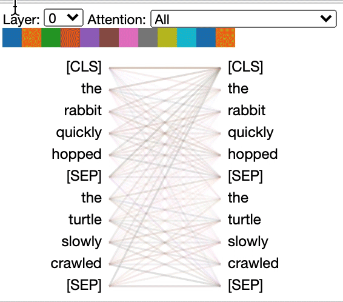

## 1 Self-Attention的概念
Self-Attention，也被称为scaled dot-product attention，是自然语言处理和深度学习领域的一个基本概念。它在机器翻译、文本摘要和情感分析等任务中发挥着关键作用。Self-Attention使模型能够在进行预测或捕获单词之间的依赖关系时权衡输入序列中不同部分的重要性。

在我们深入研究自我注意力之前，让我们先了解一下注意力这个更广泛的概念。想象一下阅读一份很长的文件;根据上下文，你的注意力自然地从一个词转移到另一个词。深度学习中的**Attention mechanisms**模仿了这种行为，允许模型选择性地专注于输入数据的特定元素，而忽略其他元素。

比如，在Encoder-Decoder框架中中，对于英-中机器翻译来说，Source是英文句子，Target是对应的翻译出的中文句子，每生成一个target单词都会考虑到Source和已生成的内容，接下来要生成的这个词就是通过计算待生成词与已生成词之间的Attention决定的。


Self-Attention中就是通过分析上下文，使模型能够辨别序列中单个词元的重要性，能够动态调整每个词元对下一个词元的影响程度。

### 注意
1. Self-Attention存在于Transformer架构中的Encoder部分，也就是一串输入的词元中，每个词元的注意力分数都是跟上下文有关，会与前后词元进行计算。可以通过上图中看到。
2. 而预测下一个词的时用到的注意力机制为：掩码注意力机制（Mask-Self-Attention），当前词元的注意力分数计算只与前文有关，只拿当前词元之前的词来计算。掩码注意力机制存在于Transformer中的Decoder中。
3. 而位于Encoder-Decoder之间的，为交叉注意力机制，Cross-Self-Attention，键Key来自于Encoder，而Query来自于Decoder。

### 优缺点
1. 优点：**可以建立全局的依赖关系，扩大图像的感受野。相比于CNN，其感受野更大，可以获取更多上下文信息。**

2. 缺点：自注意力机制是通过筛选重要信息，过滤不重要信息实现的，这就导致其有效信息的抓取能力会比CNN小一些。这样是因为自注意力机制相比CNN，无法利用图像本身具有的尺度，平移不变性，以及图像的特征局部性（图片上相邻的区域有相似的特征，即同一物体的信息往往都集中在局部）这些先验知识，只能通过大量数据进行学习。这就导致自注意力机制只有在大数据的基础上才能有效地建立准确的全局关系，而在小数据的情况下，其效果不如CNN。


## 2 Self-Attention的原理

这里先给出Self-Attention的**架构**。


### Q,K,V, and Self-Attention
- Query(Q): 可以将查询视为查找信息的元素。对于输入序列中的每个单词，计算一个查询向量。这些查询表示您希望在序列中关注的内容。
- Key(K)：用于识别和定位序列中的重要元素。与查询一样，为每个单词计算键向量。
- Value(V): 对于每个单词，计算一个值向量。这些向量包含我们在确定序列中单词的重要性时要考虑的内容。
-Attention Scores: 准备好QKV后，计算序列中每对单词的注意分数。查询和关键字之间的关注分数量化了它们的兼容性或相关性。
- Weighted Aggregation：最后，将注意力得分作为权重，对值向量进行加权聚合。这种聚合产生自关注输出，表示输入序列的增强的和上下文知情的表示。

### 计算公式
Self-Attention的核心是Query(Q),Key(K),Value(V)。
通过对注意力机制的学习我们知道，对于注意力机制来说，键值对形式的Attention计算公式如下：


在Self-Attention中，公式中的K、Q、V表示如下图所示，可以看出**QKV的来源都是输入矩阵X与矩阵的乘积，本质上都是X的线性变换（代码上就是分别经过了三个线性层），这也是为什叫做自注意力机制的原因。**


从上式可以看出其计算过程为：首先，计算矩阵Q和K每一行向量的内积，**为了防止内积过大，除以d_k的平方根**；其次，**使用Softmax对上述内积的结果进行归一化；**最后得到Softmax矩阵之后和V相乘，得到最终的输出。

### 代码实现

```python

import torch
import torch.nn as nn
import torch.nn.functional as F
import math

class SelfAttention(nn.Module):
    def __init__(self, dim_q, dim_k, dim_v):
        super(SelfAttention, self).__init__()
        self.dim_q = dim_q
        self.dim_k = dim_k
        11.          self.dim_v = dim_v
        # 定义线性变换函数
        self.linear_q = nn.Linear(dim_q, dim_k, bias=False)
        self.linear_k = nn.Linear(dim_q, dim_k, bias=False)
        self.linear_v = nn.Linear(dim_q, dim_v, bias=False)
        self._norm_fact = 1 / math.sqrt(dim_k)

    def forward(self, x):
        # x: batch, n, dim_q
        # 根据文本获得相应的维度
        batch, n, dim_q = x.shape
        # 如果条件为 True，则程序继续执行；如果条件为 False，则程序抛出一个 AssertionError 异常，并停止执行。
        assert dim_q == self.dim_q  # 确保输入维度与初始化时的dim_q一致

        q = self.linear_q(x)  # batch, n, dim_k
        k = self.linear_k(x)  # batch, n, dim_k
        v = self.linear_v(x)  # batch, n, dim_v

        # q*k的转置并除以开根号后的dim_k
        dist = torch.bmm(q, k.transpose(1, 2)) * self._norm_fact
        # 归一化获得attention的相关系数
        dist = F.softmax(dist, dim=-1)  # batch, n, n
        # attention系数和v相乘，获得最终的得分
        att = torch.bmm(dist, v)
        return att
```

**关于为什么bias=False：**

*   由于 softmax 函数会将输入转换成一个概率分布，其输出值的范围在0到1之间，并且各输出值的和为1，这减少了偏置项对模型性能的影响。因此，在这种情况下，省略偏置项可以减少模型的参数数量，提高训练速度，简化模型复杂度，并且有助于避免过拟合，提高模型的泛化能力。

## Self-Attention的计算细节
### 输入是如何Embedding的？
#### Word Embeddings
词嵌入是词的数值表示，旨在捕捉词之间的语义关系。其思想是将每个单词映射到一个高维向量，其中相似的单词在向量空间中更接近。最流行的单词嵌入之一是Word2Vec，它根据单词在大量文本语料库中出现的上下文生成单词向量。

下面是一个使用Gensim库实现Word2Vec embedding的代码：
```python
# Import the Gensim library
from gensim.models import Word2Vec

# Sample sentences for training the Word2Vec model
sentences = [
    ['machine', 'learning', 'is', 'fascinating'],
    ['natural', 'language', 'processing', 'is', 'important'],
    ['word', 'embeddings', 'capture', 'semantic', 'relations'],
]

# Train the Word2Vec model
model = Word2Vec(sentences, vector_size=100, window=5, min_count=1, sg=0)

# Get the word vector for a specific word
vector = model.wv['machine']
print(vector)

## 输出
[-1.9442164e-03 -5.2675214e-03  9.4471136e-03 -9.2987325e-03
  4.5039477e-03  5.4041781e-03 -1.4092624e-03  9.0070926e-03
  9.8853596e-03 -5.4750429e-03 -6.0210000e-03 -6.7469729e-03
 -7.8948820e-03 -3.0479168e-03 -5.5940272e-03 -8.3446801e-03
  7.8290224e-04  2.9946566e-03  6.4147436e-03 -2.6289499e-03
 -4.4534765e-03  1.2495709e-03  3.9146186e-04  8.1169987e-03
  1.8280029e-04  7.2315861e-03 -8.2645155e-03  8.4335366e-03
 -1.8889094e-03  8.7011540e-03 -7.6168370e-03  1.7963862e-03
  1.0564864e-03  4.6005251e-05 -5.1032533e-03 -9.2476979e-03
 -7.2642174e-03 -7.9511739e-03  1.9137275e-03  4.7846674e-04
 -1.8131376e-03  7.1201660e-03 -2.4756920e-03 -1.3473093e-03
 -8.9005642e-03 -9.9254129e-03  8.9493981e-03 -5.7539381e-03
 -6.3729975e-03  5.1994072e-03  6.6699935e-03 -6.8316413e-03
  9.5975993e-04 -6.0084737e-03  1.6473436e-03 -4.2892788e-03
 -3.4407973e-03  2.1856665e-03  8.6615775e-03  6.7281104e-03
 -9.6770572e-03 -5.6221043e-03  7.8803329e-03  1.9893574e-03
 -4.2560520e-03  5.9881213e-04  9.5209610e-03 -1.1027169e-03
 -9.4246380e-03  1.6084099e-03  6.2323548e-03  6.2823701e-03
  4.0916502e-03 -5.6502391e-03 -3.7069322e-04 -5.5317880e-05
  4.5717955e-03 -8.0415895e-03 -8.0183093e-03  2.6475071e-04
 -8.6082993e-03  5.8201565e-03 -4.1781188e-04  9.9711772e-03
 -5.3439774e-03 -4.8613906e-04  7.7567734e-03 -4.0679323e-03
 -5.0159004e-03  1.5900708e-03  2.6506938e-03 -2.5649595e-03
  6.4475285e-03 -7.6599526e-03  3.3935606e-03  4.8997044e-04
  8.7321829e-03  5.9827138e-03  6.8153618e-03  7.8225443e-03]


```

#### Sentence Embeddings
单词嵌入表示单个单词，句子嵌入捕获句子的整体含义。获取句子嵌入的一种常用方法是对句子中的单词向量取平均值
```python
import numpy as np

# Sample sentence and its word embeddings
sentence = ['machine', 'learning', 'is', 'fascinating']
word_vectors = [model.wv[word] for word in sentence]

# Calculate the sentence embedding by averaging word vectors
sentence_embedding = np.mean(word_vectors, axis=0)
print(sentence_embedding)

```
在这段代码中，我们取一个示例句子，并使用我们之前训练的Word2Vec模型获得句子中每个单词的词嵌入。然后，我们通过平均单词向量来计算句子嵌入。这给了我们整个句子的数字表示。

句子嵌入对于各种NLP任务都很有用，包括文本分类、情感分析和信息检索。

#### Pre-trained Embeddings
在许多NLP项目中，通常使用预训练的词嵌入或句子嵌入。这些嵌入是从大型语料库中生成的，并捕获一般的语言模式。流行的预训练模型包括Word2Vec、GloVe和BERT。
```python
from gensim.models import KeyedVectors

# Load pre-trained GloVe embeddings
glove_model = KeyedVectors.load_word2vec_format('glove.6B.100d.txt', binary=False)

# Get the word vector for a specific word
vector = glove_model['machine']
print(vector)

```
在这个例子中，我们从一个文件(在这个例子中是' GloVe . 6b .100d.txt ')加载预训练的GloVe嵌入，并使用glove_model['word']访问词向量。 

**总之，单词和句子嵌入在NLP任务中起着关键作用，使我们能够用数字表示文本数据。无论您是创建自己的嵌入还是使用预训练的模型，嵌入都是构建强大的NLP模型的基本组成部分。**

### Self=Attention是如何计算的

先看李宏毅所讲的这图，$[a^1,a^2,a^3,a^4]$是Embedding之后的输入，输入向量中的每个元素都经过一个矩阵计算得到$Query(q),Key(k),Value(v)$, 然后再经过计算得到注意力分数。


#### 计算图

**ps：在神经网络设置中，$W^v, W^q, W^k$这些权重通常是很小的数字，一般会对这些权重矩阵使用适当的随机分布(例如高斯、Xavier和Kaiming分布)进行随机初始化。**

只要能够看懂下面这图的计算过程即可。


self-attention-matrix-calculation-2


**具体看这两篇文章：**
- [“AI”科普丨一文读懂自注意力机制：8大步骤图解+代码](https://mp.weixin.qq.com/s/hrAfZL_KEAJvEbSCG-zfDQ "“AI”科普丨一文读懂自注意力机制：8大步骤图解+代码")
- [Understanding Self-Attention - A Step-by-Step Guide](https://armanasq.github.io/nlp/self-attention/)
* * *


## 4 Self-Attention的问题

Self-Attention**虽然考虑了所有的输入向量，但没有考虑到向量的位置信息**。**有学者提出可以通过位置编码(Positional Encoding)来解决这个问题，就是把位置信息添加到输入序列中，让输入数据本身就带有位置信息，该方法我们将在后续的Transformer中详细介绍。**

自注意力机制(Self-Attention)虽然强大，但在实际应用中也存在一些问题，以下是一些主要问题以及相应的解决方案:
1.**计算复杂度较高**:自注意力操作的计算复杂度为$0(n^2)$，其中n是序列长度。对于长序列，这可能导致计算成本显著增加。

**解决方案**:可以通过优化算法和使用高效的硬件(如GPU)来加速计算。此外，研究者们提出了,各种加速方法，例如稀疏注意力模式，以减少计算量24。

2.**缺乏位置信息**:自注意力机制没有内置的位置信息处理能力，这可能导致模型无法捕捉序列中单词的顺序。

**解决方案**:通过添加位置编码(Positional Encoding)来提供序列中每个元素的位置信息，帮助模型理解单词的顺序。

3.**显存占用大**:在处理高分辨率数据时，自注意力机制可能需要大量的显存，尤其是当特征图较大时。

**解决方案**:可以采用**稀疏注意力模式**或降低特征维度的方法来减少显存使用

4.**对长席列处理能力有限**:虽然自注意力可以处理长序列，但在实际应用中，可能需要对非常长的序列进行有效处理

**解决方案**:使用分段的注意力机制或层次化注意力结构以有效处理长序列

5.**可能的过拟合问题**:自注意力机制由于其参数众多，可能在小数据集上出现过拟合。

**解决方案**:使用正则化技术，如Dropout，或采用数据增强等策略来减轻过拟合21。

6.**对小数据集的泛化能力有限**:自注意力机制可能需要大量数据来训练，以学习有效的表示。

**解决方案**:使用迁移学习或预训练模型来提高模型在小数据集上的表现 

7.**多头注意力的实现复杂性**:虽然多头注意力可以提高模型的表达能力，但其实现相对复杂，需要额外的计算资源。

**解决方案**:优化多头注意力的实现，例如通过使用高效的线性变换和并行计算来简化多头注意力

