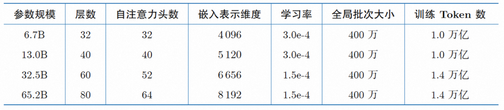

> 原文地址 [blog.csdn.net](https://blog.csdn.net/qq_35812205/article/details/136587013)

note
----

*   预训练语言模型除了自回归（Autoregressive）模型GPT，还有自编码模型（Autoencoding）BERT[1]、编-解码（Encoder-Decoder）模型BART[67]，以及融合上述三种方法的自回归填空（Autoregressive Blank Infilling）模型GLM（General Language Model）[68]。
*   ChatGPT的出现，使得目前几乎所有大语言模型神经网络结构趋同，采用自回归模型，基础架构与GPT-2相同，但在归一化函数、激活函数及位置编码等细节方面有所不同。归一化函数和激活函数的选择对于大语言模型的收敛性具有一定影响，因此在LLaMA 模型被提出之后，大多数开源模型沿用了RMSNorm 和SwiGLU 的组合方式。
*   由于LLaMA 模型所采用的位置编码方法RoPE 的外推能力不好，因此后续一些研究采用了ALiBi[69] 等具有更好外推能力的位置编码方法，使模型具有更长的上下文建模能力。
*   很多博客推导公式rope很复杂，用到了矩阵运算、复数运算、欧拉公式、三角展开式，整体过程很繁琐。如果我们直接利用旋转矩阵的性质，推导会很简洁。假设Ra表示角度为a的旋转矩阵，那么R具有如下性质：
    *   1.  Ra^T = R(-a)
    *   2.  Ra Rb = R(a+b)
    *   回到旋转位置编码，我们可以去证明 <RaX, RbY> = <X, R(b-a)Y> ，证明如下：  
        <RaX, RbY>  
        = (RaX)^T RbY  
        = X^T Ra^T RbY  
        = X^T R(b-a) Y  
        = <X, R(b-a)Y>

Llama 2 模型
----------

论文：《Llama 2: Open Foundation and Fine-Tuned Chat Models》  
链接：https://arxiv.org/pdf/2307.09288.pdf  


亮点：llama2是市面上为数不多的经过RLHF对齐训练后的大模型，记录的如从最开始的有监督[微调](https://so.csdn.net/so/search?q=%E5%BE%AE%E8%B0%83&spm=1001.2101.3001.7020)（SFT-v1） 到最终使用 PPO + RLHF 微调（RLHF-v5） 的演变历程。  


### 模型结构

和很多LLM类似也是使用[自回归](https://so.csdn.net/so/search?q=%E8%87%AA%E5%9B%9E%E5%BD%92&spm=1001.2101.3001.7020)的方式构建语言模型，但在位置编码、层归一化位置、激活函数等细节不同。模型结构和GPT2类似：  


主要的不同点：

*   前置的RMSNorm层
*   Q在与K相乘之前，先使用RoPE进行位置编码
*   K V Cache，并采用Group Query Attention
*   FeedForward层

不同规模的llama模型使用的超参数也有所不同：  



### RMSNorm归一化函数

回顾LN层（对同一个样本的不同特征进行归一化）归一化的公式：  

$$\begin{aligned} \text { LayerNorm }: y & =\frac{x-E[x]}{\sqrt{\operatorname{Var}[x]+\epsilon}} * \gamma+\beta \\ E[x] & =\frac{1}{N} \sum_{i=1}^N x_i \\ \operatorname{Var}[x] & =\frac{1}{N} \sum_{i=1}^N\left(x_i-E[x]\right)^2 \end{aligned}$$


而RMSNorm就是LayerNorm的变体, RMSNorm省去了求均值的过程,也没有了偏置 β \beta β,（如下），RMSNorm使用均方根进行归一化  

$$\begin{aligned} \text { RMSNorm }: y & =\frac{x}{\sqrt{\operatorname{Mean}\left(x^2\right)+\epsilon}} * \gamma \\ \operatorname{Mean}\left(x^2\right) & =\frac{1}{N} \sum_{i=1}^N x_i^2 \end{aligned}$$

其中 $\gamma$ 和 $\beta$ 为可学习的参数。  
RMSNorm的优点：

【换种形式】针对输入向量a，RMSNorm 函数计算公式如下：

$$\begin{aligned} \operatorname{RMS}(\boldsymbol{a}) & =\sqrt{\frac{1}{n} \sum_{i=1}^n \boldsymbol{a}_i^2} \\ \bar{a}_i & =\frac{a_i}{\operatorname{RMS}(\boldsymbol{a})} \end{aligned}$$

此外，RMSNorm 还可以引入可学习的缩放因子 g i g_i gi​ 和偏移参数 b i b_i bi​ ，从而得到 a ˉ i = a i RMS ⁡ ( a ) g i + b i \bar{a}_i=\frac{a_i}{\operatorname{RMS}(\boldsymbol{a})} g_i+b_i aˉi​=RMS(a)ai​​gi​+bi​

```python
# hidden_size是隐藏层大小，比如每个样本有5个特征，则hidden_size=5
class LlamaRMSNorm(nn.Module):
    def __init__(self, hidden_size, eps=1e-6):
        """
        LlamaRMSNorm is equivalent to T5LayerNorm
        """
        super().__init__()
        self.weight = nn.Parameter(torch.ones(hidden_size))  # 以hidden_size大小的全1张量初始化
        self.variance_epsilon = eps  # 给定一个很小的数，防止分母为0

    def forward(self, hidden_states):
        input_dtype = hidden_states.dtype
        hidden_states = hidden_states.to(torch.float32)
        variance = hidden_states.pow(2).mean(-1, keepdim=True)
        hidden_states = hidden_states * torch.rsqrt(variance + self.variance_epsilon)
        return self.weight * hidden_states.to(input_dtype)  # to(input_dtype)是为了保持数据类型` 

```

### SwiGLU 激活函数

SwiGLU 激活函数是Shazeer 在文献[50] 中提出的，在PaLM[14] 等模型中进行了广泛应用，并且取得了不错的效果，相较于ReLU 函数在大部分评测中都有不少提升。

在LLaMA 中，全连接层使用带有SwiGLU 激活函数的FFN (Position-wise Feed-Forward Network，FFN通常由两个线性变化组成，这里中间应用SwiGLU非线性激活函数) 的计算公式如下:  

$$\begin{array}{r} \operatorname{FFN}_{\text {SwiGLU }}\left(\boldsymbol{x}, \boldsymbol{W}, \boldsymbol{V}, \boldsymbol{W}_2\right)=\operatorname{SwiGLU}(\boldsymbol{x}, \boldsymbol{W}, \boldsymbol{V}) \boldsymbol{W}_2 \\ \operatorname{SwiGLU}(\boldsymbol{x}, \boldsymbol{W}, \boldsymbol{V})=\operatorname{Swish}_\beta(\boldsymbol{x} \boldsymbol{W}) \otimes \boldsymbol{x} \boldsymbol{V} \\ \operatorname{Swish}_\beta(\boldsymbol{x})=\boldsymbol{x} \sigma(\boldsymbol{\beta} \boldsymbol{x}) \end{array}$$

其中$\sigma(x)$ 是Sigmoid 函数

下图给出了Swish 激活函数在参数 β \beta β 不同取值下的形状。可以看到：

*   当 β \beta β 趋近于 0 时，Swish 函数趋近于线性函数 y = x y=x y=x;
*   当 β \beta β 趋近于无穷大时，Swish 函数趋近于 ReLU 函数;
*   当 β \beta β 取值为 1 时，Swish 函数是光滑且非单调的。

在HugqingFace 的 transformer库中Swish 函数被SiLU 函数代替。  


> 使用SwiGLU的目的在于提供一种更有效的激活方式，它可以帮助模型更好地学习数据中的复杂模式和关系。Swish激活函数因其平滑性和非零的梯度对于负值的处理，已被证明在多种任务中优于传统的ReLU函数。将Swish与GLU结合，SwiGLU通过门控机制进一步增强了模型的选择性信息传递能力，这有助于提高模型在特定任务，如自然语言处理和图像识别中的表现。

我们来看具体代码，比较不同激活函数（实际用的时候可以直接使用torch的`F.silu`函数，SiLU其实就是beta为1时的Swish激活函数）：

```python
import numpy as np
import matplotlib.pyplot as plt
from scipy.stats import norm

def gelu(x):
   return x * norm.cdf(x)

def relu(x):
   return np.maximum(0, x)

def swish(x, beta=1):
   return x * (1 / (1 + np.exp(-beta * x)))

x_values = np.linspace(-5, 5, 500)
gelu_values = gelu(x_values)
relu_values = relu(x_values)
swish_values = swish(x_values)
swish_values2 = swish(x_values, beta=0.5)

plt.plot(x_values, gelu_values, label='GELU')
plt.plot(x_values, relu_values, label='ReLU')
plt.plot(x_values, swish_values, label='Swish')
plt.plot(x_values, swish_values2, label='Swish (beta=0.5)')
plt.title("GELU, ReLU, and Swish Activation Functions")
plt.xlabel("x")
plt.ylabel("Activation")
plt.grid()
plt.legend()
save_path = "xxx"
plt.savefig(save_path)
plt.show()` 
```


### RoPE位置嵌入

#### （1）数学基础知识回顾

旋转矩阵是正交矩阵的一种特例, 它们在数学和物理学中都有广泛的应用。下面是关于正交矩阵和旋转矩阵的一些核心特点的概述：

正交矩阵的定义和特点

*   定义：正交矩阵是方块矩阵, 其元素为实数, 并且其行向量和列向量均为正交的单位向量。这意味着正交矩阵满足 Q T Q = Q Q T = I Q^T Q=Q Q^T=I QTQ=QQT=I, 其中 I I I 是单位矩阵, Q T Q^T QT 是 Q Q Q 的转置矩阵 。
*   行列式值：正交矩阵的行列式值必须为 +1 或 -1 , 这反映了其保持向量空间体积不变的性质
*   性质:
*   作为线性映射, 正交矩阵保持距离不变, 是保距映射。
*   行列式值为 +1 的正交矩阵称为特殊正交矩阵, 代表纯旋转。
*   行列式值为 -1 的正交矩阵代表旋转加上镜像, 即瑕旋转 。

旋转矩阵

*   旋转矩阵：特殊正交矩阵, 其行列式值为 +1 , 专门用于表示空间中的旋转操作。旋转矩阵通过保持向量长度和夹角不变的同时实现空间的旋转变换。
*   应用：旋转矩阵和正交矩阵在多个领域都有广泛的应用, 比如描述分子的点群对称性、数值线性代数中的QR分解、以及在计算机图形学中处理图形旋转等 。

示例  
一些小的正交矩阵的例子可能包括:

*   单位矩阵 I I I, 表示恒等变换。
*   特定角度的旋转矩阵, 比如旋转 16.2 6 ∘ 16.26^{\circ} 16.26∘ 的矩阵。
*   针对某一轴的反射矩阵。
*   置换坐标轴的矩阵等 。

#### （2）rope旋转位置编码

核心：通过绝对位置编码的方式实现相对位置编码

在位置编码上，使用旋转位置嵌入[52] 代替原有的绝对位置编码。RoPE 借助复数的思想，出发点是通过绝对位置编码的方式实现相对位置编码。其目标是通过下述运算给 q , k q, k q,k 添加绝对位置信息:  
$\tilde{\boldsymbol{q}}_m=f(\boldsymbol{q}, m), \tilde{\boldsymbol{k}}_n=f(\boldsymbol{k}, n)$

经过上述操作，$\tilde{\boldsymbol{q}}_m$​ 和 $\tilde{\boldsymbol{k}}_n$ 就带有了位置 $\mathrm{m}$和 $\mathrm{n}$ 的绝对位置信息。

详细的证明和求解过程可参考论文，最终可以得到二维情况下用复数表示的 RoPE:  
$f(\boldsymbol{q}, m)=R_f(\boldsymbol{q}, m) e^{i \Theta_f(\boldsymbol{q}, m)}=\|\boldsymbol{q}\| e^{i(\Theta(\boldsymbol{q})+m \theta)}=\boldsymbol{q} e^{i m \theta} $

根据复数乘法的几何意义，上述变换实际上是对应向量旋转，所以位置向量称为 “旋转式位置编码" 。还可以使用矩阵形式表示:  
 $$ f(\boldsymbol{q}, m)=\left( \begin{array}{cc} \cos m \theta & -\sin m \theta \\ \sin m \theta & \cos m \theta \end{array} \right) \left(\begin{array}{l} \boldsymbol{q}_0 \\ \boldsymbol{q}_1 \end{array} \right) $$


根据内积满足线性叠加的性质，任意偶数维的RoPE 都可以表示为二维情形的拼接，即:  
 $$ f(\boldsymbol{q}, m)=\underbrace{\left( \begin{array}{ccccccc} \cos m \theta_0 & -\sin m \theta_0 & 0 & 0 & \cdots & 0 & 0 \\ \sin m \theta_0 & \cos m \theta_0 & 0 & 0 & \cdots & 0 & 0 \\ 0 & 0 & \cos m \theta_1 & -\sin m \theta_1 & \cdots & 0 & 0 \\ 0 & 0 & \sin m \theta_1 & \cos m \theta_1 & \cdots & 0 & 0 \\ \cdots & \cdots & \cdots & \cdots & \ddots & \cdots & \cdots \\ 0 & 0 & 0 & 0 & \cdots & \cos m \theta_{d / 2-1} & -\sin m \theta_{d / 2-1} \\ 0 & 0 & 0 & 0 & \cdots & \sin m \theta_{d / 2-1} & \cos m \theta_{d / 2-1} \end{array} \right)}_{\boldsymbol{R}_d}\left( \begin{array}{c} \boldsymbol{q}_0 \\ \boldsymbol{q}_1 \\ \boldsymbol{q}_2 \\ \boldsymbol{q}_3 \\ \cdots \\ \boldsymbol{q}_{d-2} \\ \boldsymbol{q}_{d-1} \end{array} \right) $$

由于上述矩阵 R d R_d Rd​ 具有稀疏性，因此可以使用逐位相乘 ⊗ \otimes ⊗ 操作进一步提高计算速度。

```python
def precompute_freqs_cis(dim: int, end: int, theta: float = 10000.0):
    # 计算词向量元素两两分组以后，每组元素对应的旋转角度 
    # arange生成[0,2,4...126]
    freqs = 1.0 / (theta ** (torch.arange(0, dim, 2)[: (dim // 2)].float() / dim))
    # t = [0,....end]
    t = torch.arange(end, device=freqs.device)  # type: ignore
    # t为列向量 freqs为行向量做外积
    # freqs.shape = (t.len(),freqs.len()) #shape (end,dim//2)
    freqs = torch.outer(t, freqs).float()  # type: ignore
    # 生成复数
    # torch.polar(abs,angle) -> abs*cos(angle) + abs*sin(angle)*j
    freqs_cis = torch.polar(torch.ones_like(freqs), freqs)  # complex64
    # freqs_cis.shape  = (end,dim//2)
    return freqs_cis
​
def reshape_for_broadcast(freqs_cis: torch.Tensor, x: torch.Tensor):
    # ndim为x的维度数 ,此时应该为4
    ndim = x.ndim
    assert 0 <= 1 < ndim
    assert freqs_cis.shape == (x.shape[1], x.shape[-1])
    shape = [d if i == 1 or i == ndim - 1 else 1 for i, d in enumerate(x.shape)]
    # (1,x.shape[1],1,x.shape[-1])
    return freqs_cis.view(*shape)
​
def apply_rotary_emb(
    xq: torch.Tensor,
    xk: torch.Tensor,
    freqs_cis: torch.Tensor,
) -> Tuple[torch.Tensor, torch.Tensor]:
    # xq.shape = [bsz, seqlen, self.n_local_heads, self.head_dim]
    # xq_.shape = [bsz, seqlen, self.n_local_heads, self.head_dim//2 , 2]
    # torch.view_as_complex用于将二维向量转换为复数域 torch.view_as_complex即([x,y]) -> (x+yj)
    # 所以经过view_as_complex变换后xq_.shape = [bsz, seqlen, self.n_local_heads, self.head_dim//2]
    xq_ = torch.view_as_complex(xq.float().reshape(*xq.shape[:-1], -1, 2))
    xk_ = torch.view_as_complex(xk.float().reshape(*xk.shape[:-1], -1, 2))
    
    freqs_cis = reshape_for_broadcast(freqs_cis, xq_) # freqs_cis.shape = (1,x.shape[1],1,x.shape[-1])
    
    # xq_ 与freqs_cis广播哈达玛积
    # [bsz, seqlen, self.n_local_heads, self.head_dim//2] * [1,seqlen,1,self.head_dim//2]
    # torch.view_as_real用于将复数再转换回实数向量, 再经过flatten展平第4个维度 
    # [bsz, seqlen, self.n_local_heads, self.head_dim//2] ->[bsz, seqlen, self.n_local_heads, self.head_dim//2,2 ] ->[bsz, seqlen, self.n_local_heads, self.head_dim]
    xq_out = torch.view_as_real(xq_ * freqs_cis).flatten(3)
    xk_out = torch.view_as_real(xk_ * freqs_cis).flatten(3)
    return xq_out.type_as(xq), xk_out.type_as(xk)

# 精简版Attention
class Attention(nn.Module):
    def __init__(self, args: ModelArgs):
        super().__init__()
        self.wq = Linear(...)
        self.wk = Linear(...)
        self.wv = Linear(...)
        
        self.freqs_cis = precompute_freqs_cis(dim, max_seq_len * 2)
​
    def forward(self, x: torch.Tensor):
        bsz, seqlen, _ = x.shape
        xq, xk, xv = self.wq(x), self.wk(x), self.wv(x)
        xq = xq.view(bsz, seqlen, self.n_local_heads, self.head_dim)
        xk = xk.view(bsz, seqlen, self.n_local_kv_heads, self.head_dim)
        xv = xv.view(bsz, seqlen, self.n_local_kv_heads, self.head_dim)
         # attention 操作之前，应用旋转位置编码
        xq, xk = apply_rotary_emb(xq, xk, freqs_cis=freqs_cis)
        #...
        # 进行后续Attention计算
        scores = torch.matmul(xq, xk.transpose(1, 2)) / math.sqrt(dim)
        scores = F.softmax(scores.float(), dim=-1)
        output = torch.matmul(scores, xv)  # (batch_size, seq_len, dim)
  # ......` 
```

### 注意力机制

Q在与K相乘之前，先使用RoPE进行位置编码：

```python
class Attention(nn.Module):
    def __init__(self, args: ModelArgs):
        super().__init__()
        self.n_kv_heads = args.n_heads if args.n_kv_heads is None else args.n_kv_heads
        model_parallel_size = fs_init.get_model_parallel_world_size()
        self.n_local_heads = args.n_heads // model_parallel_size
        self.n_local_kv_heads = self.n_kv_heads // model_parallel_size
        self.n_rep = self.n_local_heads // self.n_local_kv_heads
        self.head_dim = args.dim // args.n_heads

        self.wq = ColumnParallelLinear(
            args.dim,
            args.n_heads * self.head_dim,
            bias=False,
            gather_output=False,
            init_method=lambda x: x,
        )
        self.wk = ColumnParallelLinear(
            args.dim,
            self.n_kv_heads * self.head_dim,
            bias=False,
            gather_output=False,
            init_method=lambda x: x,
        )
        self.wv = ColumnParallelLinear(
            args.dim,
            self.n_kv_heads * self.head_dim,
            bias=False,
            gather_output=False,
            init_method=lambda x: x,
        )
        self.wo = RowParallelLinear(
            args.n_heads * self.head_dim,
            args.dim,
            bias=False,
            input_is_parallel=True,
            init_method=lambda x: x,
        )

        self.cache_k = torch.zeros(
            (
                args.max_batch_size,
                args.max_seq_len,
                self.n_local_kv_heads,
                self.head_dim,
            )
        ).cuda()
        self.cache_v = torch.zeros(
            (
                args.max_batch_size,
                args.max_seq_len,
                self.n_local_kv_heads,
                self.head_dim,
            )
        ).cuda()

    def forward(
        self,
        x: torch.Tensor,
        start_pos: int,
        freqs_cis: torch.Tensor,
        mask: Optional[torch.Tensor],
    ):
        bsz, seqlen, _ = x.shape
        xq, xk, xv = self.wq(x), self.wk(x), self.wv(x)

        xq = xq.view(bsz, seqlen, self.n_local_heads, self.head_dim)
        xk = xk.view(bsz, seqlen, self.n_local_kv_heads, self.head_dim)
        xv = xv.view(bsz, seqlen, self.n_local_kv_heads, self.head_dim)

        xq, xk = apply_rotary_emb(xq, xk, freqs_cis=freqs_cis)

        self.cache_k = self.cache_k.to(xq)
        self.cache_v = self.cache_v.to(xq)

        self.cache_k[:bsz, start_pos : start_pos + seqlen] = xk
        self.cache_v[:bsz, start_pos : start_pos + seqlen] = xv

        keys = self.cache_k[:bsz, : start_pos + seqlen]
        values = self.cache_v[:bsz, : start_pos + seqlen]

        # repeat k/v heads if n_kv_heads < n_heads
        keys = repeat_kv(keys, self.n_rep)  # (bs, seqlen, n_local_heads, head_dim)
        values = repeat_kv(values, self.n_rep)  # (bs, seqlen, n_local_heads, head_dim)

        xq = xq.transpose(1, 2)  # (bs, n_local_heads, seqlen, head_dim)
        keys = keys.transpose(1, 2)
        values = values.transpose(1, 2)
        scores = torch.matmul(xq, keys.transpose(2, 3)) / math.sqrt(self.head_dim)
        if mask is not None:
            scores = scores + mask  # (bs, n_local_heads, seqlen, cache_len + seqlen)
        scores = F.softmax(scores.float(), dim=-1).type_as(xq)
        output = torch.matmul(scores, values)  # (bs, n_local_heads, seqlen, head_dim)
        output = output.transpose(1, 2).contiguous().view(bsz, seqlen, -1)
        return self.wo(output)` 
```

Reference
---------

[1] [大模型系列：SwiGLU激活函数与GLU门控线性单元原理解析](https://www.jianshu.com/p/2354873fe58a)  
[2]《GLU Variants Improve Transformer》  
[3] 《Swish: a Self-Gated Activation Function》  
[4] [大模型基础｜激活函数｜从ReLU 到SwiGLU](https://zhuanlan.zhihu.com/p/650237644)  
[5] https://github.com/meta-llama/llama/tree/main/llama  
[6] [LLaMA 中的旋转式位置编码（Rotary Position Embedding）](https://zhuanlan.zhihu.com/p/642884818)  
[7] [Llama 2详解](https://zhuanlan.zhihu.com/p/649756898)  
[8] [逐行对比LLaMA2和LLaMA模型源代码](https://blog.csdn.net/chattyfish/article/details/131799826)  
[9] [Transformer源码阅读之：Llama](https://zhuanlan.zhihu.com/p/670388521?utm_id=0)