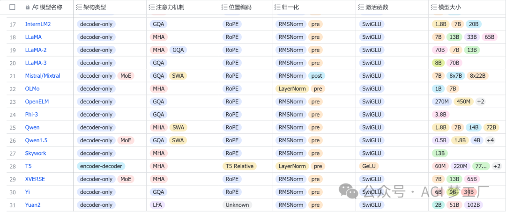
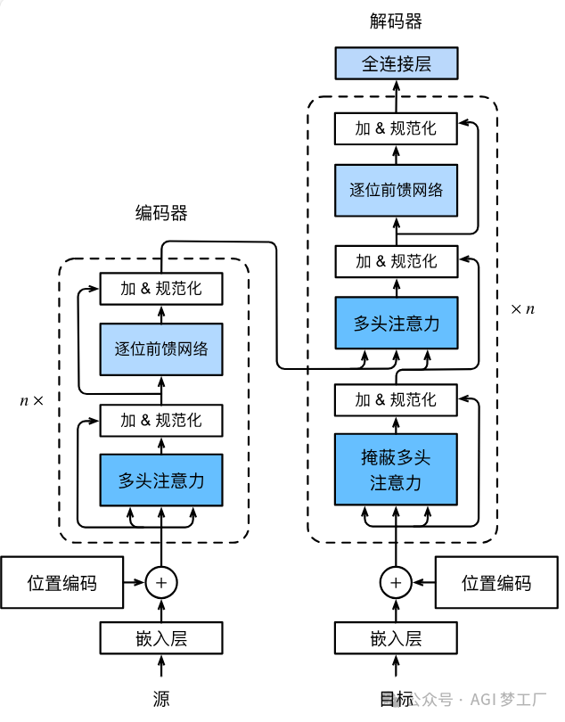
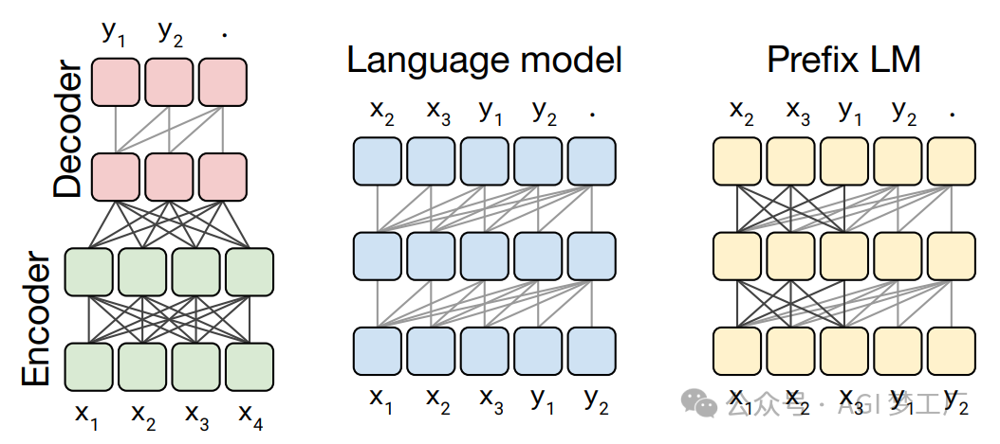

> 原文地址 [blog.csdn.net](https://blog.csdn.net/aolan123/article/details/138488018)

在近两年内，有关 LLM 的研究进展很快，每天几乎都有新的语言模型发布（隐藏的 GPT-5，Llama3，Qwen1.5，Mixtral 8x22B 和 Claude 3 等等等等），它们的性能和效果似乎每天都在持续提升。

然而，令人震惊的是，大多数现代 LLM 所使用的架构与最初的 GPT 模型非常相似。从模型架构角度出发，LLM 的一个关键组成部分一直保持不变，那就是 Transformer 架构的 Decoder。所有人或机构几乎都只是在将模型做得更大，对结构稍作修改，使用更大规模和更高质量的数据集，并采用更加先进的训练（和对齐）方法训练模型。

因此，深入了解 LLM 的内部结构对于研究人员和技术开发者来说是至关重要的。这不仅有助于我们更好地理解模型的性能和局限性，还能够指导我们如何更有效地设计和优化未来的模型。接下来，我将会简要地概述 LLM 常用的架构配置，然后针对国内外 30 个热门大模型的架构，进行详细的图文分析，以便大家对大模型有更深刻的理解。




## 架构配置

Transformer




## 架构类型

大型语言模型（LLMs）主要分为自回归模型、自编码模型和序列到序列模型这三种类型。这些模型几乎普遍采用 Transformer 架构，而传统的 RNN 架构则较少使用。基于 Transformer 架构的 LLMs，根据其设计特点，主要可以分为三类：仅包含编码器（Encoder-only）的模型、仅包含解码器（Decoder-only）的模型，以及同时包含编码器和解码器（Encoder-Decoder）的模型。



### **1. RNN**


### **2. 基于 Transformer 的 GPT，BERT 和 Transformer XL**


## 混合专家模型 MoE

MoE（Mixture-of-Experts）是一种神经网络架构，它通过路由机制（Router）将输入数据动态地分配给多个专家（Expert）网络中的一组。这种架构允许模型根据输入数据的特性选择不同的专家来处理，从而提高了模型的表达能力和效率。

**1. 稀疏 MoE**


**2. 细粒度 MoE**


## 注意力机制

注意力机制是一种在大语言模型中模拟人类注意力的技术，它通过动态调整输入数据的权重，使模型能够集中处理信息中最关键的部分。

### **1. 多头注意力**


### **2. 稀疏注意力**


**3. 滑动窗口注意力**


1MHA，GQA 和 MQA


## 位置编码

在 LLM 中，位置编码是一种将序列中 Token 的位置信息编码为模型可以理解和利用的方式的技术。

**1. 基于正弦函数和余弦函数的固定位置编码**


**2. 可学习的（learnable）位置编码**


**3. ALiBi 位置编码**


**4. RoPE 位置编码**


## 归一化

在 LLM 中，归一化是一种数据处理技术，通过将输入特征缩放到统一的尺度上，来提高模型的泛化能力和训练效率。

1.  Pre-Norm 和 Post-Norm


**2. Pre-Norm**

Sublayer 表示自注意力层或前馈神经网络层。


**3. Post-Norm**


**4. LayerNorm**


**5. RMSNorm**

RMSNorm 省略了 LayerNorm 中平均值μ的计算，只基于均方根进行缩放。


激活函数

激活函数是神经网络中的一种函数，用于对输入信号进行非线性变换，增加网络的表达能力。激活函数的选择对神经网络的性能和训练速度有很大的影响。

**1. GeLU 和 SiLU**


**2. GLU( Gated Linear Units)**


**3. GeGLU 和 SwiGLU**


详细架构

BERT

BERT 模型建立在 Transformer 的 Encoder 的基础上。

**1. 模型架构**

```
`BertModel(     (embeddings): BertEmbeddings(       (word_embeddings): Embedding(28996, 768, padding_idx=0)       (position_embeddings): Embedding(512, 768)       (token_type_embeddings): Embedding(2, 768)       (LayerNorm): LayerNorm((768,), eps=1e-12, elementwise_affine=True)       (dropout): Dropout(p=0.1, inplace=False)     )     (encoder): BertEncoder(       (layer): ModuleList(         (0-11): 12 x BertLayer(           (attention): BertAttention(             (self): BertSelfAttention(               (query): Linear(in_features=768, out_features=768, bias=True)               (key): Linear(in_features=768, out_features=768, bias=True)               (value): Linear(in_features=768, out_features=768, bias=True)               (dropout): Dropout(p=0.1, inplace=False)             )             (output): BertSelfOutput(               (dense): Linear(in_features=768, out_features=768, bias=True)               (LayerNorm): LayerNorm((768,), eps=1e-12, elementwise_affine=True)               (dropout): Dropout(p=0.1, inplace=False)             )           )           (intermediate): BertIntermediate(             (dense): Linear(in_features=768, out_features=3072, bias=True)             (intermediate_act_fn): GELUActivation()           )           (output): BertOutput(             (dense): Linear(in_features=3072, out_features=768, bias=True)             (LayerNorm): LayerNorm((768,), eps=1e-12, elementwise_affine=True)             (dropout): Dropout(p=0.1, inplace=False)           )         )       )     )     (pooler): BertPooler(       (dense): Linear(in_features=768, out_features=768, bias=True)       (activation): Tanh()     )   )` 

*   1


```

**2. 图示**


ChatGLM, ChatGLM2, ChatGLM3, GLM

GLM 是一个基于自动回归式空白填充预训练的通用语言模型。ChatGLM2 和 ChatGLM3 对 ChatGLM 的主要改进在于使用了 MAQ 注意力机制，RMSNorm 归一化方法和 SwiGLU 激活函数。下面仅给出 ChatGLM2 的模型架构。

**1. 模型架构**

```
`ChatGLMForConditionalGeneration(     (transformer): ChatGLMModel(       (embedding): Embedding(         (word_embeddings): Embedding(65024, 4096)       )       (rotary_pos_emb): RotaryEmbedding()       (encoder): GLMTransformer(         (layers): ModuleList(           (0-27): 28 x GLMBlock(             (input_layernorm): RMSNorm()             (self_attention): SelfAttention(               (query_key_value): Linear(in_features=4096, out_features=4608, bias=True)               (core_attention): CoreAttention(                 (attention_dropout): Dropout(p=0.0, inplace=False)               )               (dense): Linear(in_features=4096, out_features=4096, bias=False)             )             (post_attention_layernorm): RMSNorm()             (mlp): MLP(               (dense_h_to_4h): Linear(in_features=4096, out_features=27392, bias=False)               (dense_4h_to_h): Linear(in_features=13696, out_features=4096, bias=False)             )           )         )         (final_layernorm): RMSNorm()       )       (output_layer): Linear(in_features=4096, out_features=65024, bias=False)     )   )` 

*   1


```

**2. 图示**


ChatRWKV

RWKV 是一种基于 RNN 架构，并结合 Transformer 的优势的语言模型。

**1. 模型架构图示**


Command-R

Command-R 基于 Transformer 的 Decoder 进行创新和改进，具备 RAG（Retrieval Augmented Generation）的功能特性，部分模型使用了 GQA 技术。

**1. 模型结构**

```
`CohereForCausalLM(                       (model): CohereModel(                         (embed_tokens): Embedding(256000, 8192, padding_idx=0)                         (layers): ModuleList(                           (0-39): 40 x CohereDecoderLayer(                             (self_attn): CohereAttention(                               (q_proj): Linear(in_features=8192, out_features=8192, bias=False)                               (k_proj): Linear(in_features=8192, out_features=8192, bias=False)                               (v_proj): Linear(in_features=8192, out_features=8192, bias=False)                               (o_proj): Linear(in_features=8192, out_features=8192, bias=False)                               (rotary_emb): CohereRotaryEmbedding()                             )                             (mlp): CohereMLP(                               (gate_proj): Linear(in_features=8192, out_features=22528, bias=False)                               (up_proj): Linear(in_features=8192, out_features=22528, bias=False)                               (down_proj): Linear(in_features=22528, out_features=8192, bias=False)                               (act_fn): SiLU()                             )                             (input_layernorm): CohereLayerNorm()                           )                         )                         (norm): CohereLayerNorm()                       )                       (lm_head): Linear(in_features=8192, out_features=256000, bias=False)                     )` 

*   1


```

**2. 图示**


GPT

GPT 模型建立在 Transformer 的 Decoder 的基础上。

**1. 模型架构**

```
`` `OpenAIGPTLMHeadModel(                       (transformer): OpenAIGPTModel(                         (tokens_embed): Embedding(40478, 768)                         (positions_embed): Embedding(512, 768)                         (drop): Dropout(p=0.1, inplace=False)                         (h): ModuleList(                           (0-11): 12 x Block(                             (attn): Attention(                               (c_attn): Conv1D()                               (c_proj): Conv1D()                               (attn_dropout): Dropout(p=0.1, inplace=False)                               (resid_dropout): Dropout(p=0.1, inplace=False)                             )                             (ln_1): LayerNorm((768,), eps=1e-05, elementwise_affine=True)                             (mlp): MLP(                               (c_fc): Conv1D()                               (c_proj): Conv1D()                               (act): NewGELUActivation()                               (dropout): Dropout(p=0.1, inplace=False)                             )                             (ln_2): LayerNorm((768,), eps=1e-05, elementwise_affine=True)                           )                         )                       )                       (lm_head): Linear(in_features=768, out_features=40478, bias=False)                     )` `` 

*   1


```

**2. 图示**


GPT2, GPT3, Falcon

GPT3 与 GPT2 在模型架构上的差别在于前者使用了稀疏注意力模式的注意力机制，而 Falcon 在 GPT3 上进行的最大变动在于前者使用了 RoPE 和 MQA，这里仅提供 GPT2 的模型架构，详情请查看对应模型的具体实现。

**1. 模型架构**

```
`GPT2LMHeadModel(                       (transformer): GPT2Model(                         (wte): Embedding(50257, 768)                         (wpe): Embedding(1024, 768)                         (drop): Dropout(p=0.1, inplace=False)                         (h): ModuleList(                           (0-11): 12 x GPT2Block(                             (ln_1): LayerNorm((768,), eps=1e-05, elementwise_affine=True)                             (attn): GPT2Attention(                               (c_attn): Conv1D()                               (c_proj): Conv1D()                               (attn_dropout): Dropout(p=0.1, inplace=False)                               (resid_dropout): Dropout(p=0.1, inplace=False)                             )                             (ln_2): LayerNorm((768,), eps=1e-05, elementwise_affine=True)                             (mlp): GPT2MLP(                               (c_fc): Conv1D()                               (c_proj): Conv1D()                               (act): NewGELUActivation()                               (dropout): Dropout(p=0.1, inplace=False)                             )                           )                         )                         (ln_f): LayerNorm((768,), eps=1e-05, elementwise_affine=True)                       )                       (lm_head): Linear(in_features=768, out_features=50257, bias=False)                     )` 

*   1


```

**2. 图示**


Gemma

Gemma 在 Transformer 的 Decoder 上进行创新和改进，使用了 MQA 技术。

**1. 模型架构**

```
`` `GemmaForCausalLM(                       (model): GemmaModel(                         (embed_tokens): Embedding(256000, 2048, padding_idx=0)                         (layers): ModuleList(                           (0-17): 18 x GemmaDecoderLayer(                             (self_attn): GemmaSdpaAttention(                               (q_proj): Linear(in_features=2048, out_features=2048, bias=False)                               (k_proj): Linear(in_features=2048, out_features=256, bias=False)                               (v_proj): Linear(in_features=2048, out_features=256, bias=False)                               (o_proj): Linear(in_features=2048, out_features=2048, bias=False)                               (rotary_emb): GemmaRotaryEmbedding()                             )                             (mlp): GemmaMLP(                               (gate_proj): Linear(in_features=2048, out_features=16384, bias=False)                               (up_proj): Linear(in_features=2048, out_features=16384, bias=False)                               (down_proj): Linear(in_features=16384, out_features=2048, bias=False)                               (act_fn): PytorchGELUTanh()                             )                             (input_layernorm): GemmaRMSNorm()                             (post_attention_layernorm): GemmaRMSNorm()                           )                         )                         (norm): GemmaRMSNorm()                       )                       (lm_head): Linear(in_features=2048, out_features=256000, bias=False)                     )` `` 

*   1


```

**2. 图示**


Grok-1

Grok-1 在 Transformer 的 Decoder 上进行创新和改进，使用了 GQA ， MoE 和 Sandwish Normalization 等技术。

**1. 模型架构**

```
`` `Grok1ModelForCausalLM(                       (model): Grok1Model(                         (embed_tokens): Embedding(131072, 6144, padding_idx=0)                         (layers): ModuleList(                           (0-63): 64 x DecoderLayer(                             (attn): MultiHeadAttention(                               (q_proj): Linear(in_features=6144, out_features=6144, bias=False)                               (k_proj): Linear(in_features=6144, out_features=6144, bias=False)                               (v_proj): Linear(in_features=6144, out_features=6144, bias=False)                               (o_proj): Linear(in_features=6144, out_features=6144, bias=False)                               (rotary_emb): RotaryEmbedding()                             )                             (moe_block): MoeBlock(                               (gate): Linear(in_features=6144, out_features=8, bias=False)                               (experts): ModuleList(                                 (0-7): 8 x MoeMLP(                                   (linear_v): Linear(in_features=6144, out_features=32768, bias=False)                                   (linear_1): Linear(in_features=32768, out_features=6144, bias=False)                                   (linear): Linear(in_features=6144, out_features=32768, bias=False)                                   (act_fn): GELU(approximate='none')                                 )                               )                             )                             (pre_attn_norm): RMSNorm()                             (post_attn_norm): RMSNorm()                             (pre_moe_norm): RMSNorm()                             (post_moe_norm): RMSNorm()                           )                         )                         (norm): RMSNorm()                       )                       (lm_head): Linear(in_features=6144, out_features=131072, bias=False)                     )` `` 

*   1


```

**2. 图示**


LLama, LLama2, LLama3, Baichuan, Baichuan2, DeepSeek, DeepSeek-Coder, Intern, Intern2, OLMo,Phi-3, Skywork, Yi

Llama 基于 Transformer 的 Decoder 进行创新和改进，并吸收了 GPT3 和 PaLM 等最新研究的优点。

从 Baichuan2，Intern2，DeepSeek，OLMo，Phi-3，Skywork 和 Yi 的论文或技术报告了解到，其采用了和 LLama 相似的模型结构设计，但注意，实际上 Baichuan2，Intern2，DeepSeek，OLMo，Phi-3，Skywork 和 Yi 与 Llama2 并不完全一样，在注意力机制，位置编码，归一化，前馈神经网络的处理上可能存在着细微的差别，详情请查看对应模型的具体实现。而由于 LLama，LLama2 和 LLama3 的模型结构变化不大，这里给出 LLama2 的模型结构。

**1. 模型架构**

```
`` `LlamaForCausalLM(                       (model): LlamaModel(                         (embed_tokens): Embedding(32000, 4096)                         (layers): ModuleList(                           (0-31): 32 x LlamaDecoderLayer(                             (self_attn): LlamaAttention(                               (q_proj): Linear(in_features=4096, out_features=4096, bias=False)                               (k_proj): Linear(in_features=4096, out_features=4096, bias=False)                               (v_proj): Linear(in_features=4096, out_features=4096, bias=False)                               (o_proj): Linear(in_features=4096, out_features=4096, bias=False)                               (rotary_emb): LlamaRotaryEmbedding()                             )                             (mlp): LlamaMLP(                               (gate_proj): Linear(in_features=4096, out_features=11008, bias=False)                               (up_proj): Linear(in_features=4096, out_features=11008, bias=False)                               (down_proj): Linear(in_features=11008, out_features=4096, bias=False)                               (act_fn): SiLUActivation()                             )                             (input_layernorm): LlamaRMSNorm()                             (post_attention_layernorm): LlamaRMSNorm()                           )                         )                         (norm): LlamaRMSNorm()                       )                       (lm_head): Linear(in_features=4096, out_features=32000, bias=False)                     )` `` 

*   1


```

**2. 图示**


Mistral

Mistral 基于 Transformer 的 Decoder 进行创新和改进，使用了 GQA 和 SWA 等技术，部分模型采用了 MoE 架构。

**1. 模型架构**

```
`MistralForCausalLM(                       (model): MistralModel(                         (embed_tokens): Embedding(32000, 4096)                         (layers): ModuleList(                           (0-31): 32 x MistralDecoderLayer(                             (self_attn): MistralAttention(                               (q_proj): Linear(in_features=4096, out_features=4096, bias=False)                               (k_proj): Linear(in_features=4096, out_features=1024, bias=False)                               (v_proj): Linear(in_features=4096, out_features=1024, bias=False)                               (o_proj): Linear(in_features=4096, out_features=4096, bias=False)                               (rotary_emb): MistralRotaryEmbedding()                             )                             (mlp): MistralMLP(                               (gate_proj): Linear(in_features=4096, out_features=14336, bias=False)                               (up_proj): Linear(in_features=4096, out_features=14336, bias=False)                               (down_proj): Linear(in_features=14336, out_features=4096, bias=False)                               (act_fn): SiLU()                             )                             (input_layernorm): MistralRMSNorm()                             (post_attention_layernorm): MistralRMSNorm()                           )                         )                         (norm): MistralRMSNorm()                       )                       (lm_head): Linear(in_features=4096, out_features=32000, bias=False)                     )` 

*   1


```

**2. 图示**


OpenELM

OpenELM 基于 Transformer 的 Decoder 进行创新和改进，使用了 GQA 和 Layer-wise scaling 等技术。

**1. 模型架构**

```
`` `OpenELMForCausalLM(                       (transformer): OpenELMModel(                         (token_embeddings): Embedding(32000, 1280)                         (layers): ModuleList(                           (0): OpenELMDecoderLayer(                             (attn): OpenELMMultiHeadCausalAttention(                               query_heads=12, key_heads=3, value_heads=3                               (qkv_proj): Linear(in_features=1280, out_features=1152, bias=False)                               (pos_embedding): OpenELMRotaryEmbedding(        model_dim=64, max_seq_length=4096, freq_constant=10000)                               (q_norm): OpenELMRMSNorm(num_features=64, eps=1e-06)                               (k_norm): OpenELMRMSNorm(num_features=64, eps=1e-06)                               (out_proj): Linear(in_features=768, out_features=1280, bias=False)                             )                             (ffn): OpenELMFeedForwardNetwork(                               (ffn_with_glu) : True                               (proj_1): Linear(in_features=1280, out_features=1536, bias=False)                               (proj_2): Linear(in_features=768, out_features=1280, bias=False)                               (act): SiLU()                             )                             (ffn_norm): OpenELMRMSNorm(num_features=1280, eps=1e-06)                             (attn_norm): OpenELMRMSNorm(num_features=1280, eps=1e-06)                           )                           (1): OpenELMDecoderLayer(                             (attn): OpenELMMultiHeadCausalAttention(                               query_heads=12, key_heads=3, value_heads=3                               (qkv_proj): Linear(in_features=1280, out_features=1152, bias=False)                               (pos_embedding): OpenELMRotaryEmbedding(        model_dim=64, max_seq_length=4096, freq_constant=10000)                               (q_norm): OpenELMRMSNorm(num_features=64, eps=1e-06)                               (k_norm): OpenELMRMSNorm(num_features=64, eps=1e-06)                               (out_proj): Linear(in_features=768, out_features=1280, bias=False)                             )                             (ffn): OpenELMFeedForwardNetwork(                               (ffn_with_glu) : True                               (proj_1): Linear(in_features=1280, out_features=2048, bias=False)                               (proj_2): Linear(in_features=1024, out_features=1280, bias=False)                               (act): SiLU()                             )                             (ffn_norm): OpenELMRMSNorm(num_features=1280, eps=1e-06)                             (attn_norm): OpenELMRMSNorm(num_features=1280, eps=1e-06)                           )                           (2): OpenELMDecoderLayer(                             (attn): OpenELMMultiHeadCausalAttention(                               query_heads=12, key_heads=3, value_heads=3                               (qkv_proj): Linear(in_features=1280, out_features=1152, bias=False)                               (pos_embedding): OpenELMRotaryEmbedding(        model_dim=64, max_seq_length=4096, freq_constant=10000)                               (q_norm): OpenELMRMSNorm(num_features=64, eps=1e-06)                               (k_norm): OpenELMRMSNorm(num_features=64, eps=1e-06)                               (out_proj): Linear(in_features=768, out_features=1280, bias=False)                             )                             (ffn): OpenELMFeedForwardNetwork(                               (ffn_with_glu) : True                               (proj_1): Linear(in_features=1280, out_features=2560, bias=False)                               (proj_2): Linear(in_features=1280, out_features=1280, bias=False)                               (act): SiLU()                             )                             (ffn_norm): OpenELMRMSNorm(num_features=1280, eps=1e-06)                             (attn_norm): OpenELMRMSNorm(num_features=1280, eps=1e-06)                           )                           (3): OpenELMDecoderLayer(                             (attn): OpenELMMultiHeadCausalAttention(                               query_heads=12, key_heads=3, value_heads=3                               (qkv_proj): Linear(in_features=1280, out_features=1152, bias=False)                               (pos_embedding): OpenELMRotaryEmbedding(        model_dim=64, max_seq_length=4096, freq_constant=10000)                               (q_norm): OpenELMRMSNorm(num_features=64, eps=1e-06)                               (k_norm): OpenELMRMSNorm(num_features=64, eps=1e-06)                               (out_proj): Linear(in_features=768, out_features=1280, bias=False)                             )                             (ffn): OpenELMFeedForwardNetwork(                               (ffn_with_glu) : True                               (proj_1): Linear(in_features=1280, out_features=3072, bias=False)                               (proj_2): Linear(in_features=1536, out_features=1280, bias=False)                               (act): SiLU()                             )                             (ffn_norm): OpenELMRMSNorm(num_features=1280, eps=1e-06)                             (attn_norm): OpenELMRMSNorm(num_features=1280, eps=1e-06)                           )                           (4): OpenELMDecoderLayer(                             (attn): OpenELMMultiHeadCausalAttention(                               query_heads=12, key_heads=3, value_heads=3                               (qkv_proj): Linear(in_features=1280, out_features=1152, bias=False)                               (pos_embedding): OpenELMRotaryEmbedding(        model_dim=64, max_seq_length=4096, freq_constant=10000)                               (q_norm): OpenELMRMSNorm(num_features=64, eps=1e-06)                               (k_norm): OpenELMRMSNorm(num_features=64, eps=1e-06)                               (out_proj): Linear(in_features=768, out_features=1280, bias=False)                             )                             (ffn): OpenELMFeedForwardNetwork(                               (ffn_with_glu) : True                               (proj_1): Linear(in_features=1280, out_features=3584, bias=False)                               (proj_2): Linear(in_features=1792, out_features=1280, bias=False)                               (act): SiLU()                             )                             (ffn_norm): OpenELMRMSNorm(num_features=1280, eps=1e-06)                             (attn_norm): OpenELMRMSNorm(num_features=1280, eps=1e-06)                           )                           (5): OpenELMDecoderLayer(                             (attn): OpenELMMultiHeadCausalAttention(                               query_heads=16, key_heads=4, value_heads=4                               (qkv_proj): Linear(in_features=1280, out_features=1536, bias=False)                               (pos_embedding): OpenELMRotaryEmbedding(        model_dim=64, max_seq_length=4096, freq_constant=10000)                               (q_norm): OpenELMRMSNorm(num_features=64, eps=1e-06)                               (k_norm): OpenELMRMSNorm(num_features=64, eps=1e-06)                               (out_proj): Linear(in_features=1024, out_features=1280, bias=False)                             )                             (ffn): OpenELMFeedForwardNetwork(                               (ffn_with_glu) : True                               (proj_1): Linear(in_features=1280, out_features=4096, bias=False)                               (proj_2): Linear(in_features=2048, out_features=1280, bias=False)                               (act): SiLU()                             )                             (ffn_norm): OpenELMRMSNorm(num_features=1280, eps=1e-06)                             (attn_norm): OpenELMRMSNorm(num_features=1280, eps=1e-06)                           )                           (6): OpenELMDecoderLayer(                             (attn): OpenELMMultiHeadCausalAttention(                               query_heads=16, key_heads=4, value_heads=4                               (qkv_proj): Linear(in_features=1280, out_features=1536, bias=False)                               (pos_embedding): OpenELMRotaryEmbedding(        model_dim=64, max_seq_length=4096, freq_constant=10000)                               (q_norm): OpenELMRMSNorm(num_features=64, eps=1e-06)                               (k_norm): OpenELMRMSNorm(num_features=64, eps=1e-06)                               (out_proj): Linear(in_features=1024, out_features=1280, bias=False)                             )                             (ffn): OpenELMFeedForwardNetwork(                               (ffn_with_glu) : True                               (proj_1): Linear(in_features=1280, out_features=5120, bias=False)                               (proj_2): Linear(in_features=2560, out_features=1280, bias=False)                               (act): SiLU()                             )                             (ffn_norm): OpenELMRMSNorm(num_features=1280, eps=1e-06)                             (attn_norm): OpenELMRMSNorm(num_features=1280, eps=1e-06)                           )                           (7): OpenELMDecoderLayer(                             (attn): OpenELMMultiHeadCausalAttention(                               query_heads=16, key_heads=4, value_heads=4                               (qkv_proj): Linear(in_features=1280, out_features=1536, bias=False)                               (pos_embedding): OpenELMRotaryEmbedding(        model_dim=64, max_seq_length=4096, freq_constant=10000)                               (q_norm): OpenELMRMSNorm(num_features=64, eps=1e-06)                               (k_norm): OpenELMRMSNorm(num_features=64, eps=1e-06)                               (out_proj): Linear(in_features=1024, out_features=1280, bias=False)                             )                             (ffn): OpenELMFeedForwardNetwork(                               (ffn_with_glu) : True                               (proj_1): Linear(in_features=1280, out_features=5632, bias=False)                               (proj_2): Linear(in_features=2816, out_features=1280, bias=False)                               (act): SiLU()                             )                             (ffn_norm): OpenELMRMSNorm(num_features=1280, eps=1e-06)                             (attn_norm): OpenELMRMSNorm(num_features=1280, eps=1e-06)                           )                           (8): OpenELMDecoderLayer(                             (attn): OpenELMMultiHeadCausalAttention(                               query_heads=16, key_heads=4, value_heads=4                               (qkv_proj): Linear(in_features=1280, out_features=1536, bias=False)                               (pos_embedding): OpenELMRotaryEmbedding(        model_dim=64, max_seq_length=4096, freq_constant=10000)                               (q_norm): OpenELMRMSNorm(num_features=64, eps=1e-06)                               (k_norm): OpenELMRMSNorm(num_features=64, eps=1e-06)                               (out_proj): Linear(in_features=1024, out_features=1280, bias=False)                             )                             (ffn): OpenELMFeedForwardNetwork(                               (ffn_with_glu) : True                               (proj_1): Linear(in_features=1280, out_features=6144, bias=False)                               (proj_2): Linear(in_features=3072, out_features=1280, bias=False)                               (act): SiLU()                             )                             (ffn_norm): OpenELMRMSNorm(num_features=1280, eps=1e-06)                             (attn_norm): OpenELMRMSNorm(num_features=1280, eps=1e-06)                           )                           (9): OpenELMDecoderLayer(                             (attn): OpenELMMultiHeadCausalAttention(                               query_heads=16, key_heads=4, value_heads=4                               (qkv_proj): Linear(in_features=1280, out_features=1536, bias=False)                               (pos_embedding): OpenELMRotaryEmbedding(        model_dim=64, max_seq_length=4096, freq_constant=10000)                               (q_norm): OpenELMRMSNorm(num_features=64, eps=1e-06)                               (k_norm): OpenELMRMSNorm(num_features=64, eps=1e-06)                               (out_proj): Linear(in_features=1024, out_features=1280, bias=False)                             )                             (ffn): OpenELMFeedForwardNetwork(                               (ffn_with_glu) : True                               (proj_1): Linear(in_features=1280, out_features=6656, bias=False)                               (proj_2): Linear(in_features=3328, out_features=1280, bias=False)                               (act): SiLU()                             )                             (ffn_norm): OpenELMRMSNorm(num_features=1280, eps=1e-06)                             (attn_norm): OpenELMRMSNorm(num_features=1280, eps=1e-06)                           )                           (10): OpenELMDecoderLayer(                             (attn): OpenELMMultiHeadCausalAttention(                               query_heads=16, key_heads=4, value_heads=4                               (qkv_proj): Linear(in_features=1280, out_features=1536, bias=False)                               (pos_embedding): OpenELMRotaryEmbedding(        model_dim=64, max_seq_length=4096, freq_constant=10000)                               (q_norm): OpenELMRMSNorm(num_features=64, eps=1e-06)                               (k_norm): OpenELMRMSNorm(num_features=64, eps=1e-06)                               (out_proj): Linear(in_features=1024, out_features=1280, bias=False)                             )                             (ffn): OpenELMFeedForwardNetwork(                               (ffn_with_glu) : True                               (proj_1): Linear(in_features=1280, out_features=7168, bias=False)                               (proj_2): Linear(in_features=3584, out_features=1280, bias=False)                               (act): SiLU()                             )                             (ffn_norm): OpenELMRMSNorm(num_features=1280, eps=1e-06)                             (attn_norm): OpenELMRMSNorm(num_features=1280, eps=1e-06)                           )                           (11): OpenELMDecoderLayer(                             (attn): OpenELMMultiHeadCausalAttention(                               query_heads=16, key_heads=4, value_heads=4                               (qkv_proj): Linear(in_features=1280, out_features=1536, bias=False)                               (pos_embedding): OpenELMRotaryEmbedding(        model_dim=64, max_seq_length=4096, freq_constant=10000)                               (q_norm): OpenELMRMSNorm(num_features=64, eps=1e-06)                               (k_norm): OpenELMRMSNorm(num_features=64, eps=1e-06)                               (out_proj): Linear(in_features=1024, out_features=1280, bias=False)                             )                             (ffn): OpenELMFeedForwardNetwork(                               (ffn_with_glu) : True                               (proj_1): Linear(in_features=1280, out_features=7680, bias=False)                               (proj_2): Linear(in_features=3840, out_features=1280, bias=False)                               (act): SiLU()                             )                             (ffn_norm): OpenELMRMSNorm(num_features=1280, eps=1e-06)                             (attn_norm): OpenELMRMSNorm(num_features=1280, eps=1e-06)                           )                           (12): OpenELMDecoderLayer(                             (attn): OpenELMMultiHeadCausalAttention(                               query_heads=20, key_heads=5, value_heads=5                               (qkv_proj): Linear(in_features=1280, out_features=1920, bias=False)                               (pos_embedding): OpenELMRotaryEmbedding(        model_dim=64, max_seq_length=4096, freq_constant=10000)                               (q_norm): OpenELMRMSNorm(num_features=64, eps=1e-06)                               (k_norm): OpenELMRMSNorm(num_features=64, eps=1e-06)                               (out_proj): Linear(in_features=1280, out_features=1280, bias=False)                             )                             (ffn): OpenELMFeedForwardNetwork(                               (ffn_with_glu) : True                               (proj_1): Linear(in_features=1280, out_features=8704, bias=False)                               (proj_2): Linear(in_features=4352, out_features=1280, bias=False)                               (act): SiLU()                             )                             (ffn_norm): OpenELMRMSNorm(num_features=1280, eps=1e-06)                             (attn_norm): OpenELMRMSNorm(num_features=1280, eps=1e-06)                           )                           (13): OpenELMDecoderLayer(                             (attn): OpenELMMultiHeadCausalAttention(                               query_heads=20, key_heads=5, value_heads=5                               (qkv_proj): Linear(in_features=1280, out_features=1920, bias=False)                               (pos_embedding): OpenELMRotaryEmbedding(        model_dim=64, max_seq_length=4096, freq_constant=10000)                               (q_norm): OpenELMRMSNorm(num_features=64, eps=1e-06)                               (k_norm): OpenELMRMSNorm(num_features=64, eps=1e-06)                               (out_proj): Linear(in_features=1280, out_features=1280, bias=False)                             )                             (ffn): OpenELMFeedForwardNetwork(                               (ffn_with_glu) : True                               (proj_1): Linear(in_features=1280, out_features=9216, bias=False)                               (proj_2): Linear(in_features=4608, out_features=1280, bias=False)                               (act): SiLU()                             )                             (ffn_norm): OpenELMRMSNorm(num_features=1280, eps=1e-06)                             (attn_norm): OpenELMRMSNorm(num_features=1280, eps=1e-06)                           )                           (14): OpenELMDecoderLayer(                             (attn): OpenELMMultiHeadCausalAttention(                               query_heads=20, key_heads=5, value_heads=5                               (qkv_proj): Linear(in_features=1280, out_features=1920, bias=False)                               (pos_embedding): OpenELMRotaryEmbedding(        model_dim=64, max_seq_length=4096, freq_constant=10000)                               (q_norm): OpenELMRMSNorm(num_features=64, eps=1e-06)                               (k_norm): OpenELMRMSNorm(num_features=64, eps=1e-06)                               (out_proj): Linear(in_features=1280, out_features=1280, bias=False)                             )                             (ffn): OpenELMFeedForwardNetwork(                               (ffn_with_glu) : True                               (proj_1): Linear(in_features=1280, out_features=9728, bias=False)                               (proj_2): Linear(in_features=4864, out_features=1280, bias=False)                               (act): SiLU()                             )                             (ffn_norm): OpenELMRMSNorm(num_features=1280, eps=1e-06)                             (attn_norm): OpenELMRMSNorm(num_features=1280, eps=1e-06)                           )                           (15): OpenELMDecoderLayer(                             (attn): OpenELMMultiHeadCausalAttention(                               query_heads=20, key_heads=5, value_heads=5                               (qkv_proj): Linear(in_features=1280, out_features=1920, bias=False)                               (pos_embedding): OpenELMRotaryEmbedding(        model_dim=64, max_seq_length=4096, freq_constant=10000)                               (q_norm): OpenELMRMSNorm(num_features=64, eps=1e-06)                               (k_norm): OpenELMRMSNorm(num_features=64, eps=1e-06)                               (out_proj): Linear(in_features=1280, out_features=1280, bias=False)                             )                             (ffn): OpenELMFeedForwardNetwork(                               (ffn_with_glu) : True                               (proj_1): Linear(in_features=1280, out_features=10240, bias=False)                               (proj_2): Linear(in_features=5120, out_features=1280, bias=False)                               (act): SiLU()                             )                             (ffn_norm): OpenELMRMSNorm(num_features=1280, eps=1e-06)                             (attn_norm): OpenELMRMSNorm(num_features=1280, eps=1e-06)                           )                         )                         (norm): OpenELMRMSNorm(num_features=1280, eps=1e-06)                       )                     )` `` 

*   1


```

**2. 图示**


Qwen, Qwen1.5

Qwen 基于 Transformer 的 Decoder 进行改进的语言模型，吸收了 Llama 的优点，而 Qwen1.5（Qwen2 的 beta 版本）进一步地在 Qwen 的基础上进行创新，并借鉴了 Mistral 的成功经验。Qwen1.5 对 Qwen 主要改进在于使用了 GQA，SWA（Longformer 和 Sparse Transformers），部分模型采用了 MoE 架构，更多细节请查看具体实现。下面给出 Qwen1.5/Qwen2 的模型结构及其图示。

**1. 模型架构**

```
`` `# Qwen2   Qwen2ForCausalLM(                       (model): Qwen2Model(                         (embed_tokens): Embedding(151936, 1024)                         (layers): ModuleList(                           (0-23): 24 x Qwen2DecoderLayer(                             (self_attn): Qwen2SdpaAttention(                               (q_proj): Linear(in_features=1024, out_features=1024, bias=True)                               (k_proj): Linear(in_features=1024, out_features=1024, bias=True)                               (v_proj): Linear(in_features=1024, out_features=1024, bias=True)                               (o_proj): Linear(in_features=1024, out_features=1024, bias=False)                               (rotary_emb): Qwen2RotaryEmbedding()                             )                             (mlp): Qwen2MLP(                               (gate_proj): Linear(in_features=1024, out_features=2816, bias=False)                               (up_proj): Linear(in_features=1024, out_features=2816, bias=False)                               (down_proj): Linear(in_features=2816, out_features=1024, bias=False)                               (act_fn): SiLU()                             )                             (input_layernorm): Qwen2RMSNorm()                             (post_attention_layernorm): Qwen2RMSNorm()                           )                         )                         (norm): Qwen2RMSNorm()                       )                       (lm_head): Linear(in_features=1024, out_features=151936, bias=False)                     )      # Qwen2Moe   Qwen2MoeForCausalLM(     (model): Qwen2MoeModel(       (embed_tokens): Embedding(151936, 2048)       (layers): ModuleList(         (0-23): 24 x Qwen2MoeDecoderLayer(           (self_attn): Qwen2MoeAttention(             (q_proj): Linear(in_features=2048, out_features=2048, bias=True)             (k_proj): Linear(in_features=2048, out_features=2048, bias=True)             (v_proj): Linear(in_features=2048, out_features=2048, bias=True)             (o_proj): Linear(in_features=2048, out_features=2048, bias=False)             (rotary_emb): Qwen2MoeRotaryEmbedding()           )           (mlp): Qwen2MoeSparseMoeBlock(             (gate): Linear(in_features=2048, out_features=60, bias=False)             (experts): ModuleList(               (0-59): 60 x Qwen2MoeMLP(                 (gate_proj): Linear(in_features=2048, out_features=1408, bias=False)                 (up_proj): Linear(in_features=2048, out_features=1408, bias=False)                 (down_proj): Linear(in_features=1408, out_features=2048, bias=False)                 (act_fn): SiLU()               )             )             (shared_expert): Qwen2MoeMLP(               (gate_proj): Linear(in_features=2048, out_features=5632, bias=False)               (up_proj): Linear(in_features=2048, out_features=5632, bias=False)               (down_proj): Linear(in_features=5632, out_features=2048, bias=False)               (act_fn): SiLU()             )             (shared_expert_gate): Linear(in_features=2048, out_features=1, bias=False)           )           (input_layernorm): Qwen2MoeRMSNorm()           (post_attention_layernorm): Qwen2MoeRMSNorm()         )       )       (norm): Qwen2MoeRMSNorm()     )     (lm_head): Linear(in_features=2048, out_features=151936, bias=False)   )` `` 

*   1


```

**2. 图示**


T5

T5 是一种与原始 Transformer 非常相似的 encoder-decoder 架构的模型。

**1. 模型架构**

```
`T5ForConditionalGeneration(                       (shared): Embedding(32128, 768)                       (encoder): T5Stack(                         (embed_tokens): Embedding(32128, 768)                         (block): ModuleList(                           (0): T5Block(                             (layer): ModuleList(                               (0): T5LayerSelfAttention(                                 (SelfAttention): T5Attention(                                   (q): Linear(in_features=768, out_features=768, bias=False)                                   (k): Linear(in_features=768, out_features=768, bias=False)                                   (v): Linear(in_features=768, out_features=768, bias=False)                                   (o): Linear(in_features=768, out_features=768, bias=False)                                   (relative_attention_bias): Embedding(32, 12)                                 )                                 (layer_norm): T5LayerNorm()                                 (dropout): Dropout(p=0.1, inplace=False)                               )                               (1): T5LayerFF(                                 (DenseReluDense): T5DenseActDense(                                   (wi): Linear(in_features=768, out_features=3072, bias=False)                                   (wo): Linear(in_features=3072, out_features=768, bias=False)                                   (dropout): Dropout(p=0.1, inplace=False)                                   (act): ReLU()                                 )                                 (layer_norm): T5LayerNorm()                                 (dropout): Dropout(p=0.1, inplace=False)                               )                             )                           )                           (1-11): 11 x T5Block(                             (layer): ModuleList(                               (0): T5LayerSelfAttention(                                 (SelfAttention): T5Attention(                                   (q): Linear(in_features=768, out_features=768, bias=False)                                   (k): Linear(in_features=768, out_features=768, bias=False)                                   (v): Linear(in_features=768, out_features=768, bias=False)                                   (o): Linear(in_features=768, out_features=768, bias=False)                                 )                                 (layer_norm): T5LayerNorm()                                 (dropout): Dropout(p=0.1, inplace=False)                               )                               (1): T5LayerFF(                                 (DenseReluDense): T5DenseActDense(                                   (wi): Linear(in_features=768, out_features=3072, bias=False)                                   (wo): Linear(in_features=3072, out_features=768, bias=False)                                   (dropout): Dropout(p=0.1, inplace=False)                                   (act): ReLU()                                 )                                 (layer_norm): T5LayerNorm()                                 (dropout): Dropout(p=0.1, inplace=False)                               )                             )                           )                         )                         (final_layer_norm): T5LayerNorm()                         (dropout): Dropout(p=0.1, inplace=False)                       )                       (decoder): T5Stack(                         (embed_tokens): Embedding(32128, 768)                         (block): ModuleList(                           (0): T5Block(                             (layer): ModuleList(                               (0): T5LayerSelfAttention(                                 (SelfAttention): T5Attention(                                   (q): Linear(in_features=768, out_features=768, bias=False)                                   (k): Linear(in_features=768, out_features=768, bias=False)                                   (v): Linear(in_features=768, out_features=768, bias=False)                                   (o): Linear(in_features=768, out_features=768, bias=False)                                   (relative_attention_bias): Embedding(32, 12)                                 )                                 (layer_norm): T5LayerNorm()                                 (dropout): Dropout(p=0.1, inplace=False)                               )                               (1): T5LayerCrossAttention(                                 (EncDecAttention): T5Attention(                                   (q): Linear(in_features=768, out_features=768, bias=False)                                   (k): Linear(in_features=768, out_features=768, bias=False)                                   (v): Linear(in_features=768, out_features=768, bias=False)                                   (o): Linear(in_features=768, out_features=768, bias=False)                                 )                                 (layer_norm): T5LayerNorm()                                 (dropout): Dropout(p=0.1, inplace=False)                               )                               (2): T5LayerFF(                                 (DenseReluDense): T5DenseActDense(                                   (wi): Linear(in_features=768, out_features=3072, bias=False)                                   (wo): Linear(in_features=3072, out_features=768, bias=False)                                   (dropout): Dropout(p=0.1, inplace=False)                                   (act): ReLU()                                 )                                 (layer_norm): T5LayerNorm()                                 (dropout): Dropout(p=0.1, inplace=False)                               )                             )                           )                           (1-11): 11 x T5Block(                             (layer): ModuleList(                               (0): T5LayerSelfAttention(                                 (SelfAttention): T5Attention(                                   (q): Linear(in_features=768, out_features=768, bias=False)                                   (k): Linear(in_features=768, out_features=768, bias=False)                                   (v): Linear(in_features=768, out_features=768, bias=False)                                   (o): Linear(in_features=768, out_features=768, bias=False)                                 )                                 (layer_norm): T5LayerNorm()                                 (dropout): Dropout(p=0.1, inplace=False)                               )                               (1): T5LayerCrossAttention(                                 (EncDecAttention): T5Attention(                                   (q): Linear(in_features=768, out_features=768, bias=False)                                   (k): Linear(in_features=768, out_features=768, bias=False)                                   (v): Linear(in_features=768, out_features=768, bias=False)                                   (o): Linear(in_features=768, out_features=768, bias=False)                                 )                                 (layer_norm): T5LayerNorm()                                 (dropout): Dropout(p=0.1, inplace=False)                               )                               (2): T5LayerFF(                                 (DenseReluDense): T5DenseActDense(                                   (wi): Linear(in_features=768, out_features=3072, bias=False)                                   (wo): Linear(in_features=3072, out_features=768, bias=False)                                   (dropout): Dropout(p=0.1, inplace=False)                                   (act): ReLU()                                 )                                 (layer_norm): T5LayerNorm()                                 (dropout): Dropout(p=0.1, inplace=False)                               )                             )                           )                         )                         (final_layer_norm): T5LayerNorm()                         (dropout): Dropout(p=0.1, inplace=False)                       )                       (lm_head): Linear(in_features=768, out_features=32128, bias=False)                     )` 

*   1


```

**2. 图示**


Yuan2

Yuan 在 Transformer 的 Decoder 进行改进，引入了一种新的注意力机制 LFA。

**1. 模型架构**

```
`` `YuanForCausalLM(                       (model): YuanModel(                         (embed_tokens): Embedding(135040, 2048, padding_idx=77185)                         (layers): ModuleList(                           (0-23): 24 x YuanDecoderLayer(                             (self_attn): YuanAttention(                               (v_proj): Linear(in_features=2048, out_features=2048, bias=False)                               (o_proj): Linear(in_features=2048, out_features=2048, bias=False)                               (rotary_emb): YuanRotaryEmbedding()                               (lf_gate): LocalizedFiltering(                                 (conv1): Conv2d(2048, 1024, kernel_size=(2, 1), stride=(1, 1), padding=(1, 0))                                 (conv2): Conv2d(1024, 2048, kernel_size=(2, 1), stride=(1, 1), padding=(1, 0))                                 (output_layernorm): YuanRMSNorm()                               )                               (q_proj): Linear(in_features=2048, out_features=2048, bias=False)                               (k_proj): Linear(in_features=2048, out_features=2048, bias=False)                             )                             (mlp): YuanMLP(                               (up_proj): Linear(in_features=2048, out_features=8192, bias=False)                               (gate_proj): Linear(in_features=2048, out_features=8192, bias=False)                               (down_proj): Linear(in_features=8192, out_features=2048, bias=False)                               (act_fn): SiLU()                             )                             (input_layernorm): YuanRMSNorm()                             (post_attention_layernorm): YuanRMSNorm()                           )                         )                         (norm): YuanRMSNorm()                       )                       (lm_head): Linear(in_features=2048, out_features=135040, bias=False)                     )` `` 

*   1


```