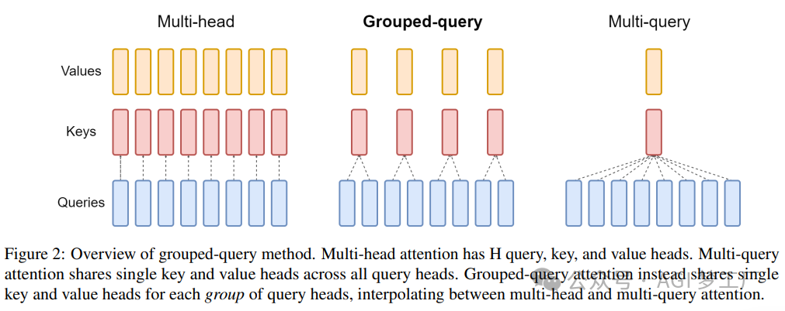
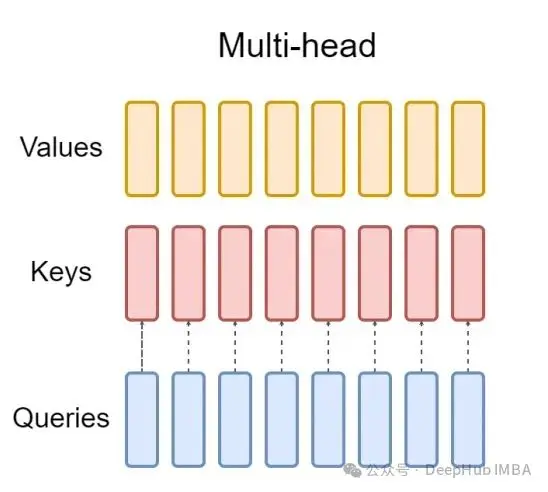
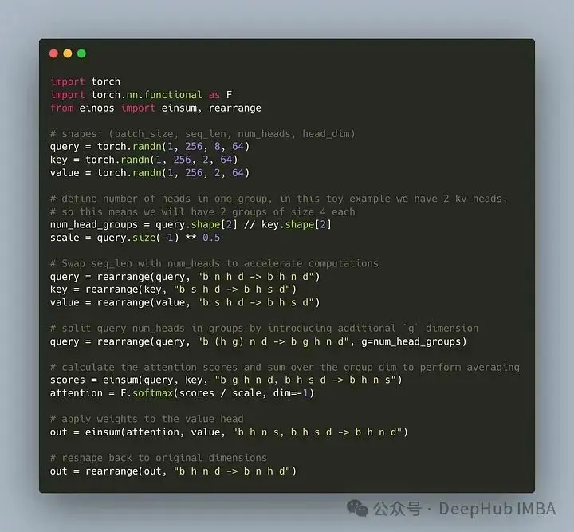
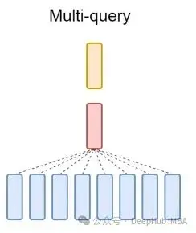
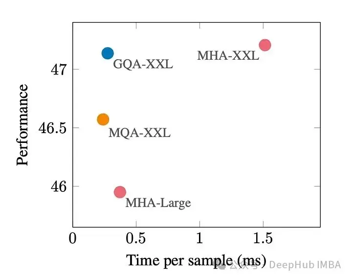

> 原文地址 [segmentfault.com](https://segmentfault.com/a/1190000044768248)

分组查询注意力 (Grouped Query Attention) 是一种在大型语言模型中的多查询注意力 (MQA) 和多头注意力 (MHA) 之间进行插值的方法，它的目标是在保持 MQA 速度的同时实现 MHA 的质量。

这篇文章中，我们将解释GQA的思想以及如何将其转化为代码。

GQA是在论文 GQA: Training Generalized Multi-Query Transformer Models from Multi-Head Checkpoints paper.中提出，这是一个相当简单和干净的想法，并且建立在多头注意力之上。



GQA
---

标准多头注意层(MHA)由H个查询头、键头和值头组成。每个头都有D个维度。Pytorch的代码如下：

```python
 fromtorch.nn.functionalimportscaled_dot_product_attention
 
 # shapes: (batch_size, seq_len, num_heads, head_dim)
 query=torch.randn(1, 256, 8, 64)
 key=torch.randn(1, 256, 8, 64)
 value=torch.randn(1, 256, 8, 64)
 
 output=scaled_dot_product_attention(query, key, value)
 print(output.shape) # torch.Size([1, 256, 8, 64])
```

对于每个查询头，都有一个对应的键。这个过程如下图所示:



而GQA将查询头分成G组，每组共享一个键和值。可以表示为:


使用可视化的表示就能非常清楚的了解GQA的工作原理，就像我们上面说的那样，GQA是一个相当简单和干净的想法

Pytorch代码实现
-----------

让我们编写代码将这种将查询头划分为G组，每个组共享一个键和值。我们可以使用einops库有效地执行对张量的复杂操作。

首先，定义查询、键和值。然后设置注意力头的数量，数量是随意的，但是要保证num_heads_for_query % num_heads_for_key = 0，也就是说要能够整除。我们的定义如下：

```
 importtorch
 
 # shapes: (batch_size, seq_len, num_heads, head_dim)
 query=torch.randn(1, 256, 8, 64)
 key=torch.randn(1, 256, 2, 64)
 value=torch.randn(1, 256, 2, 64)
 
 num_head_groups=query.shape[2] //key.shape[2]
 print(num_head_groups) # each group is of size 4 since there are 2 kv_heads
```

为了提高效率，交换seq_len和num_heads维度，einops可以像下面这样简单地完成:

```
 fromeinopsimportrearrange
 
 query=rearrange(query, "b n h d -> b h n d")
 key=rearrange(key, "b s h d -> b h s d")
 value=rearrange(value, "b s h d -> b h s d")
```

然后就是需要在查询矩阵中引入”分组“的概念。

```
 fromeinopsimportrearrange
 query=rearrange(query, "b (h g) n d -> b g h n d", g=num_head_groups)
 print(query.shape) # torch.Size([1, 4, 2, 256, 64])
```

上面的代码我们将二维重塑为二维：对于我们定义的张量，原始维度8(查询的头数)现在被分成两组(以匹配键和值中的头数)，每组大小为4。

最后最难的部分是计算注意力的分数。但其实它可以在一行中通过insum操作完成的

```
 fromeinopsimporteinsum, rearrange
 # g stands for the number of groups
 # h stands for the hidden dim
 # n and s are equal and stands for sequence length
 
 scores=einsum(query, key, "b g h n d, b h s d -> b h n s")
 print(scores.shape) # torch.Size([1, 2, 256, 256])
```

scores张量和上面的value张量的形状是一样的。我们看看到底是怎么操作的

einsum帮我们做了两件事:

1、一个查询和键的矩阵乘法。在我们的例子中，这些张量的形状是(1,4,2,256,64)和(1,2,256,64)，所以沿着最后两个维度的矩阵乘法得到(1,4,2,256,256)。

2、对第二个维度(维度g)上的元素求和——如果在指定的输出形状中省略了维度，einsum将自动完成这项工作，这样的求和是用来匹配键和值中的头的数量。

最后是注意分数与值的标准乘法:

```
 importtorch.nn.functionalasF
 
 scale=query.size(-1) **0.5
 attention=F.softmax(similarity/scale, dim=-1)
 
 # here we do just a standard matrix multiplication
 out=einsum(attention, value, "b h n s, b h s d -> b h n d")
 
 # finally, just reshape back to the (batch_size, seq_len, num_kv_heads, hidden_dim)
 out=rearrange(out, "b h n d -> b n h d")
 print(out.shape) # torch.Size([1, 256, 2, 64])
```

这样最简单的GQA实现就完成了，只需要不到16行python代码:



最后再简单提一句MQA：多查询注意(MQA)是另一种简化MHA的流行方法。所有查询将共享相同的键和值。原理图如下:



可以看到，MQA和MHA都可以从GQA推导出来。具有单个键和值的GQA相当于MQA，而具有与头数量相等的组的GQA相当于MHA。

GQA的好处是什么?
----------

GQA是最佳性能(MQA)和最佳模型质量(MHA)之间的一个很好的权衡。

下图显示，使用GQA，可以获得与MHA几乎相同的模型质量，同时将处理时间提高3倍，达到MQA的性能。这对于高负载系统来说可能是必不可少的。



在pytorch中没有GQA的官方实现。所以我找到了一个比较好的非官方实现，有兴趣的可以试试：

[https://avoid.overfit.cn/post/58ee0d8f5ed14414bc856080ab748047](https://link.segmentfault.com/?enc=mGQUbtXoEiTzqr0C0zcIsQ%3D%3D.EGIVnF8ylzTHRLjmIfSL3U%2FFC0tlieItnFIa0uuOk0HD43fgBBcvVgzc2APJVoKFxxidKgErCwdm5L68j%2BxUGw%3D%3D)

