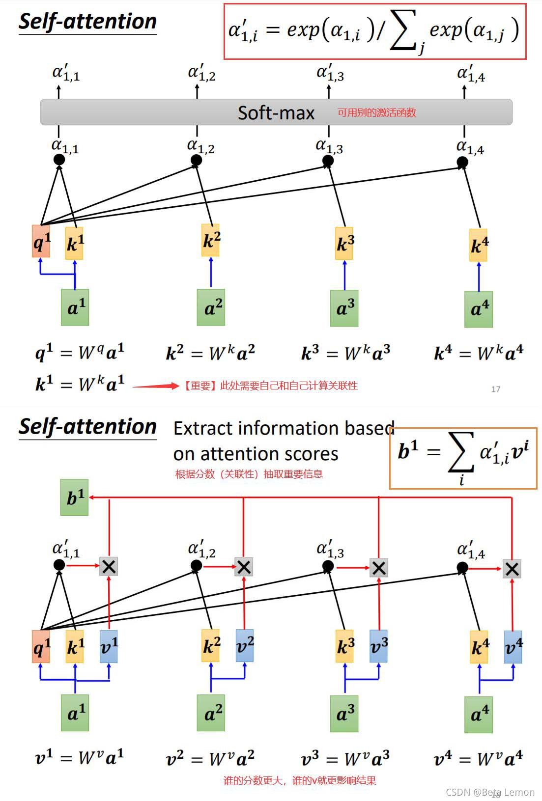
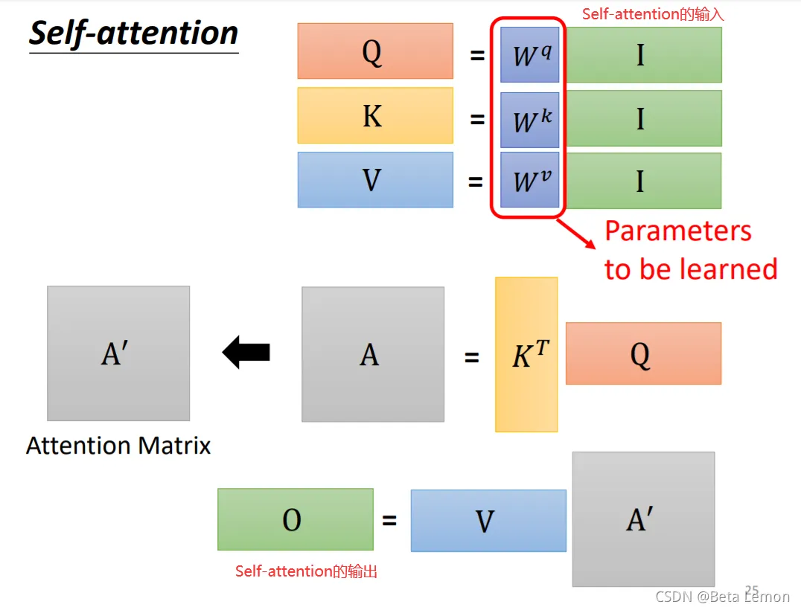

## 多头注意力
在每个自注意力模块中，对 于输入的词元序列，将其映射为相应的查询（Query$Q$）、键（Key $K$）和值（Value, $V$）三个矩阵。然后，对于每个查询$Q$，将和所有没有被mask的键$V$之间计算点积。这些点积值进一步除以 $\sqrt D$进行缩放（$D$是键$V$对应的向量维度），被传入到 $softmax$ 函数中用于权重的计算。进一步，这些权重将作用于与键相关联的值，通过加权和的形式计算得到最终的输出。
数学公式为：\
$Q = XW^Q$\
$K=XW^K$\
$V=XW^V$\
$Attention(Q,K,V)=softmax(\frac{QK^T}{\sqrt D})V$\
参照下面的图解，输入序列为：$I=[a^1,a^2,a^3,a^4]$,$W^q,W^k,W^v$分别为4x4的矩阵，分别计算得到每个词元的$q,k,v$向量，维度都为4x1，所以$q$与$k$点积时，$k$必须转置。





### 多头注意力机制
多头注意力机制的主要区别在于它使用了 $H$组结构相同 但映射参数不同的自注意力模块。输入序列首先通过不同的权重矩阵被映射为一 组查询、键和值。每组查询、键和值的映射构成一个“头”，并独立地计算自注意 力的输出。最后，不同头的输出被拼接在一起，并通过一个权重矩阵  $W^O∈R^{H*H}$进行映射，产生最终的输出。如


自注意力机制能够**直接建模序列中任意两个位置之间的关系**，进而有效捕获长程依赖关系，具有更强的序列建模能力。另一个主要的优势 是，自注意力的计算过程**对于基于硬件的并行优化（如 GPU、TPU 等）非常友好， 因此能够支持大规模参数的高效优化**。


### 代码实现
```python
import torch
import torch.nn as nn
import numpy as np
import torch.nn.functional as F
 
class MultiHeadAttention(nn.Module):
    '''
    input:
        query --- [N, T_q, query_dim] 
        key --- [N, T_k, key_dim]
        mask --- [N, T_k]
    output:
        out --- [N, T_q, num_units]
        scores -- [h, N, T_q, T_k]
    '''
 
    def __init__(self, query_dim, key_dim, num_units, num_heads):
 
        super().__init__()
        self.num_units = num_units
        self.num_heads = num_heads
        self.key_dim = key_dim
 
        self.W_query = nn.Linear(in_features=query_dim, out_features=num_units, bias=False)
        self.W_key = nn.Linear(in_features=key_dim, out_features=num_units, bias=False)
        self.W_value = nn.Linear(in_features=key_dim, out_features=num_units, bias=False)
 
    def forward(self, query, key, mask=None):
        querys = self.W_query(query)  # [N, T_q, num_units]
        keys = self.W_key(key)  # [N, T_k, num_units]
        values = self.W_value(key)
 
        split_size = self.num_units // self.num_heads
        querys = torch.stack(torch.split(querys, split_size, dim=2), dim=0)  # [h, N, T_q, num_units/h]
        keys = torch.stack(torch.split(keys, split_size, dim=2), dim=0)  # [h, N, T_k, num_units/h]
        values = torch.stack(torch.split(values, split_size, dim=2), dim=0)  # [h, N, T_k, num_units/h]
 
        ## score = softmax(QK^T / (d_k ** 0.5))
        scores = torch.matmul(querys, keys.transpose(2, 3))  # [h, N, T_q, T_k]
        scores = scores / (self.key_dim ** 0.5)
 
        ## mask
        if mask is not None:
            ## mask:  [N, T_k] --> [h, N, T_q, T_k]
            mask = mask.unsqueeze(1).unsqueeze(0).repeat(self.num_heads,1,querys.shape[2],1)
            scores = scores.masked_fill(mask, -np.inf)
        scores = F.softmax(scores, dim=3)
 
        ## out = score * V
        out = torch.matmul(scores, values)  # [h, N, T_q, num_units/h]
        out = torch.cat(torch.split(out, 1, dim=0), dim=3).squeeze(0)  # [N, T_q, num_units]
 
        return out,scores
```

使用：
```python
## 类实例化
attention = MultiHeadAttention(3,4,5,1)
 
## 输入
qurry = torch.randn(8, 2, 3)
key = torch.randn(8, 6 ,4)
mask = torch.tensor([[False, False, False, False, True, True],
                     [False, False, False, True, True, True],
                     [False, False, False, False, True, True],
                     [False, False, False, True, True, True],
                     [False, False, False, False, True, True],
                     [False, False, False, True, True, True],
                     [False, False, False, False, True, True],
                     [False, False, False, True, True, True],])
 
## 输出
out, scores = attention(qurry, key, mask)
print('out:', out.shape)         ## torch.Size([8, 2, 5])
print('scores:', scores.shape)   ## torch.Size([1, 8, 2, 6])
```