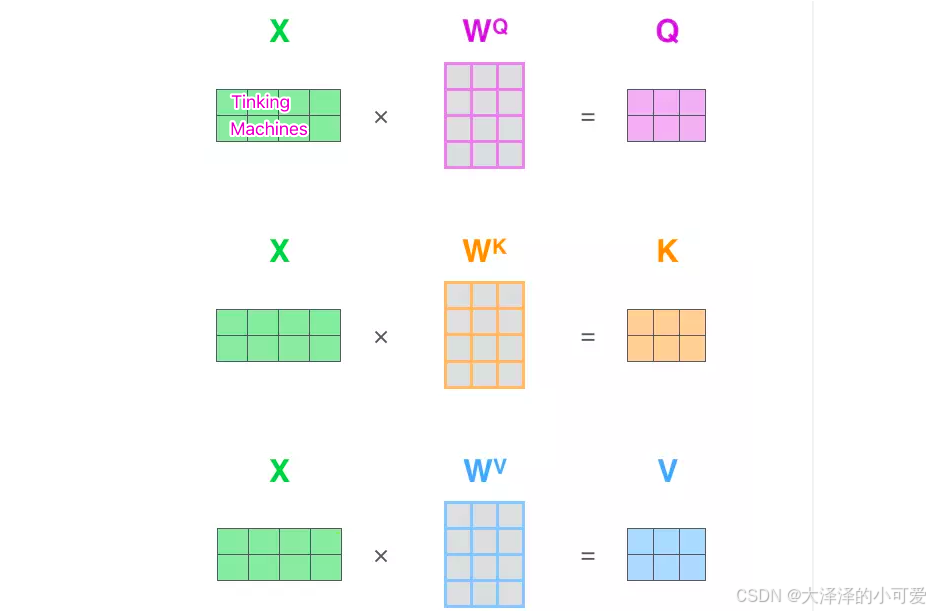
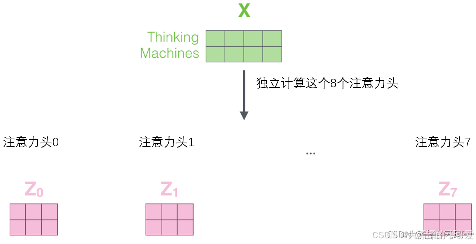

> 原文地址 [blog.csdn.net](https://blog.csdn.net/zhangzhao147/article/details/140957319)

#### python手撕——多头注意力机制

*   [1.定义变量，以及main函数调用多头注意力类](#1main_8)
*   [2.多头注意力类的实现](#2_21)
*   *   [2.1初始化函数](#21_22)
    *   [2.2 forward函数](#22_forward_39)
    *   *   [2.2.1线性映射](#221_40)
        *   [2.2.2 多头运算](#222__61)
        *   [2.2.3点积运算获得相关矩阵](#223_83)
        *   [2.2.4加权求和以及结果拼接](#224_105)

备注：以前搞的方法比较传统，现在搞卫星图像目标跟踪要用transfomer，最近在学习这方面，为了加深理解，打算手写一个transfomrer，发帖子当作笔记使用，有错误还请指出。

[参考帖子1.](https://blog.csdn.net/2401_84205765/article/details/140487757)  
[参考帖子2](https://zhuanlan.zhihu.com/p/675569052)  
[b站还有大佬的视频手撕讲解](https://www.bilibili.com/video/BV1o2421A7Dr/?spm_id_from=333.788&vd_source=a275f497832d2faa2de2cc24805998df)

1.定义变量，以及main函数调用多头注意力类
-----------------------

假设输入10个单词，我们把他embedding为输入变量X，这个X为max_len乘embedding_dim 的矩阵

```python
embedding_dim = 512                              #每个单词的维度
max_len = 10                                                 #单词数量
num_heads = 8                                             #多头注意力机制的头数
embedded_sentence=X                           #这就是输入，10x512的矩阵` 
```

接下来我们定义一个多头注意力的类，main函数如下

```python
attention_layer = MultiHeadAttention(embed_dim=embedding_dim, num_heads=num_heads)
attention_output = attention_layer(embedded_sentence.unsqueeze(0))  # 添加 batch 维度
```

2.多头注意力类的实现
-----------

### 2.1初始化函数

```python
def __init__(self, embed_dim, num_heads):
    super(MultiHeadAttention, self).__init__()
    self.num_heads = num_heads
    self.embed_dim = embed_dim
    self.head_dim = embed_dim // num_heads     #这一步将输入向量分割为多个注意力头，每个头独立地执行注意力计算
    

    self.query=nn.Linear(embed_dim, embed_dim)
    self.key=nn.Linear(embed_dim, embed_dim)
    self.value=nn.Linear(embed_dim, embed_dim)
    self.out = nn.Linear(embed_dim, embed_dim)
 #nn.Linear(embed_dim, embed_dim)定义一些输入和输出维度都为embed_dim的特征映射，这些特征映射都是设置一个随机初始值，然后通过训练得到。
```

### 2.2 forward函数

#### 2.2.1线性映射



```python
def forward(self,X):
        batch_size, seq_len, embed_dim = X.size()
         #线性映射
        q = self.query(X)
        k = self.key(X)
        v = self.value(X)
        print("q1 shape:", q.shape)
        print("k1 shape:", k.shape)

```

通过线性映射得到$qkv$，也就是$X*w^q=q $的过程

> 这里输出：  
> q1 shape: torch.Size([1, 10, 512])  
> k1 shape: torch.Size([1, 10, 512])

#### 2.2.2 多头运算




接下来分为num_heads个头计算注意力，也就是将矩阵进行变形。  
[batch_size, seq_len, embed_dim]维度变为[batch_size, seq_len, num_heads, head_dim]  \
transpose(1, 2) 调换了 seq_len 和 num_heads 的维度[batch_size, num_heads, seq_len, head_dim]

```python
q = q.view(batch_size, seq_len, self.num_heads, self.head_dim).transpose(1, 2)
k = k.view(batch_size, seq_len, self.num_heads, self.head_dim).transpose(1, 2)
v = v.view(batch_size, seq_len, self.num_heads, self.head_dim).transpose(1, 2)
print("q shape:", q.shape)
print("k shape:", k.shape)

```

> 这里输出  
> q shape: torch.Size([1, 8, 10, 64])  
> k shape: torch.Size([1, 8, 10, 64])

#### 2.2.3点积运算获得相关矩阵

```python
 #最核心的，计算点积
scores = torch.matmul(q, k.transpose(-2, -1)) / (self.head_dim ** 0.5)
attn_weights = torch.nn.functional.softmax(scores, dim=-1)
attn_output = torch.matmul(attn_weights, v)

```

> 1.首先计算 k 的转置，k.transpose(-2, -1) 将 k 的最后两个维度调换  
> 2.然后计算 q 和转置后的 k 的点积，torch.matmul(q, k.transpose(-2, -1)) 结果形状为 。  
> 3.最后除以 sqrt(head_dim) 进行缩放，这是为了稳定梯度，防止点积结果过大。


```python
scores和 attn_weights 为：[batch_size, num_heads, seq_len, seq_len]
v为: [batch_size, num_heads, seq_len, head_dim]
attn_output为：[batch_size, num_heads, seq_len, head_dim]。
```

可以看到attn_weights 为相关矩阵也就是输入单词个数的平方，也就是这个矩阵决定了transformer对于计算资源的消耗

#### 2.2.4加权求和以及结果拼接

这一步是加权求和，将每个位置的值向量 v 根据注意力权重进行加权求和。

```python
attn_output = attn_output.transpose(1, 2).contiguous().view(batch_size, seq_len, embed_dim)
        output = self.out(attn_output)
        return output
```

下面是完整测试代码。

```python
import torch
import torch.nn as nn
import torch.nn.functional as F

class MultiHeadAttention(nn.Module):

    def __init__(self, embed_dim, num_heads):
        super(MultiHeadAttention, self).__init__()
        self.num_heads = num_heads
        self.embed_dim = embed_dim
        self.head_dim = embed_dim // num_heads
        
        self.query=nn.Linear(embed_dim, embed_dim)
        self.key=nn.Linear(embed_dim, embed_dim)
        self.value=nn.Linear(embed_dim, embed_dim)
        self.out = nn.Linear(embed_dim, embed_dim)
        
        
    def forward(self,X):
        batch_size, seq_len, embed_dim = X.size()
         #线性映射
        q = self.query(X)
        k = self.key(X)
        v = self.value(X)
        print("q1 shape:", q.shape)
        print("k1 shape:", k.shape)
        #[batch_size, seq_len, embed_dim]变为[batch_size, seq_len, num_heads, head_dim]
        #transpose(1, 2) 调换了 seq_len 和 num_heads 的维度[batch_size, num_heads, seq_len, head_dim]
        q=q.view(batch_size, seq_len, self.num_heads, self.head_dim).transpose(1, 2)
        k = k.view(batch_size, seq_len, self.num_heads, self.head_dim).transpose(1, 2)
        v = v.view(batch_size, seq_len, self.num_heads, self.head_dim).transpose(1, 2)
        print("q shape:", q.shape)
        print("k shape:", k.shape)

        
        #最核心的，计算点积
        scores = torch.matmul(q, k.transpose(-2, -1)) / (self.head_dim ** 0.5)
        attn_weights = torch.nn.functional.softmax(scores, dim=-1)
        
        # 首先计算 k 的转置，k.transpose(-2, -1) 将 k 的最后两个维度调换，形状变为 [batch_size, num_heads，head_dim, seq_len]。
        # 然后计算 q 和转置后的 k 的点积，torch.matmul(q, k.transpose(-2, -1)) 结果形状为 [batch_size, num_heads, seq_len, seq_len]。
        # 最后除以 sqrt(head_dim) 进行缩放，这是为了稳定梯度，防止点积结果过大。
        attn_output = torch.matmul(attn_weights, v)
        #v: [batch_size, num_heads, seq_len, head_dim]结果
        # attn_output为：[batch_size, num_heads, seq_len, head_dim]。
#        这一步是加权求和，将每个位置的值向量 v 根据注意力权重进行加权求和。
        attn_output = attn_output.transpose(1, 2).contiguous().view(batch_size, seq_len, embed_dim)
        output = self.out(attn_output)
        return output
# 简单的词汇表和分词器
def simple_tokenizer(sentence):
    word_to_index = {'this': 1, 'is': 2, 'an': 3, 'example': 4, 'sentence': 5}
    tokens = sentence.lower().split()
    return [word_to_index.get(word, 0) for word in tokens]

# 函数：将句子编码为向量
def encode_sentence(sentence, tokenizer, max_len=10):
    tokens = tokenizer(sentence)
    if len(tokens) > max_len:
        tokens = tokens[:max_len]
    else:
        tokens = tokens + [0] * (max_len - len(tokens))
    return torch.tensor(tokens, dtype=torch.long)

# 示例数据
sentence = "this is an example sentence"
vocab_size = 6  # 假设词汇表大小，包括 0
embedding_dim = 512#输入每个x1的维度
max_len = 10
# 创建一个嵌入层
embedding_layer = nn.Embedding(num_embeddings=vocab_size, embedding_dim=embedding_dim)
# 将句子编码为输入向量X
encoded_sentence = encode_sentence(sentence, simple_tokenizer, max_len)
# 嵌入句子
embedded_sentence = embedding_layer(encoded_sentence)
#上面步骤是构造一个#尺度为max_len乘embedding_dim 的向量


num_heads = 8
# 自定义多头注意力机制
attention_layer = MultiHeadAttention(embed_dim=embedding_dim, num_heads=num_heads)
attention_output = attention_layer(embedded_sentence.unsqueeze(0))  # 添加 batch 维度

print("Encoded Sentence:", encoded_sentence)
print("Embedded Sentence Shape:", embedded_sentence.shape)
print("Attention Output Shape:", attention_output.shape)
```

pytorch有现成的多头注意力模块nn.MultiheadAttention，如果调用，代码如下：

```python
import torch
import torch.nn as nn
import torch.nn.functional as F

# 简单的词汇表和分词器
def simple_tokenizer(sentence):
    word_to_index = {'this': 1, 'is': 2, 'an': 3, 'example': 4, 'sentence': 5}
    tokens = sentence.lower().split()
    return [word_to_index.get(word, 0) for word in tokens]

# 函数：将句子编码为向量
def encode_sentence(sentence, tokenizer, max_len=10):
    tokens = tokenizer(sentence)
    if len(tokens) > max_len:
        tokens = tokens[:max_len]
    else:
        tokens = tokens + [0] * (max_len - len(tokens))
    return torch.tensor(tokens, dtype=torch.long)

# 示例数据
sentence = "this is an example sentence"
vocab_size = 6  # 假设词汇表大小，包括 0
embedding_dim = 512  # 输入每个x1的维度
max_len = 10
# 创建一个嵌入层
embedding_layer = nn.Embedding(num_embeddings=vocab_size, embedding_dim=embedding_dim)
# 将句子编码为输入向量X
encoded_sentence = encode_sentence(sentence, simple_tokenizer, max_len)
# 嵌入句子
embedded_sentence = embedding_layer(encoded_sentence)

# 现成的多头注意力机制
num_heads = 8
attention_layer = nn.MultiheadAttention(embed_dim=embedding_dim, num_heads=num_heads, batch_first=True)

# 需要转置一下维度，因为 nn.MultiheadAttention 期望的输入维度是 [seq_len, batch_size, embed_dim]
embedded_sentence = embedded_sentence.unsqueeze(0)  # 添加 batch 维度
attention_output, attn_weights = attention_layer(embedded_sentence, embedded_sentence, embedded_sentence)

print("Encoded Sentence:", encoded_sentence)
print("Embedded Sentence Shape:", embedded_sentence.shape)
print("Attention Output Shape:", attention_output.shape)
print("Attention Weights Shape:", attn_weights.shape)

```