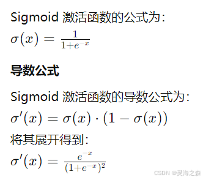
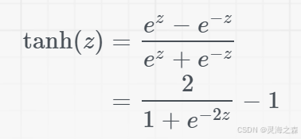
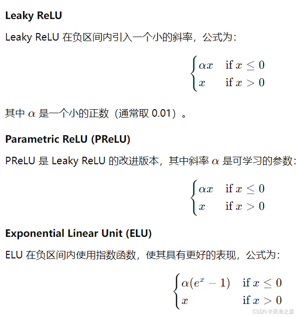

激活函数

激活函数是神经网络中的一种函数，用于对输入信号进行非线性变换，增加网络的表达能力。激活函数的选择对神经网络的性能和训练速度有很大的影响。

**1. GeLU 和 SiLU**


**2. GLU( Gated Linear Units)**


**3. GeGLU 和 SwiGLU**


> 原文地址 [blog.csdn.net](https://blog.csdn.net/qq_43814415/article/details/140751312)

### 一、激活函数的作用和价值

*   **非线性引入**：激活函数将输入转换为非线性输出，使得神经网络可以处理和学习复杂的非线性关系。
*   **梯度计算**：在反向传播中，激活函数的导数影响梯度的计算，进而影响网络的训练效果。
*   **输出范围**：激活函数定义了神经元的输出范围，从而影响网络的表达能力和训练稳定性。

### 二、梯度爆炸和梯度消失

#### 1.梯度爆炸（Gradient Explosion）

梯度爆炸是指在反向传播过程中，梯度值变得非常大，从而导致权重更新过大，使得模型参数变得不稳定，甚至导致溢出。

##### 原因

1.  **权重初始化不当**：如果权重初始化值过大，会导致反向传播时梯度值不断累积，变得越来越大。
2.  **深层网络结构**：在深度较深的网络中，由于链式法则，梯度值会在每一层相乘，如果乘积结果很大，梯度就会爆炸。
3.  **激活函数**：某些激活函数（如ReLU）在特定情况下会导致较大的梯度。

##### 解决方法

1.  **权重初始化方法**：使用合适的权重初始化方法，如He初始化或Xavier初始化。
2.  **梯度裁剪（Gradient Clipping）**：对梯度进行裁剪，限制其大小。
3.  **正则化技术**：如L2正则化，限制权重的大小。

#### 2.梯度消失（Gradient Vanishing）

梯度消失是指在反向传播过程中，梯度值变得非常小，从而导致权重更新非常慢，训练过程停滞。

##### 原因

1.  **权重初始化不当**：如果权重初始化值过小，会导致反向传播时梯度值逐层递减。
2.  **深层网络结构**：在深度较深的网络中，由于链式法则，梯度值会在每一层相乘，如果乘积结果很小，梯度就会消失。
3.  **激活函数**：某些激活函数（如sigmoid和tanh）在输入值较大或较小时，梯度值趋近于零。

##### 解决方法

1.  **权重初始化方法**：使用合适的权重初始化方法，如He初始化或Xavier初始化。
2.  **使用适当的激活函数**：如ReLU或Leaky ReLU，这些函数在大多数输入范围内梯度都不会消失。
3.  **残差网络（ResNet）**：通过引入残差连接，减小梯度消失的影响。

#### 3.激活函数与梯度爆炸、梯度消失的关系

1.  **Sigmoid和tanh**：这些激活函数在输入值较大或较小时，梯度会趋近于零，容易导致梯度消失问题。
2.  **ReLU**：在输入为负值时，梯度为零，可能会导致神经元“死亡”；但在其他情况下，梯度为1，较少导致梯度消失问题。
3.  **Leaky ReLU**：改进了ReLU，在负值区域有一个小的斜率，减小了神经元“死亡”的风险。
4.  **SiLU（Swish）**：结合了sigmoid和ReLU的优点，表现出更好的训练效果，同时减小了梯度消失和爆炸的风险。

### 三、权重初始化

包括随机、xavier，he初始化。

##### 1. 随机初始化

*   **原理**：将权重初始化为小的随机值，通常取自标准正态分布或均匀分布。
*   **实现**：适用于简单的网络，但对于深层网络容易导致梯度消失或梯度爆炸问题。

```python
import numpy as np

def random_initialization(shape):
    return np.random.randn(*shape) * 0.01
```

##### 2. Xavier初始化（Glorot初始化）

*   **原理**：旨在保持输入和输出的方差一致，防止信号在前向传播或反向传播中逐渐消失或爆炸。对每个权重设置一个在 $([- \frac{\sqrt{6}}{\sqrt{n_{in} + n_{out}}}, \frac{\sqrt{6}}{\sqrt{n_{in} + n_{out}}}])$ 范围内的随机值，其中 $(n_{in})$ 和 $(n_{out})$ 分别是权重矩阵的输入和输出维度。
*   **实现**：

```python
import numpy as np

def xavier_initialization(shape):
    in_dim, out_dim = shape
    limit = np.sqrt(6 / (in_dim + out_dim))
    return np.random.uniform(-limit, limit, size=shape)
```

##### 3. He初始化

*   **原理**：特别适用于ReLU激活函数，考虑了ReLU非对称性的影响。对每个权重设置一个在 $([- \sqrt{2/n_{in}}, \sqrt{2/n_{in}}])$ 范围内的随机值，其中 $(n_{in})$ 是权重矩阵的输入维度。
*   **实现**：

```python
import numpy as np

def he_initialization(shape):
    in_dim, _ = shape
    limit = np.sqrt(2 / in_dim)
    return np.random.randn(*shape) * limit
```

#### 实现示例

下面是一个神经网络层的实现示例，展示如何应用这些初始化方法：

```python
import numpy as np

class DenseLayer:
    def __init__(self, input_dim, output_dim, initialization='xavier'):
        self.input_dim = input_dim
        self.output_dim = output_dim
        
        if initialization == 'random':
            self.weights = random_initialization((input_dim, output_dim))
        elif initialization == 'xavier':
            self.weights = xavier_initialization((input_dim, output_dim))
        elif initialization == 'he':
            self.weights = he_initialization((input_dim, output_dim))
        else:
            raise ValueError("Unsupported initialization method")
        
        self.biases = np.zeros(output_dim)
    
    def forward(self, inputs):
        return np.dot(inputs, self.weights) + self.biases

# Example usage:
layer = DenseLayer(input_dim=128, output_dim=64, initialization='he')
inputs = np.random.randn(32, 128)  # Batch size of 32, input dimension of 128
outputs = layer.forward(inputs)
print(outputs.shape)  # Should output (32, 64)
```

#### 总结

*   **随机初始化**：简单但易导致梯度消失或爆炸问题。
*   **Xavier初始化**：适用于Sigmoid和Tanh激活函数，保持输入输出方差一致。
*   **He初始化**：适用于ReLU激活函数，考虑了ReLU的非对称性。

通过选择合适的权重初始化方法，可以有效缓解梯度消失和梯度爆炸问题，从而提高深度学习模型的训练效果和稳定性。

### 四、激活函数

#### 1.sigmoid




##### 优点

*   **输出归一化**：Sigmoid 函数将输出值限定在 0 到 1 之间，非常适合用于将概率作为输出的模型。
*   **平滑、单调递增**：Sigmoid 函数的输出是平滑且单调递增的，便于梯度的计算。

##### 缺点

*   **计算量大**：在正向传播和反向传播中都包含幂运算和除法，计算量较大。
*   **梯度消失**：当 (x) 过大或过小时，Sigmoid 函数的导数接近于 0，这会导致反向传播中的梯度消失问题，难以有效更新网络参数。例如，对于一个 10 层的网络，第 10 层的误差相对第一层卷积的参数的梯度将是一个非常小的值。
*   **输出不是 0 均值（即zero-centered）**：Sigmoid 的输出不是 0 均值，这会导致后一层的神经元将得到上一层输出的非 0 均值的信号作为输入，随着网络的加深，会改变数据的原始分布。

#### 2.softmax

##### 公式


其中，(x_i) 是输入向量中的第 (i) 个元素，(K) 是输入向量的维度。  


##### 代码

```python
# -*- coding: utf-8 -*-
import math
 
V = [9,6,3,1]
 
v1 = math.exp(9)
v2 = math.exp(6)
v3 = math.exp(3)
v4 = math.exp(1)
 
v_sum = v1+v2+v3+v4
 
print v1/v_sum,v2/v_sum,v3/v_sum,v4/v_sum
```

##### 优点

1.  **概率输出**：Softmax 将输入向量转换为一个概率分布，每个输出值在 ((0, 1)) 之间，且所有输出值之和为 1。这使得它非常适用于多分类问题。
2.  **归一化**：Softmax 函数对输入进行归一化处理，可以直观地表示各类的概率分布。

##### 缺点

1.  **数值不稳定性**：当输入值较大或较小时，指数函数 (e^{x_i}) 可能会导致数值不稳定，容易出现数值溢出或下溢的情况。
2.  **计算复杂度**：Softmax 需要计算指数函数和归一化操作，计算量较大，尤其是当输入维度 (K) 很大时。
3.  **易受干扰**：在某些情况下，Softmax 对输入值的微小变化非常敏感，可能导致输出概率的显著变化。

#### 3.tanh

##### 公式

 


##### 优点

1.  **输出范围**：Tanh 函数的输出范围是 ([-1, 1])，这使得输出均值为 0，这对于深层神经网络中的信号传播更有利。
2.  **缓解梯度消失问题**：相对于 Sigmoid 函数，Tanh 函数在中心对称于原点，其导数在输入值较小或较大时仍然较大，梯度消失问题较轻。

##### 缺点

1.  **梯度消失**：尽管比 Sigmoid 好一些，但在输入值绝对值非常大时，Tanh 的导数仍然接近 0，可能导致梯度消失问题。
2.  **计算量大**：类似于 Sigmoid，Tanh 的计算也包含指数运算，计算量较大。

#### 4.relu


##### 优点

1.  **收敛速度快**：实验表明，使用 ReLU 作为激活函数，模型的收敛速度比 Sigmoid 和 Tanh 更快。
2.  **计算复杂度低**：ReLU 只需比较和取最大值的操作，不涉及幂运算，计算效率高。
3.  **缓解梯度消失问题**：当 ( z > 0 ) 时，ReLU 的导数恒为 1，避免了深层神经网络中的梯度消失问题。
4.  **稀疏表示**：当 ( z < 0 ) 时，ReLU 的输出为 0，这种特性使得神经网络能够产生稀疏矩阵，从而增强模型的鲁棒性，保留数据的关键特征并去除噪音。

##### 缺点

1.  **输出非 0 均值**：ReLU 的输出不是以 0 为中心，类似于 Sigmoid，可能导致数据分布偏移。
2.  **神经元坏死现象**：当 ( z < 0 ) 时，ReLU 的导数为 0，导致神经元可能永远不会被激活，参数无法更新，称为 Dead ReLU Problem。
3.  **梯度爆炸问题**：ReLU 在处理大输入值时可能导致梯度爆炸问题，需要通过梯度裁剪（梯度截断）来解决。

##### 变种

为了缓解 ReLU 的缺点，尤其是神经元死亡问题，提出了几种 ReLU 的变种：  


#### 5.gelu

 


##### 优点

1.  **平滑性**：GELU 是一个平滑的激活函数，输出和输入之间存在连续的变化，不会像 ReLU 那样在 (x = 0) 处存在不连续点。
2.  **概率解释**：GELU 可以被解释为在正态分布下根据输入的值对其进行权重调整的过程，这使得它在处理高斯分布的数据时表现更好。
3.  **性能提升**：实验表明，使用 GELU 激活函数可以在某些任务中取得比 ReLU 更好的性能，尤其是在自然语言处理（NLP）任务中。

##### 缺点

1.  **计算复杂度**：GELU 的计算涉及到误差函数和指数函数，相较于 ReLU 等简单激活函数，计算复杂度更高。
2.  **实现复杂性**：由于公式较为复杂，实现和调试可能需要更多的时间和精力。

##### 应用场景

GELU 激活函数在某些深度学习模型中表现优异，特别是在 NLP 任务中，如 BERT（Bidirectional Encoder Representations from Transformers）模型中，GELU 被作为默认激活函数使用。

#### 6.SwiGLU激活函数（llama）

包含了GLU和Swish激活函数

##### GLU

GLU 全称为 Gated Linear Unit，即门控线性单元函数。


在该公式中，x 表示输入向量，⊗表示两个向量逐元素相乘，σ表示sigmoid函数。


##### Swish函数

 


##### 最终得到的SwiGLU激活函数

是将GLU的relu激活函数替换为了swish函数。  


参考LLaMA，全连接层使用带有SwiGLU激活函数的FFN(Position-wise Feed-Forward Network)的公式：  


###### SwiGLU 激活函数的优点

SwiGLU（Swish-Gated Linear Unit）是一种结合了 Swish 和 GLU（Gated Linear Unit）的激活函数，广泛应用于现代神经网络架构中，如 Transformer。以下是 SwiGLU 的主要优点：

###### 1. 提升性能

*   **应用于 Transformer 架构**：SwiGLU 被应用于 Transformer 架构中的前馈神经网络（FFN）层，显著增强了模型的性能。具体来说，通过引入 Swish 和 GLU 的优点，SwiGLU 能够更好地捕捉复杂的特征表示，提高模型的表达能力和准确性。

###### 2. 可微性

*   **处处可微**：SwiGLU 是一个处处可微的非线性函数，这意味着它在整个定义域内都是平滑和连续的。与 ReLU 等其他激活函数相比，SwiGLU 在计算梯度时不会遇到不连续点，从而在训练过程中提供更稳定和有效的梯度传播。

###### 3. 自适应性

*   **门机制**：SwiGLU 包含了类似于长短期记忆网络（LSTM）的门机制。通过门机制，模型可以自适应地控制信息通过的比例，从而选择对预测下一个词或特征有帮助的部分。这种机制使得 SwiGLU 能够更好地处理序列数据和复杂特征，提升模型的泛化能力和鲁棒性。

参考：  
https://mingchao.wang/1fb1JNJ6/#2swiglu  
https://www.heywhale.com/mw/notebook/6436195faf944ada5ce28ea5  
https://blog.csdn.net/baoyan2015/article/details/138137549  
https://blog.csdn.net/yjw123456/article/details/138441972