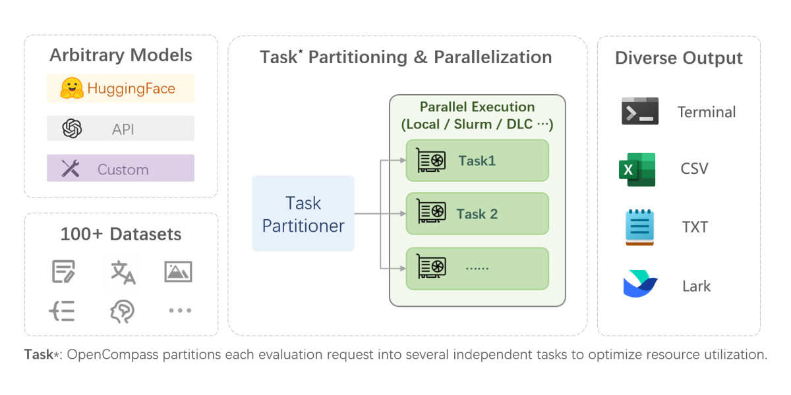
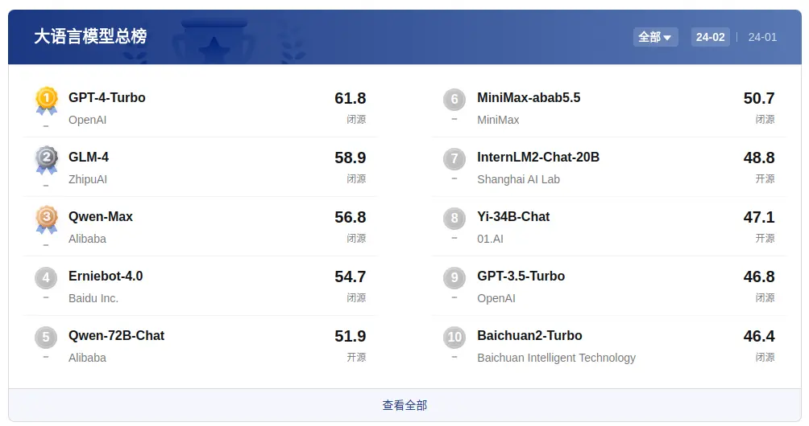
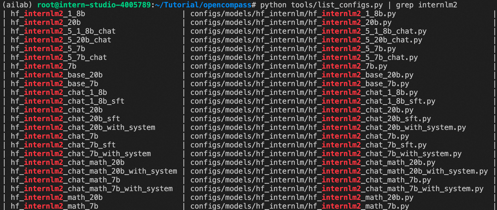

> 原文地址 [blog.csdn.net](https://blog.csdn.net/2401_85325397/article/details/139334228)

## 前言

OpenCompass，也称为“司南”，是由上海人工智能实验室发布的一个开源的大模型评测体系，已经成为目前权威的大型模型评估平台，本篇介绍如何使用OpenCompass进行大模型测评，以及其中涉及的相关知识。
官方[看这里](https://github.com/open-compass/opencompass)。

## 内容摘要

*   OpenCompass概述介绍
*   OpenCompass下载安装
*   OpenCompass快速开始
*   ppl、gen两种测评方式区别简述
*   OpenCompass的Prompt构建
*   数据集、测评指标、模型推理的配置
*   测评结果可视化

* * *

## OpenCompass概述介绍
OpenCompass是一个一站式的大模型评估平台，旨在为大模型评估提供一个公平、开放和可复制的基准。它不仅量化了模型在知识、语言、理解、推理等方面的能力，还推动了模型的迭代和优化。OpenCompass平台广泛支持 40 多个 HuggingFace 和 API 模型，整合了 100 多个基准和大约 400,000 个问题，以评估八个维度的模型。其高效的分布式评估系统可以快速、全面地评估数十亿规模的模型。该平台支持各种评估方法，包括零样本评估、少样本评估和思维链评估，并具有高度可扩展的模块化设计，可以轻松添加新模型、基准测试或定制任务策略。此外，OpenCompass 还包括强大的实验管理和报告工具，用于详细跟踪和实时结果呈现。\
OpenCompass工作流程为：


### OpenCompass主要特点包括：

*   **对模型和数据集支持丰富**：支持20+HuggingFace和API模型，70+数据集的模型评估方案，约40万个问题，从五个维度全面评估模型的能力
*   **分布式高效评测**：提供了分布式评测方案，支持了本机或集群上的计算任务并行分发，实现评测并行式的提速
*   **评估范式多样化**：支持Zero-Shot、Few-Shot、思维链，内置多种Prompt模板，最大程度激发大模型潜能
*   **模块化设计和可拓展性强**：支持对用户自定义的的新模型或者数据集进行测评，各模块可高效复用和拓展
*   **实验管理和报告机制**：有完备的实验管理和报告结果跟踪，并且有多种可视化方案，输出到终端、文件、飞书

OpenCompass平台同时会发布大模型的评分榜，包含大语言模型、多模态模型、以及各个垂类领域的模型排名，为用户提供全面、客观、中立的评测参考。




## OpenCompass评估流程
### 2.1 安装依赖库

GPU 环境：

```bash
conda create --name opencompass python=3.10 pytorch torchvision pytorch-cuda -c nvidia -c pytorch -y
conda activate opencompass
git clone https://github.com/open-compass/opencompass opencompass
cd opencompass
pip install -e .
```

**接下来的步骤是在克隆完成的opencompass目录下进行**
### 2.2 数据准备

```
# 下载数据集到 data/ 处
wget https://github.com/open-compass/opencompass/releases/download/0.1.8.rc1/OpenCompassData-core-20231110.zip
unzip OpenCompassData-core-20231110.zip
```

### 2.3 快速模型评测

确保按照上述步骤正确安装 OpenCompass 并准备好数据集后，可以通过以下命令评测 LLaMA-7b 模型在 MMLU 和 C-Eval 数据集上的性能：

```
python run.py --models hf_llama_7b --datasets mmlu_ppl ceval_ppl
```

注意，通用流程中评测的是内置的一些模型，如何查看内置有哪些模型：

```bash
# 列出所有配置
python tools/list_configs.py
```

如果要看是否支持某个模型，可以：
```bash
python tools/list_configs.py | grep internlm2
```
如下：  


### 评测internlm2-chat-1.8b

使用`ceval`数据集评测`internlm2-chat-1.8b`模型
```python
python run.py --models hf_internlm2_chat_1_8b --datasets ceval_gen
```


#### OpenCompass完整指令运行
和前文一样，本节也采用C-Eval数据来测评ChatGLM2-6B，在OpenCompass项目上只需要运行**run.py**脚本，并且通过命令行传参的方式指定**模型文件路径**和**测评数据名称**即可进行评测，执行脚本如下

```bash
python run.py \
--datasets ceval_gen \
--hf-path /root/model/internlm2-chat-1_8b \
--tokenizer-path /root/model/internlm2-chat-1_8b \
--model-kwargs device_map='auto' trust_remote_code=True \
--tokenizer-kwargs padding_side='left' truncation='left' use_fast=False trust_remote_code=True \
--max-out-len 100 \
--max-seq-len 2048 \
--batch-size 8 \
--no-batch-padding \
--hf-num-gpus 1
```

```bash
python run.py 
--datasets ceval_gen 
--hf-path /share/new_models/Shanghai_AI_Laboratory/internlm2-chat-1_8b 
--tokenizer-path /share/new_models/Shanghai_AI_Laboratory/internlm2-chat-1_8b 
--tokenizer-kwargs padding_side='left' truncation='left' trust_remote_code=True 
--model-kwargs trust_remote_code=True device_map='auto' 
--max-seq-len 2048 
--max-out-len 16 
--batch-size 4 
--num-gpus 1 
--debug
```

```bash
--datasets ceval_gen \
--hf-path /share/temp/model_repos/internlm-chat-7b/ \  # HuggingFace 模型路径
--tokenizer-path /share/temp/model_repos/internlm-chat-7b/ \  # HuggingFace tokenizer 路径（如果与模型路径相同，可以省略）
--tokenizer-kwargs padding_side='left' truncation='left' trust_remote_code=True \  # 构建 tokenizer 的参数
--model-kwargs device_map='auto' trust_remote_code=True \  # 构建模型的参数
--max-seq-len 2048 \  # 模型可以接受的最大序列长度
--max-out-len 16 \  # 生成的最大 token 数
--batch-size 2  \  # 批量大小
--num-gpus 1  # 运行模型所需的 GPU 数量
--debug
```
其中datasets指定测评数据的配置方式为**ceval_gen**，gen代表以generate生成式的方式来评估大模型，ceval_gen配置方式和OpenCompass目录下的**/configs/datasets/ceval_gen.py**对应，在配置里面指明了测试数据的地址、解析方式以及Prompt构建等信息。hf-path和tokenizer-path分别指定模型文件个分词模型，直接瞄定本地已经下载好的HuggingFace模型文件即可。除此之外还需要指定其他的模型推理参数，包括max-out-len等。  

OpenCompass分别计算C-Eval每个学科的正确率，最后输出模型在4个学科大类，以及Hard模式和整体的平均得分，测评结果如下

<table><thead><tr><th>学科</th><th>得分</th></tr></thead><tbody><tr><td>ceval-stem</td><td>43.44</td></tr><tr><td>ceval-social-science</td><td>60.04</td></tr><tr><td>ceval-humanities</td><td>58.58</td></tr><tr><td>ceval-other</td><td>49.21</td></tr><tr><td>ceval-hard</td><td>36.24</td></tr><tr><td>ceval</td><td>51.06</td></tr></tbody></table>


### 自定义评测

#### 准备评测配置文件

新增如下文件`./configs/eval_{你的模型名字}.py`，  


里面的内容比如：

```python
from mmengine.config import read_base

with read_base():
    from .datasets.collections.base_medium_llama import piqa_datasets, siqa_datasets
    from .models.hf_llama.hf_llama_7b import models

datasets = [*piqa_datasets, *siqa_datasets]
```

**本段配置代码主要输出两个重要配置**：

*   评测数据集 datasets，当前是 piqa_datasets 和 siqa_datasets，也可以选择多个评测集
*   待评测模型 models，当前是 hf_llama_7b

### 3.2 准备模型
下载模型，可以从HuggingFace上面下载，这里以下载`internlm2-chat-1.8b`模型为例，
```bash
git clone 
```

对于开源模型，OpenCompass 默认直接使用 HuggingFace model ID 从 hf 上下载开源模型和权重，[点击这里](https://huggingface.co/meta-llama)，对于一些无法访问外网的机器，这里很容易网络连接失败。

对于评测开源模型的，需要先准备好模型文件，如果无法访问外网下载，可以通过 [ModelScope](https://www.modelscope.cn/models) ，这里搜索一些开源的模型，很多是 copy HuggingFace 的。  
  
下载具体的模型，建议用官方提供 Python 代码去下载，下载之后记得把模型拷贝到自己熟悉的目录下！  
  
例如，我把下载的模型拷贝到 OpenCompass 的项目下了：  
  
如果你是用自己的模型，那你就把你的模型拷贝到你指定的目录下即可！

### 3.3 修改模型配置

模型的下载没有问题后，通过如下方式来指定模型配置文件：`./configs/models/{模型名字}/{具体模型名字}.py`，如图：  


即刚刚在上个配置文件中指定的模型配置，内容修改的地方如下：

```python
from opencompass.models import HuggingFaceCausalLM
models = [
    # LLaMA 7B
    dict(
        type=HuggingFaceCausalLM,
        abbr='llama-7b-hf',
        path="/root/data/opencompass-main/llmmodel/llama-7b", # 你的模型存放的实际路径，建议使用完整绝对路径
        tokenizer_path='/root/data/opencompass-main/llmmodel/llama-7b', # 你的模型存放的实际路径，建议使用完整绝对路径
        tokenizer_kwargs=dict(padding_side='left',
                              truncation_side='left',
                              use_fast=False,
                              ),
        max_out_len=100,
        max_seq_len=2048,
        batch_size=8,
        model_kwargs=dict(device_map='auto'),
        batch_padding=False, # if false, inference with for-loop without batch padding
        run_cfg=dict(num_gpus=1, num_procs=1),
    )
]
```

将 path 和 tokenizer_path 指向本地模型目录即可。

### 3.4 启动评测

直接使用项目根目录下的 run.py，指定我们定义好的评测配置，即可运行：

`python run.py configs/eval_{你的模型名字}.py`

最终的评测结果会在 `outputs/default/{时间戳}` 输出：  


4. 参考
-----

https://zhuanlan.zhihu.com/p/669291064?utm_id=0

欢迎关注本人，我是喜欢搞事的程序猿； 一起进步，一起学习；

也欢迎关注我的wx公众号：一个比特定乾坤

* * *

* * *

##### ppl、gen两种测评方式区别简述

上一节中使用ceval_gen数据配置来评估大模型，表明其采用generate的形式，额外的还有另一种评估形式ppl，在项目的configs/datasets下能查看到ppl和gen两种数据配置，它们决定了测试数据集在Prompt构造和回答结果后处理的差异。


数据配置下的gen和ppl两种形式

ppl 是**困惑度 (perplexity)** 的缩写，是一种评价模型进行语言建模能力的指标。在OpenCompass的语境下，它一般指一种选择题的做法：给定一个上下文，模型需要从多个备选项中选择一个最合适的。此时，我们会将n个选项拼接上下文后，形成n个序列，然后计算模型对这n个序列的perplexity，我们认为其中perplexity最低的序列所对应的选项即为模型在这道题上面的推理结果，该种评测方法的后处理简单直接、确定性高。ppl的工作流程图示如下


ppl测评的方式

gen 是**生成 (generate)** 的缩写，它指的是在给定上下文的情况下，模型往后续写的结果就是这道题目上的推理结果。一般来说，续写得到的字符串需要结合上比较重的**后处理**过程，才能进行可靠的答案提取，从而完成评测。


gen测评的方式

ppl需要推理的试题+答案的组合，推理的组合数量由选项多少决定，对于单选题，如果有N个选项则需要推理N条句子分别得到困惑度才能获得最终的答案，而gen不需要组合答案，直接对问题进行推理，因此一条试题只需要推理一个句子，但是由于gen生成的结果不可控，需要配合复杂的后处理提取出答案，而ppl几乎不需要后处理。  
ppl和gen的选取由大模型的类型、试题类型和提示词要求多方因素决定，一般**Base模型没有经过指令微调，更加适合续写任务，因此Base模型一般采用ppl的方式**，而**Chat模型可以直接对问题进行回答，因此采用gen的方式**，特殊的，如果Base模型面对的试题存在多选题，或者需要CoT思维链的方式引入中间过程，则还是采用gen方式。  
在OpenCompass的官方文档中还提到第三种评估方法：clp（条件对数概率 ，conditional log probability），前文介绍的使用Python脚本来测试C-Eval就是采用clp的方法。clp条件对数概率是在给定上下文的情况下，计算下一个 token 的概率。它也仅适用于选择题，考察概率的范围仅限于备选项标号所对应的 token，取其中概率最高的 token 所对应的选项为模型的推理结果。clp的评估示意图如下


clp测评的方式

clp和ppl一样，下一个token的条件概率对答案的判断起到决定作用，区别是clp只需要推理一次，而ppl需要推理选项个数N次，因此clp更加高效，但是clp更加容易受到prompt的扰动，因此OpenCompass官方一般都采用ppl的方式，由于ppl考虑了整个句子的合理性，比clp的鲁棒性更高。

* * *

##### OpenCompass的Prompt构建

OpenCompass将测评数据集的试题通过Prompt模板组装成最终输入给大模型的语句，模板分为数据侧(Prompt Template)和模型侧(Meta Template)，原始试题依次进入为数据侧和模型侧的Prompt模板最终输入给大模型。  
数据侧的Prompt模板包括需要完成的**任务说明**，以及**上下文样例**，一个数据侧的Prompt模板样例如下


数据侧的Prompt模板样例

其中任务说明为**“Solve math questions”**，而round定义了每一轮HUMAN和BOT对话的范例，使用这个模板对数学计算问题进行提问，最终格式如下


仅使用数据侧的Prompt模板的大模型输入

其中左侧代表采用ppl的方式，将最后的答案**11**拼接到Prompt中让模型推理出困惑度，而右侧代表gen的方式，不需要给到答案，只需要提问**5+6=？**，基于模型生成的答案再做提取。  
模型侧的Prompt模板一般为了迎合模型在SFT过程中所加入一些预定义的自负串，包括在对话开头加入的系统层级的指令，以及每轮对话期望的文本格式，模型侧的Prompt模板样例如下


模型侧的Prompt模板样例

模型侧的Prompt在开头给到大模型身份提示，并且约定了每轮问答的文本格式，最终加入模型侧Prompt后的模型输入如下，上方为ppl方式，下方为gen方式


融合模型侧Prompt和数据侧Prompt的最终输入

* * *

##### 数据集、测评指标、模型推理的配置

在数据配置中对数据集、测评指标等相关信息进行了指定，我们以C-Eval测评数据为例，配置代码在configs/datasets/ceval/ceval_gen下

```
`ceval_datasets.append(
            dict(
                type=CEvalDataset,
                path="./data/ceval/formal_ceval",
                name=_name,
                abbr="ceval-" + _name if _split == "val" else "ceval-test-" +
                _name,
                reader_cfg=dict(
                    input_columns=["question", "A", "B", "C", "D"],
                    output_column="answer",
                    train_split="dev",
                    test_split=_split),
                infer_cfg=ceval_infer_cfg,
                eval_cfg=ceval_eval_cfg,
            ))` 

*   1
*   2
*   3
*   4
*   5
*   6
*   7
*   8
*   9
*   10
*   11
*   12
*   13
*   14
*   15
*   16


```

OpenCompass会遍历C-Eval的每一个科目，分别生成一个配置信息写入ceval_datasets，其中

*   **path**： 指定了数据集的路径
*   **name**：指定学科名称
*   **reader_cfg**：测评数据读取的相关信息，包括输入的表头列，答案列，训练数据和测试数据分别对应的字符串标签
*   **infer_cfg**：推理配置信息
*   **eval_cfg**：评测的配置信息

推理配置信息infer_cfg包含推理的Prompt模板，以gen为例推理配置如下，其中inferencer指定的类型为**GenInferencer**代表采用gen方式。

```
`ceval_infer_cfg = dict(
            ice_template=dict(
                type=PromptTemplate,
                template=dict(
                    begin="</E>",
                    round=[
                        dict(
                            role="HUMAN",
                            prompt=
                            f"以下是中国关于{_ch_name}考试的单项选择题，请选出其中的正确答案。\n{{question}}\nA. {{A}}\nB. {{B}}\nC. {{C}}\nD. {{D}}\n答案: "
                        ),
                        dict(role="BOT", prompt="{answer}"),
                    ]),
                ice_token="</E>",
            ),
            retriever=dict(type=FixKRetriever, fix_id_list=[0, 1, 2, 3, 4]),
            inferencer=dict(type=GenInferencer),
        )` 

*   1
*   2
*   3
*   4
*   5
*   6
*   7
*   8
*   9
*   10
*   11
*   12
*   13
*   14
*   15
*   16
*   17
*   18
*   19


```

评测配置包含评测的指标和后处理，在C-Eval这种单选题的形式下评测指标是正确率**AccEvaluator**，如果采用的gen模式需要指定后处理方式，C-Eval使用的**first_capital_postprocess**后处理

```
`ceval_eval_cfg = dict(
            evaluator=dict(type=AccEvaluator),  # TODO 评估指标：正确率
            pred_postprocessor=dict(type=first_capital_postprocess))  # TODO 后处理,提取第一个大写英文字符` 

*   1
*   2
*   3
*   4


```

跟踪first_capital_postprocess，它的作用是抽取回答内容的**第一个大写英文字母**作为答案

```
`@TEXT_POSTPROCESSORS.register_module('first-capital')
def first_capital_postprocess(text: str) -> str:
    for t in text:
        if t.isupper():
            return t
    return ''` 

*   1
*   2
*   3
*   4
*   5
*   6
*   7


```

ppl方式的Prompt和后处理和gen有差异，感兴趣的读者可以自行阅读ppl的C-Eval数据配置源码。  
在OpenCompass快速开始章节中以chatglm2-6为例，其中已经给到了模型推理配置，包括模型和分词模型路径，最大推理长度，推理的batch_size等，在此不再敖述。

* * *

##### 测评结果可视化

在OpenCompass快速开始章节中测评结果打印在终端上，同步的OpenCompass会将评测信息写入本地文件，默认在项目的**outputs/default**下，进入对应的评测版本号，一共有5个文件夹

```
`(opencompass) ubuntu@root :~/myproject/opencompass-main/outputs/default/20240220_143747$ ls -l
总用量 20
drwxr-xr-x 2 root root 4096  2月 20 14:37 configs
drwxr-xr-x 4 root root 4096  2月 20 14:45 logs
drwxr-xr-x 3 root root 4096  2月 20 14:38 predictions
drwxr-xr-x 3 root root 4096  2月 20 14:45 results
drwxr-xr-x 2 root root 4096  2月 20 14:48 summary` 

*   1
*   2
*   3
*   4
*   5
*   6
*   7
*   8


```

*   **configs**：记录了每个科目的数据配置信息，包括Prompt模板，标签名称等
*   **logs**：程序运行日志，又包括eval日志和infer日志，其中eval日志记录了每个科目的正确率和运行耗时，infer日志记录了推理日志，包括运行进度，报错信息等
*   **predictions**：记录每个科目的模型回答结果，其中包含了模型的最终输入和输出，通过该文件可以追溯每一条问题的回答结果。以一条信息为例

```
`{
    "0": {
        "origin_prompt": "以下是中国关于注册会计师考试的单项选择题，请选出其中的正确答案。\n甲公司是国内一家上市公司。甲公司对其各子公司实行全面预算管理，并通常使用增量预算方式进行战略控制，子公司预算需要经甲公司预算管理委员会批准后执行。2015年10月，甲公司投资了一个新的项目乙(子公司)。2015年11月，甲公司启动2016年度预算编制工作，此时甲公司应要求乙公司编制____。\nA. 增量预算\nB. 零基预算\nC. 固定预算\nD. 弹性预算\n答案: \nB\n以下是中国关于注册会计师考试的单项选择题，请选出其中的正确答案。\n债务人转让全部合同义务的，下列说法不正确的是____。\nA. 须债权人同意方可进行\nB. 新债务人可主张原债务人对债权人的抗辩\nC. 债务人转移债务的，原债务人对债权人享有债权的，新债务人可以向债权人主张抵销\nD. 非专属于原债务人自身的从债务，一并转让给新债务人\n答案: \nC\n以下是中国关于注册会计师考试的单项选择题，请选出其中的正确答案。\n某公司2012年以150万元的价格进口了1台仪器；2014年6月因出现故障运往日本修理(出境时已向海关报明)，2014年10月，按海关规定的期限复运进境。此时，该仪器的国际市场价格为200万元。若经海关审定的修理费和料件费为40万元，运费为1.5万元，保险费用为2.8万元，进口关税税率为6%。该仪器复运进境时，应缴纳的进口关税为____万元。\nA. 9\nB. 3\nC. 2.4\nD. 12\n答案: \nC\n以下是中国关于注册会计师考试的单项选择题，请选出其中的正确答案。\n公开发行公司债券，证监会同意注册的决定自作出之日起一定期限内有效，发行人应当该期限内发行公司债券。该期限是____。\nA. 6个月\nB. 1年\nC. 2年\nD. 3年\n答案: \nC\n以下是中国关于注册会计师考试的单项选择题，请选出其中的正确答案。\n某集团公司在一家银行开设了许多不同的银行账户，那么，该集团公司可以要求银行在考虑其利息及透支限额时将其子公司的账户余额集中起来。下列不属于现金余额集中的好处是____。\nA. 盈余与赤字相抵\nB. 加强控制\nC. 增加投资机会\nD. 匹配\n答案: \nD\n以下是中国关于注册会计师考试的单项选择题，请选出其中的正确答案。\n下列关于税法基本原则的表述中，不正确的是____。\nA. 税收法定原则包括税收要件法定原则和税务合法性原则\nB. 税收公平原则源于法律上的平等性原则\nC. 税
收效率原则包含经济效率和行政效率两个方面\nD. 税务机关按法定程序依法征税，可以自由做出减征、停征或免征税款的决定\n答案: ",
        "prediction": "\nD",
        "gold": "D"
    },
}` 

*   1
*   2
*   3
*   4
*   5
*   6
*   7
*   8
*   9


```

origin_prompt为最终的模型输入，它采用**Few-Shot Answer Only**方式，将dev数据集中属于该科目的问题+答案作为范例，将其中一条val中的问题拼接在所有范例之后，让大模型回答答案。prediction为模型的回答，gold为标准答案，这条信息表明，大模型在该科目的编号为0的问题上回答为D，并且回答正确。

*   **results**：记录了每个科目的正确率结果
*   **summary**：记录了最终评测结果，以csv表格的形式呈现，结果如下


本篇介绍了如何快速上手和理解OpenCompass，对于该项目来说所介绍的内容只是冰山一角，有兴趣的读者可以自行阅读官方文档，全文完毕。

最后的最后
-----

**感谢你们的阅读和喜欢，我收藏了很多技术干货，可以共享给喜欢我文章的朋友们，如果你肯花时间沉下心去学习，它们一定能帮到你。**

因为这个行业不同于其他行业，知识体系实在是过于庞大，知识更新也非常快。作为一个普通人，无法全部学完，所以我们在提升技术的时候，首先需要明确一个目标，然后制定好完整的计划，同时找到好的学习方法，这样才能更快的提升自己。

**这份完整版的大模型 AI 学习资料已经上传CSDN，朋友们如果需要可以微信扫描下方CSDN官方认证二维码免费领取【`保证100%免费`】**  


#### 一、全套AGI大模型学习路线

**AI大模型时代的学习之旅：从基础到前沿，掌握人工智能的核心技能！**


#### 二、640套AI大模型报告合集

这套包含640份报告的合集，涵盖了AI大模型的理论研究、技术实现、行业应用等多个方面。无论您是科研人员、工程师，还是对AI大模型感兴趣的爱好者，这套报告合集都将为您提供宝贵的信息和启示。


#### 三、AI大模型经典PDF籍

随着人工智能技术的飞速发展，AI大模型已经成为了当今科技领域的一大热点。这些大型预训练模型，如GPT-3、BERT、XLNet等，以其强大的语言理解和生成能力，正在改变我们对人工智能的认识。 那以下这些PDF籍就是非常不错的学习资源。


#### 四、AI大模型商业化落地方案


**这份完整版的大模型 AI 学习资料已经上传CSDN，朋友们如果需要可以微信扫描下方CSDN官方认证二维码免费领取【`保证100%免费`】**  
