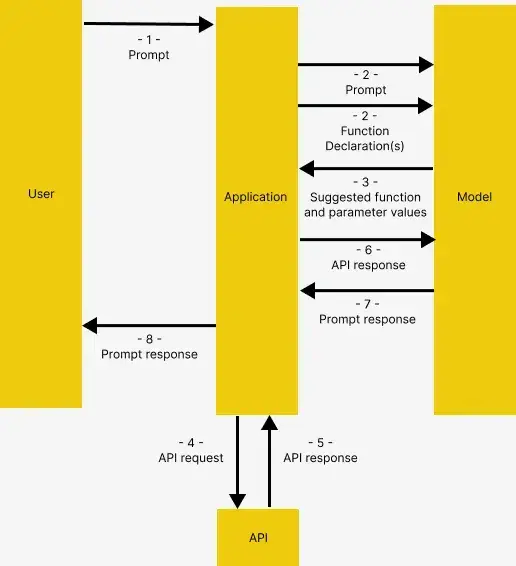
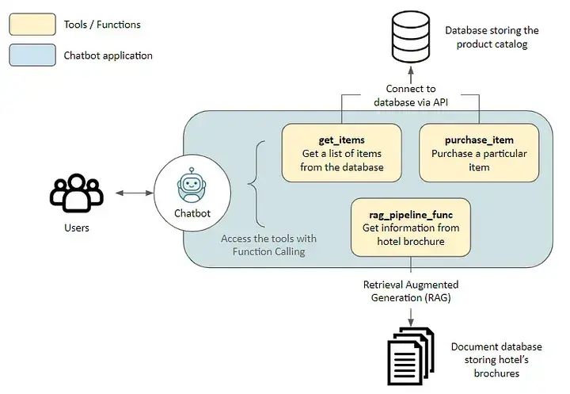
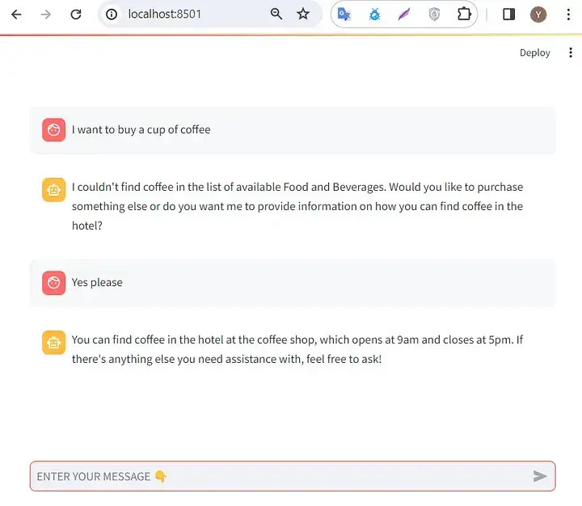

> 原文地址 [segmentfault.com](https://segmentfault.com/a/1190000044903044)

> **编者按：** 大语言模型拥有令人惊叹的语言理解和生成能力，却也存在自主决策、与外部系统交互等方面的不足。函数调用（Function Calling）技术的出现，正是为解决这一难题而生的创新方案，它赋予了大语言模型更强的自主能力和与外部世界连接的能力，成为实现真正智能自主 Agent 的关键一环。
> 
> 本期我们精心为各位读者伙伴呈现一篇详实的搭建技术教程，全面介绍了如何利用函数调用技术构建 Autonomous AI Agents 。作者从函数调用（Function Calling）的工作原理和应用场景出发，通过构建一个旅游服务助手的实例，层层递进地讲解了整个系统的设计思路、技术细节和代码实现。
> 
> 希望通过阅读本文，各位读者伙伴能获得启发，为开发更智能、更人性化的 AI Agents 寻得更宽广的光明大道。

**作者 | Julian Yip**

**编译 | 岳扬**

函数调用并非一个新鲜概念。早在 2023 年 7 月，  OpenAI 就为其 GPT 模型引入了这一功能，现在这一功能也被其他竞争对手采用。比如，谷歌的 Gemini API 最近也开始支持函数调用， Anthropic 也在将其整合到 Claude 中。函数调用（译者注：Function Calling，允许模型通过调用特定的函数来执行某些复杂任务。）已经成为大语言模型（LLMs）的关键功能之一，能够显著增强大模型应用能力。因此，学习这项技术是极其有意义的。

基于此，我打算撰写一篇详细的教程，内容重点为基础介绍（因为这类教程已经很多了）之外的内容。本教程将专注于实际应用上，展示如何构建一个 fully autonomous AI agent（译者注：能够独立运行和做出决策的、不需要人为干预的 AI agent 。），并将其与 Streamlit 集成来实现类似 ChatGPT 的 Web 交互界面。**虽然本教程使用 OpenAI 进行演示，但本文内容同样适用于其他支持函数调用的大语言模型，例如 Gemini。**

**01 函数调用（Function Calling）的用途有哪些？**
------------------------------------

Function Calling 这一技术让开发者能够定义函数（也被称为工具（tools），可以将其视为模型要执行的操作，如进行数学运算或下订单），并让模型智能地选择并输出一个包含调用这些函数所需参数的 JSON 对象。简单来说，这一技术具备以下功能：

*   **自主决策（Autonomous decision making）** ：模型能够智能地选择所需工具来回答问题。
*   **可靠地解析过程（Reliable parsing）** ：响应一般以 JSON 格式呈现，而非更典型的对话式响应（dialogue-like response）。乍看之下似乎没什么，但正是这种技术使得 LLM 能够通过结构化输入（ structured inputs）连接到外部系统，比如通过 API 进行交互。

这种技术为人们带来了各种各样的新机遇、新机会：

*   **Autonomous AI assistants**：机器人不仅可以回答用户咨询的问题，还能与内部系统（译者注：企业内部用于处理内部业务流程、数据管理、客户关系等任务的系统）交互，处理客户下订单和退货等任务。
*   **Personal research assistants**：比方说，当我们需要制定旅行计划时，可以请这些助理在互联网搜索内容、爬取内容、比较内容，并将结果汇总到 Excel 中。
*   **IoT voice commands**：模型可以根据检测到的用户意图来控制设备或给出操作建议，例如调节空调温度。

**02 函数调用功能的运行流程**
------------------

参考 Gemini 的函数调用文档，函数调用功能的运行流程如下，OpenAI 中此功能的工作原理基本相同：




**1. 用户向应用程序发出提示词（prompt）**

**2. 应用程序会传递用户提供的提示词和函数声明（Function Declaration(s)），即对模型所需工具的描述信息**

**3. 根据函数声明，模型会给出工具选取建议和相关的请求参数。注意，模型仅会输出建议的工具和请求参数，并不会实际调用函数**

**4. & 5. 应用程序根据模型响应调用相关 API**

**6. & 7. 将 API 的响应内容再次输入模型，生成人类可读的内容**

**8. 应用程序将最终响应返回给用户，然后再次回到第 1 步，如此循环往复**

上述的介绍内容可能看起来有些许复杂，接下来将通过实例详细解释该概念。

**03 该 Agents 的整体设计和总体架构**
--------------------------

在深入讲解具体代码之前，先简要介绍一下本文介绍的这个 Agents 的整体设计和总体架构。

### **3.1 Solution：旅游服务助手**

在本文，我们将为外出旅游的酒店顾客构建一个旅游服务助手，该产品可以使用以下工具（这些工具使得该服务助手能够访问外部应用程序）。

*   **get_items 和 purchase_item**：通过 API 连接到数据库中的产品目录（product catalog），这两个工具分别用于获取商品列表和进行商品购买
*   **rag_pipeline_func**：通过检索增强生成（RAG）连接到存储和管理文档数据的存储系统，以便从非结构化文本中获取相关信息，例如酒店的宣传册



### **3.2 相关技术栈**

*   **嵌入模型（Embedding model）** ：all-MiniLM-L6-v2[2]
*   **向量数据库（Vector Database）** ：Haystack 的 InMemoryDocumentStore[3]
*   **大语言模型（LLM）** ：通过 OpenRouter 访问 GPT-4 Turbo[4]。只要支持函数调用，稍作代码修改即可使用其他大语言模型（如 Gemini）。
*   **LLM 框架**：使用 Haystack[5]，因为它易于使用，文档详尽，并且在 pipeline 的构建方面比较透明。本教程实际上是对该框架使用教程[6]的扩展。

现在开始介绍吧！

**04 使用上述技术栈构建一个 Agent 样例**
---------------------------

### **4.1 前期准备工作**

前往 Github[7] 克隆本项目代码。以下内容可以在 Notebook `function_calling_demo` 中找到。

请创建并激活一个虚拟环境，然后运行 pip install -r requirements.txt 安装所需的包。

### **4.2 项目初始化**

首先连接 OpenRouter。如果有 OpenAI API 密钥，也可以使用原始的 `OpenAIChatGenerator` 而不重写覆盖 `api_base_url` 参数。

```python
import os
from dotenv import load_dotenv
from haystack.components.generators.chat import OpenAIChatGenerator
from haystack.utils import Secret
from haystack.dataclasses import ChatMessage
from haystack.components.generators.utils import print_streaming_chunk

# Set your API key as environment variable before executing this
load_dotenv()
OPENROUTER_API_KEY = os.environ.get('OPENROUTER_API_KEY')

chat_generator = OpenAIChatGenerator(api_key=Secret.from_env_var("OPENROUTER_API_KEY"),
  api_base_url="https://openrouter.ai/api/v1",
  model="openai/gpt-4-turbo-preview",
        streaming_callback=print_streaming_chunk)  
```

**接下来，我们测试 chat_generator 是否能成功调用。**

```python
chat_generator.run(messages=[ChatMessage.from_user("Return this text: 'test'")])
```

```python
---------- The response should look like this ----------
{'replies': [ChatMessage(content="'test'", role=<ChatRole.ASSISTANT: 'assistant'>, name=None, meta={'model': 'openai/gpt-4-turbo-preview', 'index': 0, 'finish_reason': 'stop', 'usage': {}})]}  
```

### **4.3 步骤 1：选择使用合适的数据存储方案**

在此，我们将在应用程序和两个数据源（data sources）之间建立连接：用于非结构化文本的文档存储系统（Document store），以及通过 API 连接的应用程序数据库（application database via API）。

**使用 Pipeline 给文档编制索引**

需要给系统提供文本样本（sample texts），以供模型进行检索增强生成（RAG）。这些文本将被转换为嵌入（embeddings），并使用将文档数据存储在内存中的数据存储方案。

```python
from haystack import Pipeline, Document
from haystack.document_stores.in_memory import InMemoryDocumentStore
from haystack.components.writers import DocumentWriter
from haystack.components.embedders import SentenceTransformersDocumentEmbedder

# Sample documents
documents = [
    Document(content="Coffee shop opens at 9am and closes at 5pm."),
    Document(content="Gym room opens at 6am and closes at 10pm.")
]

# Create the document store
document_store = InMemoryDocumentStore()

# Create a pipeline to turn the texts into embeddings and store them in the document store
indexing_pipeline = Pipeline()
indexing_pipeline.add_component(
 "doc_embedder", SentenceTransformersDocumentEmbedder(model="sentence-transformers/all-MiniLM-L6-v2")
)
indexing_pipeline.add_component("doc_writer", DocumentWriter(document_store=document_store))

indexing_pipeline.connect("doc_embedder.documents", "doc_writer.documents")

indexing_pipeline.run({"doc_embedder": {"documents": documents}})
```

上述程序的输出结果应该与输入的示例文档数据保持一致：

```python
{'doc_writer': {'documents_written': 2}}
```

**启动 API 服务进程**

在 db_api.py 文件中创建一个用 Flask 框架构建的 API 服务，用于连接 SQLite 数据库。请在终端运行 python db_api.py，启动该服务。


如果服务成功执行，终端将显示图中所示的信息

我注意到在 db_api.py 中预置一些初始的基础数据。


_数据库中的数据样本_

### 4.4 步骤 2：定义函数（Define the functions）

这一步是在准备真正的函数，以供模型在之后的函数调用（Function Calling）步骤中调用执行。（如 02 节 “函数调用功能的运行流程” 中所述的步骤 4-5）

**RAG 函数（RAG function）**

其中之一就是 RAG 函数 `rag_pipeline_func`。这个函数的作用是让模型能够搜索之前存储在文档存储中的文本内容，并基于搜索结果提供答案。它首先使用 Haystack 这个框架。将 RAG （检索增强生成）的检索过程定义为一个 pipeline 。

```python
from haystack.components.embedders import SentenceTransformersTextEmbedder
from haystack.components.retrievers.in_memory import InMemoryEmbeddingRetriever
from haystack.components.builders import PromptBuilder
from haystack.components.generators import OpenAIGenerator

template = """
Answer the questions based on the given context.

Context:

    {{ document.content }}

Question: {{ question }}
Answer:
"""
rag_pipe = Pipeline()
rag_pipe.add_component("embedder", SentenceTransformersTextEmbedder(model="sentence-transformers/all-MiniLM-L6-v2"))
rag_pipe.add_component("retriever", InMemoryEmbeddingRetriever(document_store=document_store))
rag_pipe.add_component("prompt_builder", PromptBuilder(template=template))
# Note to llm: We are using OpenAIGenerator, not the OpenAIChatGenerator, because the latter only accepts List[str] as input and cannot accept prompt_builder's str output
rag_pipe.add_component("llm", OpenAIGenerator(api_key=Secret.from_env_var("OPENROUTER_API_KEY"),
  api_base_url="https://openrouter.ai/api/v1",
  model="openai/gpt-4-turbo-preview"))

rag_pipe.connect("embedder.embedding", "retriever.query_embedding")
rag_pipe.connect("retriever", "prompt_builder.documents")
rag_pipe.connect("prompt_builder", "llm")
```

测试函数功能是否正常工作。

```python
query = “When does the coffee shop open?”
rag_pipe.run({"embedder": {"text": query}, "prompt_builder": {"question": query}})
```

rag_pipeline_func 函数在被模型调用执行后，应该会产生如下输出。**请注意，模型给出的回答来自于我们之前提供的样本文档数据。**

```python
{'llm': {'replies': ['The coffee shop opens at 9am.'],
 'meta': [{'model': 'openai/gpt-4-turbo-preview',
 'index': 0,
 'finish_reason': 'stop',
 'usage': {'completion_tokens': 9,
 'prompt_tokens': 60,
 'total_tokens': 69,
 'total_cost': 0.00087}}]}}
```

然后，我们可以将 rag_pipe 转化为一个函数，在需要时调用 rag_pipeline_func(query) 获取基于 query 的答案，而不会返回其他的中间细节信息。

```
def rag_pipeline_func(query: str):
    result = rag_pipe.run({"embedder": {"text": query}, "prompt_builder": {"question": query}})

 return {"reply": result["llm"]["replies"][0]}
```

**定义与数据库进行交互的 API**

在此处，我们定义与数据库进行交互的 `get_items` 函数和 `purchase_itemfunctions` 函数。

```python
 # Flask's default local URL, change it if necessary
db_base_url = 'http://127.0.0.1:5000'

# Use requests to get the data from the database
import requests
import json

# get_categories is supplied as part of the prompt, it is not used as a tool
def get_categories():
    response = requests.get(f'{db_base_url}/category')
    data = response.json()
 return data

def get_items(ids=None,categories=None):
    params = {
 'id': ids,
 'category': categories,
 }
    response = requests.get(f'{db_base_url}/item', params=params)
    data = response.json()
 return data

def purchase_item(id,quantity):

    headers = {
 'Content-type':'application/json', 
 'Accept':'application/json'
 }

    data = {
 'id': id,
 'quantity': quantity,
 }
    response = requests.post(f'{db_base_url}/item/purchase', json=data, headers=headers)
 return response.json()
```

**定义工具函数列表**

现在我们已经成功完成函数的定义，接下来需要让模型识别并了解如何使用这些函数，为此我们需要为这些函数提供一些描述说明内容。

由于我们在此处使用的是 OpenAI，所以需要按照 OpenAI 要求的格式[8]来描述这些 tools（函数）。

```python
tools = [
 {
 "type": "function",
 "function": {
 "name": "get_items",
 "description": "Get a list of items from the database",
 "parameters": {
 "type": "object",
 "properties": {
 "ids": {
 "type": "string",
 "description": "Comma separated list of item ids to fetch",
 },
 "categories": {
 "type": "string",
 "description": "Comma separated list of item categories to fetch",
 },
 },
 "required": [],
 },
 }
 },
 {
 "type": "function",
 "function": {
 "name": "purchase_item",
 "description": "Purchase a particular item",
 "parameters": {
 "type": "object",
 "properties": {
 "id": {
 "type": "string",
 "description": "The given product ID, product name is not accepted here. Please obtain the product ID from the database first.",
 },
 "quantity": {
 "type": "integer",
 "description": "Number of items to purchase",
 },
 },
 "required": [],
 },
 }
 },
 {
 "type": "function",
 "function": {
 "name": "rag_pipeline_func",
 "description": "Get information from hotel brochure",
 "parameters": {
 "type": "object",
 "properties": {
 "query": {
 "type": "string",
 "description": "The query to use in the search. Infer this from the user's message. It should be a question or a statement",
 }
 },
 "required": ["query"],
 },
 },
 }
]
```

### 4.5 步骤 3：将所有系统组件整合在一起

我们现在已经准备好了测试函数调用（Function Calling）功能所需的所有系统组件！这一步骤我们需要做以下几件事：

1.  为模型提供初始提示词（prompt），并为其提供上下文
2.  提供样例用户消息，模拟真实用户的 query 或需求
3.  将之前定义的工具函数列表（tool list）作为 `tools` 参数传递给 chat generator （译者注：生成对话式回复的语言模型或 AI 系统），这是最关键的一步。

```python
# 1. Initial prompt
context = f"""You are an assistant to tourists visiting a hotel.
You have access to a database of items (which includes {get_categories()}) that tourists can buy, you also have access to the hotel's brochure.
If the tourist's question cannot be answered from the database, you can refer to the brochure.
If the tourist's question cannot be answered from the brochure, you can ask the tourist to ask the hotel staff.
"""
messages = [
    ChatMessage.from_system(context),
 # 2. Sample message from user
    ChatMessage.from_user("Can I buy a coffee?"),
 ]

# 3. Passing the tools list and invoke the chat generator
response = chat_generator.run(messages=messages, generation_kwargs= {"tools": tools})
response
```

```python
---------- Response ----------
{'replies': [ChatMessage(content='[{"index": 0, "id": "call_AkTWoiJzx5uJSgKW0WAI1yBB", "function": {"arguments": "{\"categories\":\"Food and beverages\"}", "name": "get_items"}, "type": "function"}]', role=<ChatRole.ASSISTANT: 'assistant'>, name=None, meta={'model': 'openai/gpt-4-turbo-preview', 'index': 0, 'finish_reason': 'tool_calls', 'usage': {}})]}
```

现在让我们来检查一下模型响应内容。

**需要注意的是，函数调用（Function Calling）所返回的内容，不仅包括模型选择调用的函数本身，还应该包括为调用该函数所传入的参数。**

```python
function_call = json.loads(response["replies"][0].content)[0]
function_name = function_call["function"]["name"]
function_args = json.loads(function_call["function"]["arguments"])
print("Function Name:", function_name)
print("Function Arguments:", function_args)
```

```python
---------- Response ----------
Function Name: get_items
Function Arguments: {‘categories’: ‘Food and beverages’}
```

当模型遇到另一个新问题时，会分析该问题，结合它已有的上下文信息，评估哪一个可用的工具函数最能够帮助回答这个问题。

```python
# Another question
messages.append(ChatMessage.from_user("Where's the coffee shop?"))

# Invoke the chat generator, and passing the tools list
response = chat_generator.run(messages=messages, generation_kwargs= {"tools": tools})
function_call = json.loads(response["replies"][0].content)[0]
function_name = function_call["function"]["name"]
function_args = json.loads(function_call["function"]["arguments"])
print("Function Name:", function_name)
print("Function Arguments:", function_args)
```

```python
---------- Response ----------
Function Name: rag_pipeline_func
Function Arguments: {'query': "Where's the coffee shop?"}
```

请再次注意，这一步骤实际上还没有真正调用执行任何函数，真正执行函数调用，将是我们接下来这个步骤要做的。

**调用函数**

这一步骤，我们需要将参数输入所选函数：

```python
 ## Find the correspoding function and call it with the given arguments
available_functions = {"get_items": get_items, "purchase_item": purchase_item,"rag_pipeline_func": rag_pipeline_func}
function_to_call = available_functions[function_name]
function_response = function_to_call(**function_args)
print("Function Response:", function_response)
```

```python
---------- Response ----------
Function Response: {'reply': 'The provided context does not specify a physical location for the coffee shop, only its operating hours. Therefore, I cannot determine where the coffee shop is located based on the given information.'} 
```

然后，我们可以将来自 `rag_pipeline_func` 的模型响应结果，作为上下文信息附加到 `messages` 变量中，从而让模型基于这个附加的上下文，生成最终的答复。

```python
messages.append(ChatMessage.from_function(content=json.dumps(function_response), name=function_name))
response = chat_generator.run(messages=messages)
response_msg = response["replies"][0]

print(response_msg.content)
```

```
---------- Response ----------
For the location of the coffee shop within the hotel, I recommend asking the hotel staff directly. They will be able to guide you to it accurately. 
```

现在已经完成了一个完整的用户与 AI 的对话循环！

### **4.6 步骤 4：将其转化为实时交互式对话（interactive chat）系统**

上面的代码展示了函数调用是如何实现的，但我们想更进一步，将其转化为实时交互式对话（interactive chat）系统。

在本节，我展示了两种实现方式：

1.  **较为原始的 input() 方法，将对话内容打印到 notebook 中。**
2.  **通过 Streamlit 进行渲染，提供类似 ChatGPT 的 UI 体验。**

**input() loop**

这部分代码是从 Haystack 的教程[9]中复制过来的，我们可以通过它快速测试模型。**请注意：该应用程序是为了演示函数调用（Function Calling）这一概念而创建的，并非意味着此应用程序的健壮性完美，例如：支持同时对多个项目进行排序、无幻觉等。**

```python
import json
from haystack.dataclasses import ChatMessage, ChatRole

response = None
messages = [
    ChatMessage.from_system(context)
]

while True:
 # if OpenAI response is a tool call
 if response and response["replies"][0].meta["finish_reason"] == "tool_calls":
        function_calls = json.loads(response["replies"][0].content)

 for function_call in function_calls:
 ## Parse function calling information
            function_name = function_call["function"]["name"]
            function_args = json.loads(function_call["function"]["arguments"])

 ## Find the correspoding function and call it with the given arguments
            function_to_call = available_functions[function_name]
            function_response = function_to_call(**function_args)

 ## Append function response to the messages list using `ChatMessage.from_function`
            messages.append(ChatMessage.from_function(content=json.dumps(function_response), name=function_name))

 # Regular Conversation
 else:
 # Append assistant messages to the messages list
 if not messages[-1].is_from(ChatRole.SYSTEM):
            messages.append(response["replies"][0])

        user_input = input("ENTER YOUR MESSAGE 👇 INFO: Type 'exit' or 'quit' to stop\n")
 if user_input.lower() == "exit" or user_input.lower() == "quit":
 break
 else:
            messages.append(ChatMessage.from_user(user_input))

    response = chat_generator.run(messages=messages, generation_kwargs={"tools": tools}) 
```

尽管基本的交互方式也可以运行使用，但拥有一个更加美观友好的用户界面会让用户体验更加出色。

**Streamlit 界面**

Streamlit 能够将 Python 脚本和 Web 开发技术优雅地结合，转化为可共享使用的 Web 服务应用，为这个函数调用交互式应用程序构建了一个全新的 Web 界面。上述代码已被改编成一个 Streamlit 应用，位于代码仓库的 streamlit 文件夹中。

我们可以通过以下步骤运行该应用：

1.  如果还未运行，请使用 `python db_api.py` 启动 API 服务器。
2.  将 `OPENROUTER_API_KEY` 设置为环境变量，例如在 Linux 上或使用 `git bash` 时，执行 `export OPENROUTER_API_KEY='@替换为您的API密钥'`。
3.  在终端中进入 streamlit 文件夹，目录切换命令为 `cd streamlit`。
4.  运行 `streamlit run app.py` 启动 Streamlit。浏览器应该会自动创建一个新的标签页，运行该应用程序。

基本上我想介绍的内容就是这些了！真心希望大家能够喜欢这篇文章。


