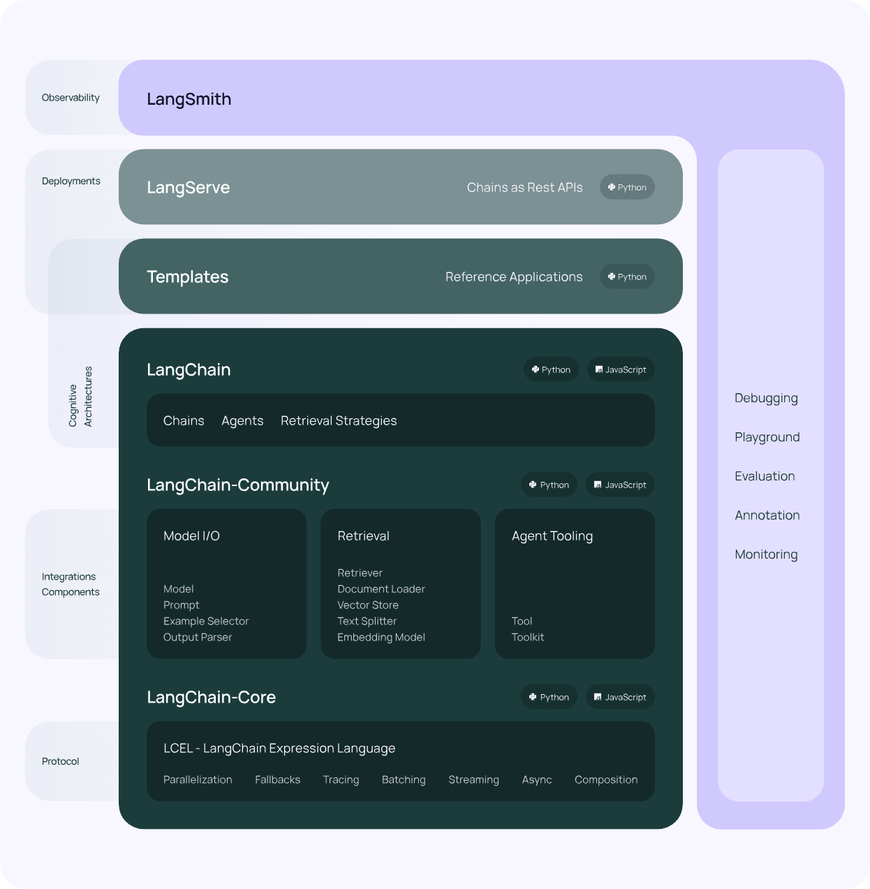

## LangChain介绍

LangChain是一个强大的框架，旨在帮助开发人员使用语言模型构建端到端的应用程序。它提供了一套工具、组件和接口，可简化创建由大型语言模型 (LLM) 和聊天模型提供支持的应用程序的过程。LangChain 可以轻松管理与语言模型的交互，将多个组件链接在一起，并集成额外的资源，例如 API 和数据库。


LangChain 简化了LLM应用程序生命周期的每个阶段：

- 开发：使用 LangChain 的开源构建模块和组件构建应用程序。使用第三方集成(opens in a new tab)和模板(opens in a new tab)快速上手。
- 生产化：使用LangSmith检查、监控和评估你的链条，以便你可以持续优化和自信地部署。
- 部署：使用LangServe(opens in a new tab)将任何链条转变为 API。



具体而言，该框架由以下开源库组成：

- langchain-core：基本抽象和 LangChain 表达式语言。
- langchain-community：第三方集成。
- 合作伙伴包（例如 langchain-openai，langchain-anthropic 等）：某些集成已进一步拆分为仅依赖于 langchain-core 的轻量级包。
- langchain：构成应用程序认知架构的链条、代理和检索策略。
- langgraph(opens in a new tab)：通过将步骤建模为图中的边缘和节点，使用LLMs构建强大且有状态的多角色应用程序。
- langserve(opens in a new tab)：将 LangChain 链条部署为 REST API。

## LangChain的常用组件

### 1. Components and Chains
在 LangChain 中，Component 是模块化的构建块，可以组合起来创建强大的应用程序。Chain 是组合在一起以完成特定任务的一系列 Components（或其他 Chain）。例如，一个 Chain 可能包括一个 Prompt 模板、一个语言模型和一个输出解析器，它们一起工作以处理用户输入、生成响应并处理输出。

### 2. Prompt Templates and Values
Prompt Template 负责创建 PromptValue，这是最终传递给语言模型的内容。Prompt Template 有助于将用户输入和其他动态信息转换为适合语言模型的格式。PromptValues 是具有方法的类，这些方法可以转换为每个模型类型期望的确切输入类型（如文本或聊天消息）。

### 3. Example Selectors
当您想要在 Prompts 中动态包含示例时，Example Selectors 很有用。他们接受用户输入并返回一个示例列表以在提示中使用，使其更强大和特定于上下文。

### 4. Output Parsers
Output Parsers 负责将语言模型响应构建为更有用的格式。它们实现了两种主要方法：一种用于提供格式化指令，另一种用于将语言模型的响应解析为结构化格式。这使得在您的应用程序中处理输出数据变得更加容易。

### 5. Indexes and Retrievers
Index 是一种组织文档的方式，使语言模型更容易与它们交互。检索器是用于获取相关文档并将它们与语言模型组合的接口。LangChain 提供了用于处理不同类型的索引和检索器的工具和功能，例如矢量数据库和文本拆分器。

### 6. Chat Message History
LangChain 主要通过聊天界面与语言模型进行交互。ChatMessageHistory 类负责记住所有以前的聊天交互数据，然后可以将这些交互数据传递回模型、汇总或以其他方式组合。这有助于维护上下文并提高模型对对话的理解。

### 7. Agents and Toolkits
Agent 是在 LangChain 中推动决策制定的实体。他们可以访问一套工具，并可以根据用户输入决定调用哪个工具。Tookits 是一组工具，当它们一起使用时，可以完成特定的任务。代理执行器负责使用适当的工具运行代理。


## 安装
安装Langchain只需要在Python中install即可
```bash
pip install langchian
```

## Demo
以下是几个Demo应用。
### 1. 调用OpenAI模型构建对话
```python
from langchain.chat_models import ChatOpenAI
from langchain.schema import (
    AIMessage,
    HumanMessage,
    SystemMessage
)
# 初始化OpenAI
chat = ChatOpenAI(temperature=0)

# 直接传递信息调用
chat([HumanMessage(content="Translate this sentence from English to French. I love programming.")])
# -> AIMessage(content="J'aime programmer.", additional_kwargs={})

# 传递多条信息调用
messages = [
    SystemMessage(content="You are a helpful assistant that translates English to Chinese."),
    HumanMessage(content="Translate this sentence from English to Chinese. I love programming.")
]
chat(messages)
# -> AIMessage(content="我喜欢编程。(Wǒ xǐhuān biānchéng.)", additional_kwargs={})

# 还可以同时传入多组数据，使用generate接口批量生成。
batch_messages = [
    [
        SystemMessage(content="You are a helpful assistant that translates English to Chinese."),
        HumanMessage(content="Translate this sentence from English to Chinese. I love programming.")
    ],
    [
        SystemMessage(content="You are a helpful assistant that translates English to Chinese."),
        HumanMessage(content="Translate this sentence from English to Chinese. I love artificial intelligence.")
    ],
]
result = chat.generate(batch_messages)
result
# -> LLMResult(generations=[[ChatGeneration(text="我喜欢编程。(Wǒ xǐhuān biānchéng.)", generation_info=None, message=AIMessage(content="我喜欢编程。(Wǒ xǐhuān biānchéng.)", additional_kwargs={}))], [ChatGeneration(text="我喜爱人工智能。(Wǒ xǐ'ài rén gōng zhì néng.)", generation_info=None, message=AIMessage(content="我喜爱人工智能。(Wǒ xǐ'ài rén gōng zhì néng.)", additional_kwargs={}))]], llm_output={'token_usage': {'prompt_tokens': 71, 'completion_tokens': 18, 'total_tokens': 89}})

```

### 2. 使用PromptTemplate
Langchian提供了各种PromptTemplate供我们使用，我们可以构建一个Template目标，并集成到Langchain中，然后就可以在运行的时候只需要传入参数，便能够自动构建好Prompt，输入模型。\
对于聊天模型，您还可以通过使用 MessagePromptTemplate 来使用模板。您可以从一个或多个 MessagePromptTemplates 创建 ChatPromptTemplate。ChatPromptTemplate 的方法format_prompt返回一个 PromptValue，您可以将其转换为字符串或 Message 对象，具体取决于您是否要使用格式化值作为 LLM 或聊天模型的输入。
```python
from langchain.chat_models import ChatOpenAI
from langchain.prompts.chat import (
    ChatPromptTemplate,
    SystemMessagePromptTemplate,
    HumanMessagePromptTemplate,
)

chat = ChatOpenAI(temperature=0)
template="You are a helpful assistant that translates {input_language} to {output_language}."
system_message_prompt = SystemMessagePromptTemplate.from_template(template)
human_template="{text}"
human_message_prompt = HumanMessagePromptTemplate.from_template(human_template)
chat_prompt = ChatPromptTemplate.from_messages([system_message_prompt, human_message_prompt])
# get a chat completion from the formatted messages
chain = LLMChain(llm=chat, prompt=chat_prompt)
chain.run(input_language="English", output_language="Chinese", text="I love programming.")
# -> "我喜欢编程。(Wǒ xǐhuān biānchéng.)"
```

## 优质资源
#### 学习Langchain最好的资源只有Langchain的官方文档，英文原版的更新太多，看起来可能无处下手，建议先从中文版的开始学习。
Langchain官方原版官网：[https://python.langchain.com/v0.1/docs/get_started/quickstart.html](https://python.langchain.com/v0.1/docs/get_started/quickstart.html)
Langchain中文网教程：[https://www.langchain.com.cn/](https://www.langchain.com.cn/)
中文网教程是对官方教程的翻译，内容几乎一致，但是更新速度可能稍微慢于官方。
该目录下的教程大多来自：[https://github.com/DjangoPeng/LLM-quickstart/tree/main/langchain](https://github.com/DjangoPeng/LLM-quickstart/tree/main/langchain)

## Tips
1. Langchain不同版本之间的差异比较大，需要注意版本之间的区别。
