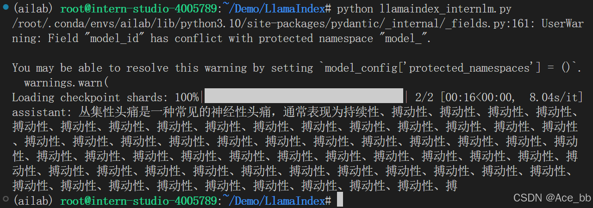
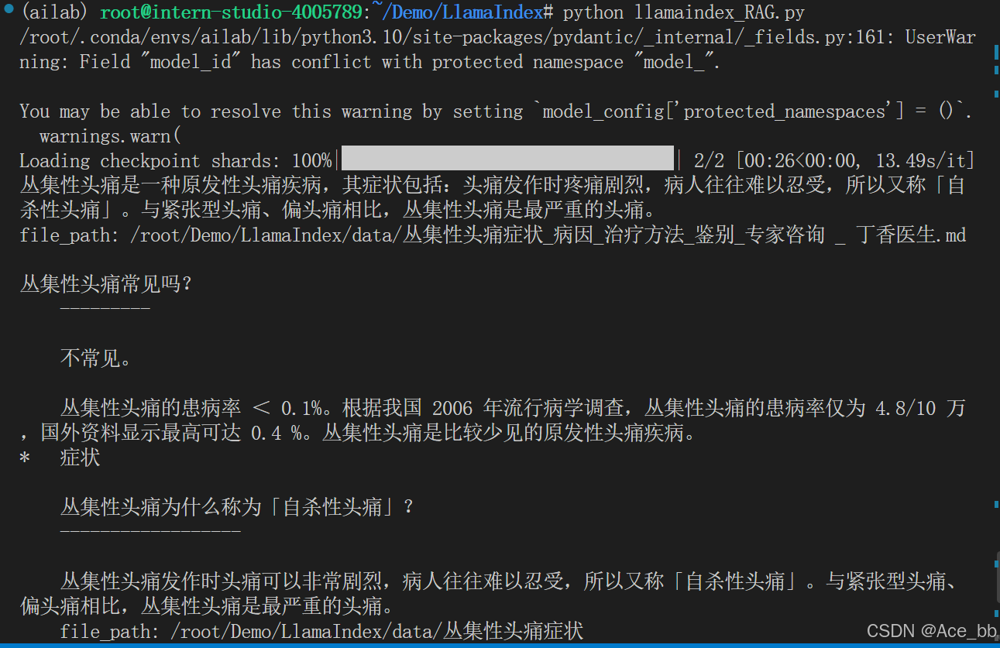

### RAG 效果比对

如图所示，由于`xtuner`是一款比较新的框架， `InternLM2-Chat-1.8B` 训练数据库中并没有收录到它的相关信息。左图中问答均未给出准确的答案。右图未对 `InternLM2-Chat-1.8B` 进行任何增训的情况下，通过 RAG 技术实现的新增知识问答。


## 2. 环境、模型准备
### 2.1 配置基础环境
这里以在 [Intern Studio](https://studio.intern-ai.org.cn/) 服务器上部署LlamaIndex为例。


进入开发机后，创建新的conda环境，命名为 `llamaindex`，在命令行模式下运行：
```bash
conda create -n llamaindex python=3.10
```
复制完成后，在本地查看环境。
```bash
conda env list
```
结果如下所示。
```bash
# conda environments:
#
base                  *  /root/.conda
llamaindex               /root/.conda/envs/llamaindex
```

运行 `conda` 命令，激活 `llamaindex` 然后安装相关基础依赖
**python** 虚拟环境:
```bash
conda activate llamaindex
conda install pytorch==2.0.1 torchvision==0.15.2 torchaudio==2.0.2 pytorch-cuda=11.7 -c pytorch -c nvidia
```
**安装python 依赖包**
```bash
pip install einops
pip install  protobuf
```

环境激活。

### 2.2 安装 Python环境和依赖包
安装Python3.10版本的Anaconda虚拟环境和相关的包
```bash
conda create -n llamaindex python=3.10
conda activate llamaindex
conda install pytorch==2.0.1 torchvision==0.15.2 torchaudio==2.0.2 pytorch-cuda=11.7 -c pytorch -c nvidia
pip install einops
pip install  protobuf
pip install llama-index==0.10.38 llama-index-llms-huggingface==0.2.0 "transformers[torch]==4.41.1" "huggingface_hub[inference]==0.23.1" huggingface_hub==0.23.1 sentence-transformers==2.7.0 sentencepiece==0.2.0
```

### 2.3 下载 Sentence Transformer 模型

源词向量模型 [Sentence Transformer](https://huggingface.co/sentence-transformers/paraphrase-multilingual-MiniLM-L12-v2):（我们也可以选用别的开源词向量模型来进行 Embedding，目前选用这个模型是相对轻量、支持中文且效果较好的，同学们可以自由尝试别的开源词向量模型）
运行以下指令，新建一个python文件，贴入以下代码
然后，执行该脚本即可自动开始下载：
```bash
cd /root/llamaindex_demo
conda activate llamaindex
python download_hf.py
```
更多关于镜像使用可以移步至 [HF Mirror](https://hf-mirror.com/) 查看。

### 2.4 下载 NLTK 相关资源
我们在使用开源词向量模型构建开源词向量的时候，需要用到第三方库 `nltk` 的一些资源。正常情况下，其会自动从互联网上下载，但可能由于网络原因会导致下载中断，此处我们可以从国内仓库镜像地址下载相关资源，保存到服务器上。
我们用以下命令下载 nltk 资源并解压到服务器上：
```bash
cd /root
git clone https://gitee.com/yzy0612/nltk_data.git  --branch gh-pages
cd nltk_data
mv packages/*  ./
cd tokenizers
unzip punkt.zip
cd ../taggers
unzip averaged_perceptron_tagger.zip
```
之后使用时服务器即会自动使用已有资源，无需再次下载

## 3. LlamaIndex HuggingFaceLLM
运行以下指令，把 `InternLM2 1.8B` 软连接出来
```bash
cd ~/model
ln -s /root/share/new_models/Shanghai_AI_Laboratory/internlm2-chat-1_8b/ ./
```
运行以下指令，新建一个python文件
```bash
cd ~/llamaindex_demo
touch llamaindex_internlm.py
```
打开llamaindex_internlm.py 贴入以下代码
```python
from llama_index.llms.huggingface import HuggingFaceLLM
from llama_index.core.llms import ChatMessage
llm = HuggingFaceLLM(
    model_name="/root/model/internlm2-chat-1_8b",
    tokenizer_name="/root/model/internlm2-chat-1_8b",
    model_kwargs={"trust_remote_code":True},
    tokenizer_kwargs={"trust_remote_code":True}
)

rsp = llm.chat(messages=[ChatMessage(content="什么是丛集性头痛?")])
print(rsp)
```
运行结果为：

回答的效果并不好，并不是我们想要的xtuner。
## 4. LlamaIndex RAG
安装 `LlamaIndex` 词嵌入向量依赖
```bash
conda activate llamaindex
pip install llama-index-embeddings-huggingface llama-index-embeddings-instructor
```
### 加载文档
LlamaIndex提供了两种方式创建文档，文档可以通过数据加载器自动创建，也可以手动构建。
默认情况下，我们所有的数据加载器（包括 LlamaHub 上提供的）都通过 load_data 函数返回 Document 对象。
详细使用方法建议看官方文档：[http://www.aidoczh.com/llamaindex/module_guides/loading/documents_and_nodes/usage_documents/](http://www.aidoczh.com/llamaindex/module_guides/loading/documents_and_nodes/usage_documents/)
```python
from llama_index.core import SimpleDirectoryReader

documents = SimpleDirectoryReader("./data").load_data()
```
您也可以选择手动构建文档。LlamaIndex 提供了 Document 结构。

```python
from llama_index.core import Document

text_list = [text1, text2, ...]
documents = [Document(text=t) for t in text_list]
```
数据加载器由LlamaHub提供，支持pdf, docs, pptx, epub等格式的数据。数据连接器使用指南建议看官方文档：
[http://www.aidoczh.com/llamaindex/module_guides/loading/connector/](http://www.aidoczh.com/llamaindex/module_guides/loading/connector/)。

这里使用的了丁香医生网站丛集性头痛内容作为知识库，原链接为：[丛集性头痛](https://dxy.com/disease/1861/detail)
导出为markdown文件。然后在项目目录下创建data目录，将md文件存入data目录中。通过配置，LlamaIndex会自动加载这个目录中的文件存入知识库中。
```bash
mkdir data
cd data
```
### 构建向量存储索引库
建议阅读LlamaIndex官方文档介绍：[http://www.aidoczh.com/llamaindex/module_guides/indexing/vector_store_index/](http://www.aidoczh.com/llamaindex/module_guides/indexing/vector_store_index/)
要构建向量索引库，首先需要完成第一步的加载文档。向量库可以接收`SimpleDirectoryReader().load_data()`返回的documents对象，构建成vector store，并提供相似度查询的接口。
使用 Vector Store 的最简单方法是使用 from_documents 加载一组文档并从中构建索引：
```python
from llama_index.core import VectorStoreIndex, SimpleDirectoryReader

# 加载文档并构建索引
documents = SimpleDirectoryReader(
    "../../examples/data/paul_graham"
).load_data()
index = VectorStoreIndex.from_documents(documents)
```
`VectorStoreIndex`构建向量库时会自动对文档进行分片。
### 检索器
检索器定义了如何在给定查询时有效地从索引中检索相关上下文。检索策略对于检索到的数据的相关性和效率至关重要。检索器主要建立在向量库索引之上，被用作查询引擎，用于从向量库中检索出相关的上下文。
最简单的方式是使用向量索引库提供的默认检索器，也就是直接进行相似度检索。
```python
retriever = index.as_retriever()
nodes = retriever.retrieve("Who is Paul Graham?")
```
使用检索器检索到与用户query相关的结果之后，便可以将检索结果交给LLM来进行回答。
### RAG代码
完整的RAG代码如下，包含了模型加载，文档加载，向量索引库构建，检索器构建和模型输出。
运行以下指令，新建一个python文件，打开`llamaindex_RAG.py`贴入以下代码
```python

from llama_index.core import VectorStoreIndex, SimpleDirectoryReader, Settings

from llama_index.embeddings.huggingface import HuggingFaceEmbedding
from llama_index.llms.huggingface import HuggingFaceLLM

#初始化一个HuggingFaceEmbedding对象，用于将文本转换为向量表示
embed_model = HuggingFaceEmbedding(
#指定了一个预训练的sentence-transformer模型的路径
    model_name="/root/model/sentence-transformer"
)
#将创建的嵌入模型赋值给全局设置的embed_model属性，
#这样在后续的索引构建过程中就会使用这个模型。
Settings.embed_model = embed_model

llm = HuggingFaceLLM(
    model_name="/root/model/internlm2-chat-1_8b",
    tokenizer_name="/root/model/internlm2-chat-1_8b",
    model_kwargs={"trust_remote_code":True},
    tokenizer_kwargs={"trust_remote_code":True}
)
#设置全局的llm属性，这样在索引查询时会使用这个模型。
Settings.llm = llm

#从指定目录读取所有文档，并加载数据到内存中
documents = SimpleDirectoryReader("/root/Demo/LlamaIndex/data").load_data()
#创建一个VectorStoreIndex，并使用之前加载的文档来构建索引。
# 此索引将文档转换为向量，并存储这些向量以便于快速检索。
index = VectorStoreIndex.from_documents(documents)
# 创建一个查询引擎，这个引擎可以接收查询并返回相关文档的响应。
query_engine = index.as_query_engine()
response = query_engine.query("什么是丛集性头痛?")

print(response)
```
运行结果为：



借助RAG技术后，就能获得我们想要的答案了。可以看到回答得比没有加RAG要好很多。

## 5. LlamaIndex web
运行之前首先安装依赖

```shell
pip install streamlit==1.36.0
```

运行以下指令，新建一个python文件

```bash
cd ~/llamaindex_demo
touch app.py
```

打开`app.py`贴入以下代码
```python
import streamlit as st
from llama_index.core import VectorStoreIndex, SimpleDirectoryReader, Settings
from llama_index.embeddings.huggingface import HuggingFaceEmbedding
from llama_index.llms.huggingface import HuggingFaceLLM

st.set_page_config(page_title="llama_index_demo", page_icon="🦜🔗")
st.title("llama_index_demo")

# 初始化模型
@st.cache_resource
def init_models():
    embed_model = HuggingFaceEmbedding(
        model_name="/root/model/sentence-transformer"
    )
    Settings.embed_model = embed_model

    llm = HuggingFaceLLM(
        model_name="/root/model/internlm2-chat-1_8b",
        tokenizer_name="/root/model/internlm2-chat-1_8b",
        model_kwargs={"trust_remote_code": True},
        tokenizer_kwargs={"trust_remote_code": True}
    )
    Settings.llm = llm

    documents = SimpleDirectoryReader("/root/llamaindex_demo/data").load_data()
    index = VectorStoreIndex.from_documents(documents)
    query_engine = index.as_query_engine()

    return query_engine

# 检查是否需要初始化模型
if 'query_engine' not in st.session_state:
    st.session_state['query_engine'] = init_models()

def greet2(question):
    response = st.session_state['query_engine'].query(question)
    return response

      
# Store LLM generated responses
if "messages" not in st.session_state.keys():
    st.session_state.messages = [{"role": "assistant", "content": "你好，我是你的助手，有什么我可以帮助你的吗？"}]    

    # Display or clear chat messages
for message in st.session_state.messages:
    with st.chat_message(message["role"]):
        st.write(message["content"])

def clear_chat_history():
    st.session_state.messages = [{"role": "assistant", "content": "你好，我是你的助手，有什么我可以帮助你的吗？"}]

st.sidebar.button('Clear Chat History', on_click=clear_chat_history)

# Function for generating LLaMA2 response
def generate_llama_index_response(prompt_input):
    return greet2(prompt_input)

# User-provided prompt
if prompt := st.chat_input():
    st.session_state.messages.append({"role": "user", "content": prompt})
    with st.chat_message("user"):
        st.write(prompt)

# Gegenerate_llama_index_response last message is not from assistant
if st.session_state.messages[-1]["role"] != "assistant":
    with st.chat_message("assistant"):
        with st.spinner("Thinking..."):
            response = generate_llama_index_response(prompt)
            placeholder = st.empty()
            placeholder.markdown(response)
    message = {"role": "assistant", "content": response}
    st.session_state.messages.append(message)
```

之后运行
```bash
streamlit run app.py
```

然后在命令行点击，红框里的url。


即可进入以下网页，然后就可以开始尝试问问题了。

询问结果为：


