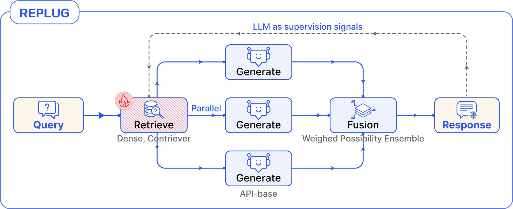

大语言模型(large Language Models, llm)已经展示出了非凡的能力，但它们仍然面临着许多挑战，如幻觉和信息更新的滞后。检索增强生成(Retrieval-augmented Generation, RAG)通过访问外部知识库，为LLM提供重要的上下文信息，显著提高法学硕士在知识密集型任务上的表现。目前，RAG作为一种增强方法，已经广泛应用于各种实际应用场景，包括知识问答、推荐系统、客户服务、个人助理等。

在RAG的初始阶段，其核心框架由**索引、检索和生成**组成，这种范式被称为**Naive RAG(朴素RAG)**。然而，随着任务的复杂性和应用程序的需求不断升级，Naive RAG的局限性变得越来越明显。如图1所示，它主要依赖于块的直接相似性，当面对复杂查询和具有大量可变性的块时，会导致性能差。Naive RAG的主要挑战包括: \
1. 对查询的肤浅理解。查询和文档块之间的语义相似性并不总是高度一致的。单纯依靠相似度计算进行检索，缺乏对查询与文档之间关系的深入探索。
2. 检索冗余和噪声。将所有检索到的块直接提供给llm并不总是有益的。研究表明，过多的冗余和噪声信息可能会干扰LLM对关键信息的识别，从而增加产生错误和幻觉反应的风险.

为了克服上述局限性，**Advanced RAG**范式侧重于优化检索阶段，旨在提高检索效率和增强检索块的利用率。如图1所示，典型的策略包括**检索前处理**和**检索后处理**。例如，**使用查询重写使查询更加清晰和具体，从而提高检索的准确性**，使用检索结果的重新排序来增强LLM识别和利用关键信息的能力

尽管Advanced RAG的实用性有所提高，但它的功能与真实的世界应用程序需求之间仍然存在差距。
- 一方面，随着RAG技术的进步，用户期望提高，需求不断发展，应用程序设置变得更加复杂。例如，异构数据的集成以及对系统透明性、控制和可维护性的新需求。
- 另一方面，应用需求的增长进一步推动了RAG技术的发展。

如图2所示，为了实现更精确和高效的任务执行，现代RAG(modern RAG)系统正在逐步集成更复杂的功能，例如以知识图的形式组织更精细的索引库，通过查询构造方法集成结构化数据，以及采用微调技术使编码器能够更好地适应特定于领域的文档。

在工艺设计方面，当前的RAG系统已经超越了传统的线性检索-生成范式。研究人员使用**迭代检索**来获取更丰富的文本，使用**递归检索**来处理复杂的查询，使用自适应检索来提供整体的自主性和灵活性。这种过程中的灵活性大大增强了RAG系统的表现力和适应性，使其能够更好地适应各种应用场景。然而，这也使得工作流的编排和调度变得更加复杂，给系统设计带来了更大的挑战：
1. **复杂数据源集成**。RAG不再局限于单一类型的非结构化文本数据源，而是扩展到包括各种数据类型，例如**半结构化数据**(如表)和**结构化数据**(如知识图谱)。对多源异构数据的访问可以为系统提供更丰富的知识背景，以及更可靠的知识验证能力能力
2. 对系统**可解释性、可控性和可维护性**的新需求。随着sys术语的日益复杂，系统的维护和调试变得越来越具有挑战性。此外，当出现问题时，必须快速查明需要优化优化的特定组件
3. **部件的选择和优化**。RAG系统涉及更多的神经网络工作，因此需要选择适当的组件来满足特定特定任务和资源配置的需要。此外，额外的组件增强了RAG的有效性，但也带来了新的协同工作需求。确保这些模型按预期执行并有效地协同工作以增强整体系统性能是至关重要的。
4. **工作流编排和调度**。组件可能需要按照特定的顺序执行，在某些条件下以平行级别进行处理，甚至由LLM根据不同的输出进行判断。合理规划工作流程对于提高系统效率和实现预期结果至关重要

为了解决RAG系统日益复杂所带来的设计、管理和维护方面的挑战，并满足日益增长和多样化的需求和预期，本文提出了模块化RAG架构。在现代计算系统中，模块化正成为一种趋势。它可以增强系统的可扩展性和保持能力，并通过过程控制实现高效的任务执行。

模块化RAG系统由多个独立但紧密协调的模块组成，每个模块负责处理特定的功能或任务。该体系结构分为三个层次:顶层侧重于RAG的关键阶段，其中每个阶段都被视为一个独立的模块。这一层不仅继承了高级RAG范例中的主要流程，而且还引入了一个编排模块来控制RAG流程的协调。中间层由每个模块内部的子模块组成，对功能进行进一步细化和优化。最底层由操作的基本单位——算子组成。在模块化RAG框架中，RAG系统可以以计算图的形式表示，其中节点表示特定的操作符。三种范式的比较如图3所示。模块化RAG是在以前的RAG开发的基础上发展起来的。这三种范式之间是一种继承与发展的关系。高级RAG是模块化RAG的特殊情况，而朴素RAG是高级RAG的特殊情况。

提出了一种**新的模块化RAG框架**，通过将复杂的RAG系统分解为三层架构设计（**模块、子模块和操作符**）以统一和结构化的方式定义RAG系统，增强了系统的灵活性和可扩展性，这种框架超越了传统的线性架构，**采用了集成路由、调度和融合机制的更先进设计**。

**当前模块化RAG的案例**。该系统整合了多样化的数据和更多功能性组件。过程不再局限于线性，而是由多个控制组件控制检索和生成，使整个系统更加灵活和复杂。

模块化RAG框架与符号
-----------

1.  RAG系统组成：典型的RAG系统主要由三个关键部分组成：索引（Indexing）、检索（Retrieval）和生成（Generation）。
2.  索引（Indexing）：文档被分割成可管理的块（chunks），并通过嵌入模型转换成向量，存储在向量数据库中。这一步骤是系统组织的关键。
3.  检索（Retrieval）：使用相同的编码模型将查询转换成向量，然后根据向量相似度筛选出最相关的文档块。
4.  生成（Generation）：获取相关文档后，将查询和检索到的文档一起输入到大型语言模型（LLM）中，生成最终答案。
5.  模块化RAG框架：随着RAG技术的发展，系统整合了越来越多的功能组件。模块化RAG框架包括三个层次，从大到小分别是：
    *   L1 模块（Module）：RAG系统的核心过程。
    *   L2 子模块（Sub-module）：模块内的功能模块。
    *   L3 操作符（Operator）：模块或子模块中具体的功能实现。
7.  RAG Flow：模块和操作符的排列构成了RAG Flow，这是RAG系统的工作流程。RAG Flow可以分解为子功能的图形表示，在最简单的情况下，图形是线性链。
8.  符号描述：文中提供了一个重要符号的表格，定义了如下符号：

模块化RAG模块和操作符
------------

详细介绍了模块化RAG框架下的六个主要模块以及所使用的的具体技术：**索引、检索前处理、检索、检索后处理、生成和编排**。

**三种RAG范式的比较**。模块化RAG从之前的范式中发展而来，并与当前RAG系统的实际需求相一致。

1.  索引（Indexing）：
*   将文档分割成易于管理的块，是系统组织的关键步骤。
*   面临的挑战包括:
    1. 内容表示不完整、语义信息受到分割方法的影响，导致重要信息在较长的语境中丢失或淹没
    2. 块相似度搜索不准确，数据量越大，噪声越多，匹配错误越多
    3. 引用轨迹不清晰，可能来自不同文档，但没有引用轨迹
*   解决方案包括块优化（如调整块大小和重叠）、元数据附加和结构化组织。
*   技术包括：
    - **块优化（Chunk Optimization）**：分块的大小和块之间overlap重叠部分大小至关重要。调整块的大小和重叠以优化语义信息的捕获和噪声的控制。
    - **元数据附加（Metadata Attachment）**：为块附加元数据，如页码、文件名等，以增强检索的过滤能力。
    - **以小见大（Small to Big）**：检索小的分块，但是使用它更大的父分块，小分块检索准确率高，大分块文本信息多。
    - **结构化组织（Structure Organization）**：建立文档的层次结构，使用分层索引来检索，按照层次结构的父子关系来排列分块，方法有：(1)基于文档中段落和句子分词的结构感知。(2)基于PDF、HTML和Latex固有结构的内容感知
    - **知识图谱索引（KG Index）**：使用知识图谱来组织文档，明确概念和实体之间的关系。
        
2.  检索前处理（Pre-retrieval）：
    对于复杂问题，存在措辞表达不明，语言复杂模糊以及存在歧义等问题。所以在retrieval前需要对原始query进行改写。
*   方法包括**查询扩展、查询转换和查询构造**。
*   技术包括：
    - **查询扩展（Query Expansion）**：通过扩展查询来丰富上下文，提高检索的相关性。扩展Query的方法有两种，①：**Multi-Query**，由LLM生成多个同义的Query，增加多样性和覆盖度。为提高原始Query的相关性，可提高原始Query在检索结果中的采样权重。② Sub-Query. 分解和规划复杂问题，生成多个子问题。按照不同策略去检索子问题相关知识，以减少幻觉。
    - **查询转换（Query Transformation）**：对原始查询进行**Rewrite改写**或转换以提高检索的准确性。**查询转换HyDE**：为Query生成假设文档（Answer），使用假设文档去检索；或者反过来，为每个chunk生成假设Query，根据检索Query之间的相似度来获取文本。
    - **查询构建（Query Construction）**：根据需要将查询转换为不同的查询语言，如SQL或Cypher，以访问结构化数据。
        

3.  检索（Retrieval）：
    检索过程在RAG系统中是关键的。通过利用强大的嵌入模型，查询和文本可以有效地在潜在空间中表示，这有助于建立问题和文档之间的语义相似度，从而增强检索能力。需要解决的三个主要考虑因素包括**检索效率、质量以及任务、数据和模型的一致性**。
*   技术包括：
    - **检索器选择（Retriever Selection）**：根据不同的任务需求选择合适的检索器，检索器类型包括：
    1. **稀疏检索器**：使用统计方法将查询和文档转换为稀疏向量，效率高，但处理复杂语义能力不足。
    2. **密集检索器**：使用预先训练的语言模型(plm)来提供查询和文档的密集表示，BERT，ColBert, BGE,GTE.
    3. **混合检索器**：同时使用稀疏和密集的检索器，稀疏检索器发挥零采样检索优势完成初筛，密集检索器根据语义再晒。
    - **检索器微调（Retriever Fine-tuning）**：通过对检索器进行微调来大大提高检索效率以及与上下文支架的语义对齐，适应特定领域的数据和术语。微调方法有：
    1. **监督微调Supervised Fine-Tuning (SFT)**：基于标记域数据的检索模型的微调通常使用对比学习来完成。
    2. **LM-supervised Retriever (LSR)**：LSR在RAG过程中利用lm生成的结果作为监督信号对嵌入模型进行微调。

4.  检索后处理（Post-retrieval）：
*   对检索到的文档块进行后处理，以更好地利用上下文信息。
*   包括重新排序、压缩和选择操作，以提高最终生成答案的质量。
*   技术包括：
    - **重排（Rerank）**：根据相关性对检索到的文档块进行重新排序。重排方法有：①**Rule-base rerank**：基于规则重排，例如多样性、相关性和最大边际相关性。以此减少冗余。②**Model-base rerank**：使用语言模型来对文档块进行重新排序。
    - **压缩（Compression）**：压缩检索到的内容，以减少噪声并提高LLM对关键信息的识别。
    - **选择（Selection）**：直接移除不相关或冗余的文档块。

5.  生成（Generation）：
*   使用大型语言模型基于用户的查询和检索到的上下文信息生成答案。
*   考虑因素包括生成器微调和答案的验证。
*   技术包括：
    - **生成器微调（Generator Fine-tuning）**：根据特定领域或数据特性对生成器进行微调，以提高生成答案的质量。微调方法有**Instruct-Tuning，Reinforcement learning和Dual Fine-tuing** 。
    - **验证（Verification）**：通过知识库或模型基础的方法对生成的答案进行验证，以减少错误信息。方法有**Knowledge-base verification**，**Model-based verification**。
        
6.  编排（Orchestration）：
*   控制RAG过程的模块，包括路由、调度和融合。
*   动态选择后续步骤，根据前一个结果进行决策。
*   技术包括：
    - 路由（Routing）：根据查询的类型或内容将查询定向到不同的处理流程。
    - 调度（Scheduling）：管理RAG流程中的决策点，如何时进行检索或生成。
    - 融合（Fusion）：整合来自多个分支的信息，以形成一个全面且一致的响应。
    

## 模块化RAG流程及其模式

详细探讨了模块化RAG系统中的工作流模式，即RAG流程（RAG Flow）及其模式（Flow Pattern）。  

### RAG Flow的定义
RAG Flow是模块和操作符之间的协作，形成模块化RAG系统中的工作流程。
通过控制逻辑，操作符可以按照预定的管道执行，也可以在必要时执行条件、分支或循环操作。

### RAG Flow Pattern
识别并定义了一组常见的RAG流程模式，这些模式跨越不同的应用领域，展现出高度的一致性和可重用性。
RAG流程模式可以定义为一系列模块的有序连接，每个模块包含一组操作符。

#### 线性模式（Linear Pattern）
最简单且最常用的模式，模块按照固定的顺序执行。线性RAG包括pre-retrieval processing, retrieval, post-retrieval processing, and generation模块，去掉了pre-retrieval and post-retrieval模块后就是朴素RAG模板。\
伪代码表示RAG流程为：

例如，RRR（RewriteRetrieve-Read）模型，它在检索前引入了一个可学习的查询改写模块。

**RRR是一种典型的线性流程**，它在检索之前引入了一个可学习的查询重写模块。该模块基于大型语言模型（LLM）的输出结果进行强化学习。  

####  条件模式（Conditional Pattern）
根据不同的条件选择不同的RAG管道。通过路由模块决定流程的下一个模块。

 **条件流程模式。存在一个路由模块**，它控制查询被导向哪个 RAG 流程。通常，不同的流程用于不同的配置，以满足 RAG 系统的一般要求。

#### 分支模式（Branching Pattern）
RAG流程可能有多个并行运行的分支，通常是为了增加生成结果的多样性。
分为检索前分支（Pre-retrieval Branching）和检索后分支（Post-retrieval Branching）。

**检索前分支模式（Pre-retrieval Branching Pattern）:**
技术包括**查询扩展（Query Expansion）、并行检索（Parallel Retrieval）、生成（Generation）、合并（Merge）**。\
将查询Query展开以生成多个子查询q。然后使用每个子查询$q_i$通过retriever检索相关文档，形成文档集$D^i$。这些文档集以及相应的子查询被输入生成模块$M_generate$，以生成一组答案$G_i$。最后，使用合并模块$M_merge$将所有这些生成的答案组合起来，形成最终结果$y$。

**检索后分支模式（Post-retrieval Branching Pattern）:**

技术包括单一查询检索（Single Query Retrieval）、并行生成（Parallel Generation）、合并（Merge）。
**检索后分支流程模式。只执行一次检索**，然后对每个检索到的文档块分别进行生成，随后进行聚合。

REPLUG中的 RAG 流程，**遵循典型的检索后分支模式**。每个检索到的块都经历并行生成，然后使用加权概率集合进行聚合。

#### 循环模式（Loop Pattern）
涉及检索和生成步骤的相互依赖，通常包括一个调度模块来控制流程。

包括迭代检索（Iterative Retrieval）、递归检索（Recursive Retrieval）、自适应检索（Adaptive Retrieval）。

**循环流程模式**。通常，RAG 系统执行多轮检索和生成。它可以被分类为三种形式：**迭代、递归和自适应**。

  

##### Iterative retrieval

单一的检索和生成可能无法有效地解决复杂问题。因此，可以在RAG中使用迭代方法，通常涉及固定数量的检索迭代次数。在第$t$步，给定查询$q_t$和之前的输出序列$y_{<t} = [y_0，…]， y_{t−1}]$，迭代在t小于允许的最大迭代t的条件下进行。在每个循环中，它使用最后一个输出$y_{t−1}和当前查询$q_t$检索文档块$D_{t−1}$，随后生成一个新的输出$y_t$。这个迭代过程是否继续由一个判断模块来决定。

迭代式RAG流程的伪代码如下：

#### 递归式检索器 Recursive retrieval

递归检索的特点是对前一步的明显依赖和检索的不断深化。通常，它遵循树状结构，并且有明确的终止机制作为递归检索的退出条件。

ToC的 RAG 流程。这个过程的一个典型特点是，每次**递归检索**都使用前一步生成的新查询，从而逐步深化对原始复杂查询的分析。

  

#### 自适应检索 Adaptive (Active) retrieval （主动检索）
核心思想与Agent类似，都是有系统自己做一些决定。RAG系统可以主动确定检索时间，决定何时结束整个过程并产生最终结果。根据判断标准，可以进一步将其分为基于prompt的方法和基于Tuning的方法。

##### Prompt-base方法
基于提示的方法包括使用Prompt Engineering控制流程来指导LLM。\
一个典型的实现例子是**FLARE-RAG**。其核心概念是**llm应该只在缺乏基本知识时进行检索，以避免在增强的LM中进行不必要或不适当的检索**。FLARE迭代地生成下一个临时句子，并检查是否存在低概率token。如果找到，系统检索相关文档并重新生成句子。

##### Tuning-base方法
通过微调LLM模型来生成特殊的Token，从而触发检索或生成。主要用于控制检索和生成的步骤。一个典型的例子就是Self-RAG。

**自适应检索：SELF-RAG的RAG流程**。\
给定输入Prompt和前面生成的结果result，
首先预测特殊Token Retrieve是否有助于通过检索增强继续生成。然后，如果需要检索，则模型生成一个critique token来评估检索到的段落的相关性。以及一个critique token，用于评估响应中的信息是否被检索到的通道所支持。最后，一个critique token评估响应的总体效用，并选择最优结果作为最终输出

## 调优模式（Tuning Pattern）

RAG不断整合更多的LLM相关技术，其中许多组件由可训练的语言模型组成。通过微调，可以进一步优化组件的性能和与整体流程的兼容性。

包括**检索器微调（Retriever Fine-tuning）、生成器微调（Generator Fine-tuning）、双重微调（Dual Fine-tuning）**。

### 检索器微调模式
如下图所示，检索器微调的方式有：
- 直接对Retriever进行SFT监督微调
- 添加可训练的适配器、对基于API的嵌入模型无法进行微调，则可通过增加适配器模块的方式，使检索器更好的与下游任务对齐。
- 受语言模型监督的检索和基于大型语言模型（LLM）奖励的强化学习（RL）。

### 生成器微调模式
生成器微调的方法主要有：
- 主要方法包括直接微调（SFT）。通过外部数据集进行微调可以为生成器补充附加知识。另一个好处是能够自定义输入和输出格式。通过设置Q&A格式，LLM可以理解特定的数据格式，并根据指令输出
- 蒸馏以及来自大型语言模型（LLM）。在使用开源模型的内部部署时，使用GPT-4批量构建微调数据来增强开源模型的能力是一种简单有效的优化方法
- 人类反馈的强化学习（RL）。基于最终生成答案反馈的强化学习。除了使用人工评估，强大的LLM也可以作为评估者

#### 双重微调模式
在这种模式下，检索器和生成器都参与微调，它们的偏好将被对齐。

