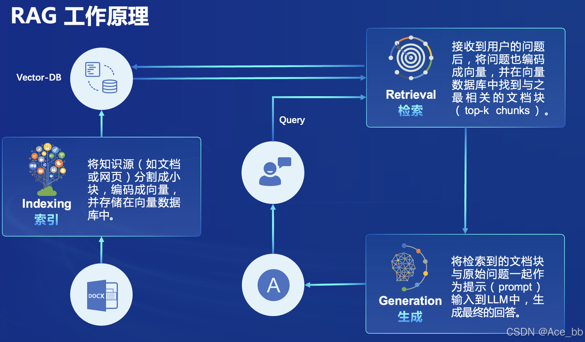
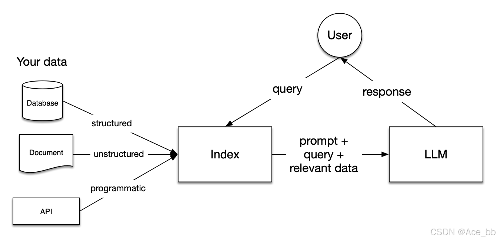

# Retrieval-augmented Generation
本文将分为以下几个部分来介绍，如何使用 LlamaIndex 来部署 InternLM2 1.8B并实现RAG功能。
- 前置知识
- 环境、模型准备
- LlamaIndex HuggingFaceLLM
- LlamaIndex RAG

## 1. 基础识
### RAG背景
给模型注入新知识的方式，可以简单分为两种方式，一种是内部的，即更新模型的权重，另一个就是外部的方式，给模型注入格外的上下文或者说外部信息，不改变它的的权重。
第一种方式，改变了模型的权重即进行模型训练，这是一件代价比较大的事情，大语言模型具体的训练过程，可以参考[InternLM2](https://arxiv.org/abs/2403.17297)技术报告。第二种方式，并不改变模型的权重，只是给模型引入额外的信息。

对比两种注入知识方式，第二种更容易实现。RAG正是这种方式。它能够让基础模型实现非参数知识更新，无需训练就可以掌握新领域的知识。本次课程选用了LlamaIndex框架。LlamaIndex 是一个上下文增强的 LLM 框架，旨在通过将其与特定上下文数据集集成，增强大型语言模型（LLMs）的能力。它允许您构建应用程序，既利用 LLMs 的优势，又融入您的私有或领域特定信息。

**在RAG中有五个关键阶段**，这些阶段将成为你构建的任何更大应用程序的一部分。这些阶段包括：

- 加载：这指的是从数据源（无论是文本文件、PDF、另一个网站、数据库或API）获取你的数据并将其放入你的流水线中。LlamaHub 提供了数百个可供选择的连接器。

- 索引：这意味着创建一个允许查询数据的数据结构。对于LLM来说，这几乎总是意味着创建向量嵌入，即你的数据含义的数值表示，以及许多其他元数据策略，使其易于准确找到上下文相关的数据。

- 存储：一旦你的数据被索引，你几乎总是希望存储你的索引，以及其他元数据，以避免重新对其进行索引。

- 查询：对于任何给定的索引策略，你可以利用LLM和LlamaIndex数据结构进行查询的许多方式，包括子查询、多步查询和混合策略。

- 评估：在任何流水线中的一个关键步骤是检查它相对于其他策略的有效性，或者当你进行更改时。评估提供了关于你对查询的响应有多准确、忠实和快速的客观度量。

## RAG优质资源

### 1. RAG-Survey
RAG综述建议看这个Repo：https://github.com/Tongji-KGLLM/RAG-Survey
这个团队几乎整理了RAG的所有内容， 包括RAG工具，前沿文章等，全都在这个团队提供的Notion仓库中，仓库链接为：https://openrag.notion.site/Open-RAG-c41b2a4dcdea4527a7c1cd998e763595。
RAG综述中文版已翻译加入到本项目中：[RAG综述](./RAG综述.md)

### 2. LlamaIndex
LlamaIndex 是一个用于构建上下文增强LLM应用的框架。上下文增强是指将LLM应用于您的私有数据或领域特定数据的任何用例。
LlamaIndex 提供以下工具，帮助您快速搭建生产就绪的LLM应用：

- 数据连接器从其原生来源和格式摄取您的现有数据。这些可以是API、PDF、SQL等（还有更多）。
- 数据索引将您的数据结构化为LLM易于消费的中间表示形式，而且性能良好。
- 引擎为您的数据提供自然语言访问。例如：
    - 查询引擎是用于问答的强大接口（例如RAG管道）。
    - 聊天引擎是用于与数据进行多消息、“来回”交互的对话接口。
- 代理是由工具增强的LLM动力知识工作者，从简单的辅助功能到API集成等等。
- 可观察性/评估集成，使您能够在良性循环中严格实验、评估和监控您的应用。
官方英文文档为：https://docs.llamaindex.ai/en/stable/#introduction
中文文档为：http://www.aidoczh.com/llamaindex/
本项目中中的BaseDemo就是使用LlamaIndex实现的简单RAG: [Demo](./BaseDemo.md)。

