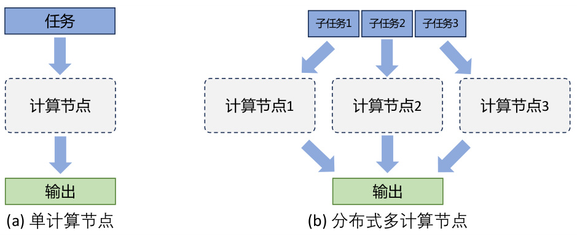
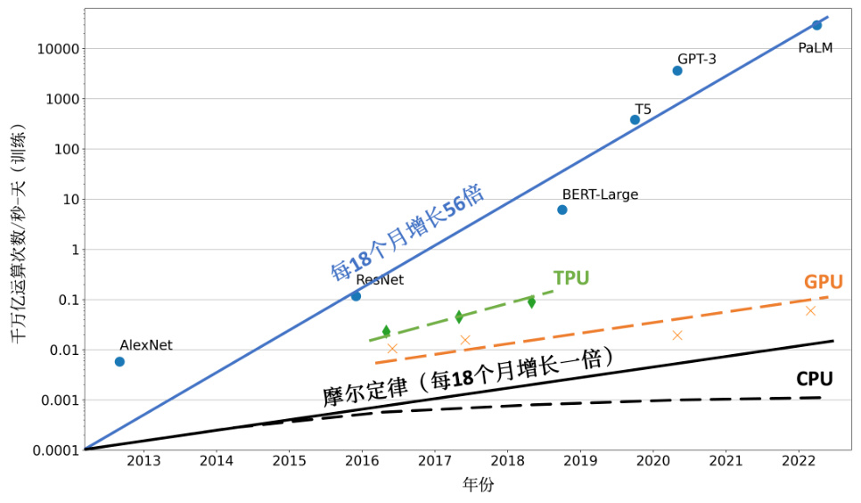
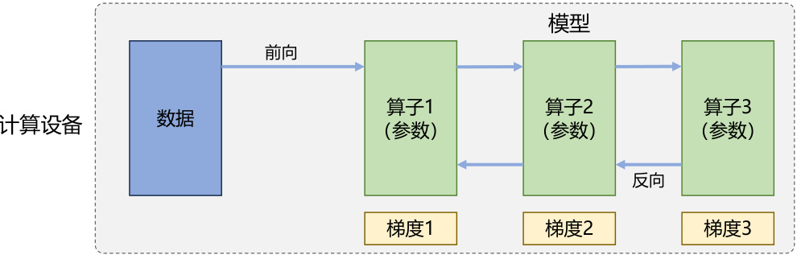

# 4. 分布式训练  

随着语言模型参数量和所需训练数据量的急速增长，单个机器上有限的资源已无法满足大语言模型训练的要求。需要设计分布式训练（Distributed Training）系统来解决海量的计算和内存资源需求问题。在分布式训练系统环境下需要将一个模型训练任务拆分成多个子任务，并将子任务分发给多个计算设备，从而解决资源瓶颈。但是如何才能利用包括数万计算加速芯片的集群，训练模型参数量千亿甚至是万亿的大规模语言模型？这其中涉及到集群架构、并行策略、模型架构、内存优化、计算优化等一系列的技术。  

本章将介绍分布式机器学习系统的基础概念、分布式训练集群架构、分布式训练并行策略，并以DeepSpeed 为例介绍如何在集群上训练大语言模型。  

# 4.1 分布式训练概述  

分布式训练（Distributed Training）是指将机器学习或深度学习模型训练任务分解成多个子任务，并在多个计算设备上并行地进行训练。图4.1给出了单个计算设备和多个计算设备的示例，这里计算设备可以是中央处理器（Central Processing Unit，CPU）、图形处理器（Graphics ProcessingUnit，GPU）、张量处理器（Tensor Processing Unit，TPU）也可以是神经网络处理器（Neural networkProcessing Unit，NPU）。由于同一个服务器内部的多个计算设备之间内存也可能并不共享，因此无论这些计算设备是否处于一个服务器还是多个服务器中，其系统架构都属于分布式系统范畴。一个模型训练任务往往会有大量的训练样本作为输入，可以利用一个计算设备完成，也可以将整个模型的训练任务拆分成子任务，分发给不同的计算设备，实现并行计算。此后，还需要对每个计算设备的输出进行合并，最终得到与单个计算设备等价的计算结果。由于每个计算设备只需要负责子任务，并且多个计算设备可以并行执行，因此其可以更快速地完成整体计算，并最终实现对整个计算过程的加速。  

促使人们设计分布式训练系统的一个最重要的原因就是单个计算设备的算力已经不足以支撑模型训练。图4.2给出了机器学习模型对于算力的需求以及同期单个计算设备能够提供的算力。如图所示，机器学习模型快速发展，从2013 年AlexNet 开始，到2022 年拥有5400 亿参数的PalM 模型，机器学习模型以每18 个月增长56 倍的速度发展。模型参数规模增大的同时，对训练数据量  

76 大规模语言模型：从理论到实践-- 张奇、桂韬、郑锐、黄萱菁的要求也指数级增长，这更加剧了对算力的需求。然而，近几年CPU 的算力增加已经远低于摩尔定律（Moore’s Law），虽然计算加速设备（如GPU、TPU 等）为机器学习模型提供了大量的算力，但是其增长速度仍然没有突破每18 个月翻倍的摩尔定律。为了能够满足机器学习模型的发展，只有通过分布式训练系统才可以匹配模型不断增长的算力需求。  

  
图4.1 单计算设备计算和多计算设备示例  

  
图4.2 机器学习模型参数量增长和计算硬件的算力增长对比[133]  

分布式训练的总体目标就是提升总的训练速度，减少模型训练的总体时间。总训练速度可以用如下公式简略估计：  

总训练速度 ${\displaystyle\propto}$ 单设备计算速度 $\times$ 计算设备总量 $\times$ 多设备加速比其中，单设备计算速度主要由单块计算加速芯片的运算速度和数据I/O 能力来决定，对单设备训练效率进行优化，主要的技术手段有混合精度训练、算子融合、梯度累加等；分布式训练系统中计算设备数量越多，其理论峰值计算速度就会越高，但是受到通信效率的影响，计算设备数量增大则会造成加速比急速降低；多设备加速比则是由计算和通讯效率决定，需要结合算法和网络拓扑结构进行优化，分布式训练并行策略主要目标就是提升分布式训练系统中的多设备加速比。  

大语言模型参数量和所使用的数据量都非常巨大，因此都采用了分布式训练架构完成训练。文献[5] 针对GPT-3 的训练过程仅介绍了训练过程全部使用NVIDIA V100 GPU，文献[31] 介绍了OPT 模型训练使用了992 块NVIDIA A100 80G GPU，采用全分片数据并行（Fully Sharded DataParallel）[134] 以及Megatron-LM 张量并行（Tensor Parallelism）[135]，整体训练时间将近2 个月。BLOOM[33] 模型的研究人员则公开了更多在硬件和所采用的系统架构方面的细节。该模型的训练一共花费3.5 个月，使用48 个计算节点。每个节点包含8 块NVIDIA A100 80G GPU（总计384 个GPU），并且使用 $4^{*}\mathrm{NVLink}$ 用于节点内部GPU 之间通信。节点之间采用四个Omni-Path 100 Gbps网卡构建的增强8 维超立方体全局拓扑网络进行通信。文献[37] 并没有给出LLaMA 模型训练中所使用的集群的具体配置和网络拓扑结构，但是给出了不同参数规模的总GPU 小时数。LLaMA模型训练采用NVIDIA A100-80GB GPU，LLaMA-7B 模型训练需要82432 GPU 小时，LLaMA-13B模型训练需要135168 GPU 小时，LLaMA-33B 模型训练花费了530432 GPU 小时，而LLaMA-65B模型训练花费则高达1022362 GPU 小时。由于LLaMA 所使用的训练数据量远超OPT 和BLOOM模型，因此，虽然模型参数量远小于上述两个模型，但是其所需计算量仍然非常惊人。  

通过使用分布式训练系统，大语言模型训练周期可以从单计算设备花费几十年，缩短到使用数千个计算设备花费几十天就可以完成。然而，分布式训练系统仍然需要克服计算墙、显存墙、通信墙等多种挑战，以确保集群内的所有资源得到充分利用，从而加速训练过程并缩短训练周期。  

- 计算墙：单个计算设备所能提供的计算能力与大语言模型所需的总计算量之间存在巨大差异。2022 年3 月发布的NVIDIA H100 SXM 的单卡FP16 算力也只有2000 TFLOPS（FloatingPoint Operations Per Second），而GPT-3 则需要314 ZFLOPs（Floating Point Operations）的总计算量，两者相差了8 个数量级。  
- 显存墙：单个计算设备无法完整存储一个大语言模型的参数。GPT-3 包含1750 亿参数，在推理阶段如果采用FP32 格式进行存储，需要700GB 的计算设备内存空间，而NVIDIA H100GPU 只有80GB 显存。  
- 通信墙：分布式训练系统中各计算设备之间需要频繁地进行参数传输和同步。由于通信的延迟和带宽限制，这可能成为训练过程的瓶颈。GPT-3 训练过程中，如果分布式系统中存在128个模型副本，那么在每次迭代过程中至少需要传输89.6TB 的梯度数据。而截止2023 年8 月，单个InfiniBand 链路仅能够提供不超过 $800\mathrm{Gb/s}$ 带宽。  

计算墙和显存墙源于单计算设备的计算和存储能力有限，与模型对庞大计算和存储需求之间存在矛盾。这个问题可以通过采用分布式训练方法来解决，但分布式训练又会面临通信墙的挑战。在多机多卡的训练中，这些问题逐渐显现。随着大模型参数的增大，对应的集群规模也随之增加，这些问题变得更加突出。同时，在大型集群进行长时间训练时，设备故障可能会影响或中断训练过程，对分布式系统的问题性也提出了很高要求。  

# 4.2 分布式训练并行策略  

分布式训练系统目标就是将单节点模型训练转换成等价的分布式并行模型训练。对于大语言模型来说，训练过程就是根据数据和损失函数，利用优化算法对神经网络模型参数进行更新的过程。单节点模型训练系统结构如图4.3所示，主要由数据和模型两个部分组成。训练过程会由多个数据小批次（Mini-batch）完成。图中数据表示一个数据小批次。训练系统会利用数据小批次根据损失函数和优化算法生成梯度，从而对模型参数进行修正。针对大语言模型多层神经网络的执行过程，可以由一个计算图（Computational Graph）表示。这个图有多个相互连接的算子（Operator），每个算子实现一个神经网络层（Neural Network Layer），而参数则代表了这个层在训练中所更新的的权重。  

  
图4.3 单设备模型训练系统  

计算图的执行过程可以分为前向计算和反向计算两个阶段。前向计算的过程是将数据读入第一个算子，计算出相应的输出结构，然后依此重复这个前向计算过程，直到最后一个算子结束。反向计算过程，是根据优化函数和损失，每个算子依次计算出梯度，并利用梯度更新本地的参数。在反向计算结束后，该数据小批次的计算完成，系统就会读取下一个数据小批次，继续下一轮的模型参数更新。  

根据单设备模型训练系统的流程，可以看到如果进行并行加速，可以从数据和模型两个维度进行考虑。首先可以对数据进行切分（Partition），并将同一个模型复制到多个设备上，并行执行不同的数据分片，这种方式通常被称为数据并行（Data Parallelism，DP）。还可以对模型进行划分，将模型中的算子分发到多个设备分别完成，这种方式通常被称为模型并行（Model Parallelism，MP）。当训练超大规模语言模型时，往往需要同时对数据和模型进行切分，从而实现更高程度的并行，这种方式通常被称为混合并行（Hybrid Parallelism，HP）。  