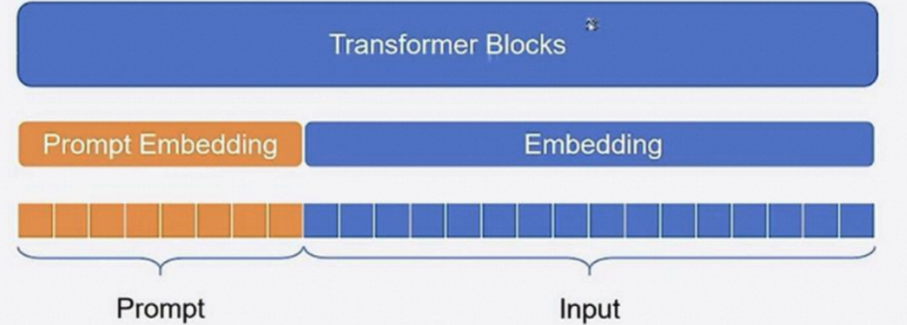

# Prompt tuning
一句话总结什么事Prompt-tuning：
Prompt-tuning is an efficient, low-cost way of adapting an AI foundation model to new downstream tasks without retraining the model and updating its weights.\
**Prompt-tuning是一种高效的，低成本的，针对下游任务微调AI模型，而不需要重新训练模糊和更新模型参数的方法。**

Prompt-Tuning通过在输入层添加prompt tokens来为每个任务定制模型。 这些prompt tokens可以看作是模型的一种“提示”，它们被添加到输入序列的开头或结尾，以引导模型更好地适应不同任务。 与传统的微调方法相比，Prompt Tuning只需要调整一小部分参数，即prompt tokens，而无需对整个模型进行大规模的训练。

### 划重点：Prompt-tuning是只微调输入层增加的token参数，假设原本输入层维度是100，下一个隐藏层的维度是50，那么这部分的参数矩阵就是(100*50)，增加了Prompt token之后，输入层维度增加到120，那么这部分的参数矩阵就变成了(120*50)维，只调整增加的这20*50的参数量，其他的所有参数不改变。如图：



相较于传统的微调方法，Prompt-Tuning具有以下优势：
1. 参数高效：Prompt-Tuning通过训练Prompt的权重来实现模型微调，而不是对整个模型进行训练。这大大减少了需要训练的参数数量，降低了计算复杂度，使得微调过程更加高效。
2. 灵活性高：Prompt-Tuning允许用户根据需要自定义Prompt，这使得微调过程更加灵活。用户可以根据任务需求、数据特点等因素，设计合适的Prompt来引导模型输出。
3. 易于实现：Prompt-Tuning的实现相对简单，不需要复杂的算法和计算资源。这使得Prompt-Tuning成为了一种易于普及和应用的微调方法。

## 实现步骤
在实际应用中，我们可以通过以下步骤来实施Prompt-Tuning：
1. 确定任务和目标：首先，我们需要明确模型需要完成的任务和目标。这将有助于我们设计合适的Prompt来引导模型的输出。
2. 设计Prompt：根据任务需求和数据特点，设计具有上下文的词或句子序列作为Prompt。Prompt的设计应充分考虑任务的语义信息和上下文关系。
3. 训练Prompt权重：在保持模型其他部分不变的情况下，仅训练Prompt的权重。这可以通过标准的梯度下降算法或其他优化算法来实现。
4. 评估和调整：在训练过程中，我们需要不断评估模型的性能，并根据评估结果对Prompt进行调整。这可以通过调整Prompt的长度、结构或语义信息等方式来实现。

通过以上步骤，我们可以实现Prompt-Tuning在模型微调过程中的应用。在实际操作中，我们还需要注意以下几点：
1. 注意Prompt的多样性和泛化能力：设计Prompt时，应尽量保证其在不同任务和数据集上的多样性和泛化能力，以提高模型的适应性和鲁棒性。
2. 结合其他技术：Prompt-Tuning可以与其他微调技术相结合，如知识蒸馏、迁移学习等。这可以进一步提高模型的性能和效率。
3. 注计算资源：虽然Prompt-Tuning在参数高效方面具有优势，但在实际应用中仍需关注计算资源的消耗。合理分配计算资源，以提高训练速度和效率。

## 源码实现
huggingface peft关于Prompt-tuning的核心代码实现在[PromptEmbedding](https://github.com/huggingface/peft/blob/main/src/peft/tuners/prompt_tuning/model.py):
```python
class PromptEmbedding(torch.nn.Module):
    """
    The model to encode virtual tokens into prompt embeddings.

    Args:
        config ([`PromptTuningConfig`]): The configuration of the prompt embedding.
        word_embeddings (`torch.nn.Module`): The word embeddings of the base transformer model.

    **Attributes**:
        - **embedding** (`torch.nn.Embedding`) -- The embedding layer of the prompt embedding.

    Example:

    ```py
    >>> from peft import PromptEmbedding, PromptTuningConfig

    >>> config = PromptTuningConfig(
    ...     peft_type="PROMPT_TUNING",
    ...     task_type="SEQ_2_SEQ_LM",
    ...     num_virtual_tokens=20,
    ...     token_dim=768,
    ...     num_transformer_submodules=1,
    ...     num_attention_heads=12,
    ...     num_layers=12,
    ...     prompt_tuning_init="TEXT",
    ...     prompt_tuning_init_text="Predict if sentiment of this review is positive, negative or neutral",
    ...     tokenizer_name_or_path="t5-base",
    ... )

    >>> # t5_model.shared is the word embeddings of the base model
    >>> prompt_embedding = PromptEmbedding(config, t5_model.shared)
    ```

    Input Shape: (`batch_size`, `total_virtual_tokens`)

    Output Shape: (`batch_size`, `total_virtual_tokens`, `token_dim`)
    """

    def __init__(self, config, word_embeddings):
        super().__init__()

        total_virtual_tokens = config.num_virtual_tokens * config.num_transformer_submodules
        self.embedding = torch.nn.Embedding(total_virtual_tokens, config.token_dim)
        if config.prompt_tuning_init == PromptTuningInit.TEXT and not config.inference_mode:
            from transformers import AutoTokenizer

            tokenizer_kwargs = config.tokenizer_kwargs or {}
            tokenizer = AutoTokenizer.from_pretrained(config.tokenizer_name_or_path, **tokenizer_kwargs)
            init_text = config.prompt_tuning_init_text
            init_token_ids = tokenizer(init_text)["input_ids"]
            # Trim or iterate until num_text_tokens matches total_virtual_tokens
            num_text_tokens = len(init_token_ids)
            if num_text_tokens > total_virtual_tokens:
                init_token_ids = init_token_ids[:total_virtual_tokens]
            elif num_text_tokens < total_virtual_tokens:
                num_reps = math.ceil(total_virtual_tokens / num_text_tokens)
                init_token_ids = init_token_ids * num_reps
            init_token_ids = init_token_ids[:total_virtual_tokens]
            init_token_ids = torch.LongTensor(init_token_ids).to(word_embeddings.weight.device)
            with gather_params_ctx(word_embeddings.parameters()):
                word_embedding_weights = word_embeddings(init_token_ids).detach().clone()
            word_embedding_weights = word_embedding_weights.to(torch.float32)
            self.embedding.weight = torch.nn.Parameter(word_embedding_weights)

    def forward(self, indices):
        # Just get embeddings
        prompt_embeddings = self.embedding(indices)
        return prompt_embeddings
```
## Prompt-tuning官方介绍
Google reasearch的Prompt tuning官方介绍：[https://github.com/google-research/prompt-tuning](https://github.com/google-research/prompt-tuning)

## 优质资源
本部分主要取自：
[大模型微调实践——Prompt tuning、PET、Prefix tuning、P-tuning的原理、区别与代码解析(一)](https://mp.weixin.qq.com/s?__biz=Mzg4MTkwMTQ4NA==&mid=2247484100&idx=1&sn=9a16611524c7953361717769284e7802&chksm=cf5fa807f8282111d1c8912ce305072f3e5558506d45b4d634d8e315cb84bdb7b5d92a7747c6&scene=21#wechat_redirect)

关于Prompt-tuning的综述，欢迎拜读华师数据学院·王嘉宁的文章(已收录)：\
[Prompt-Tuning——深度解读一种新的微调范式](https://blog.csdn.net/qq_36426650/article/details/120607050)

实操建议看苏神的代码：
[Pattern-Exploiting Training](https://github.com/bojone/Pattern-Exploiting-Training/tree/master)
苏神的解读原文链接：[必须要GPT3吗？不，BERT的MLM模型也能小样本学习](https://kexue.fm/archives/7764)
原文解读和代码均已收录于本目录中。\
sentiment.py是情感分类任务的代码，数据集下载链接：[情感分类数据集](https://github.com/bojone/bert4keras/blob/master/examples/datasets/sentiment.zip) \
代码的解读已在源码中进行详细标注。其中使用到的bert4keras原仓库链接为：[bert4karas](https://github.com/bojone/bert4keras)，是一个轻量级的keras版bert。

使用Prompt-tuning来微调大语言模型案例可看该目录下的：Prompt-Tuning代码实践.ipynb

至此，Prompt-Tuning完成。