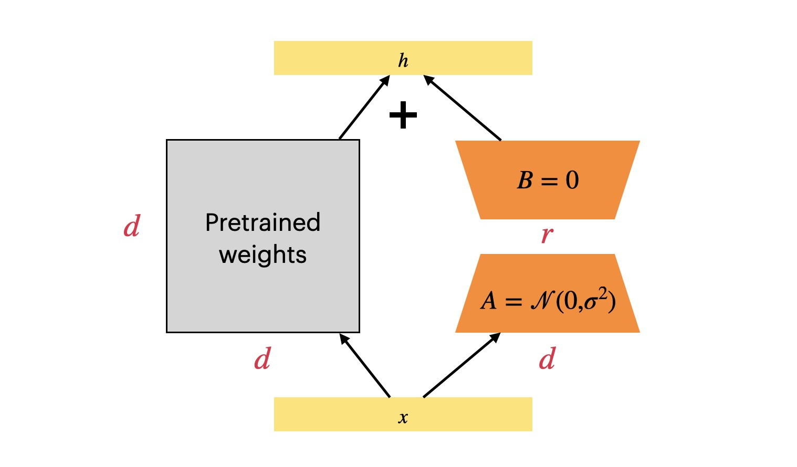

> 原文地址 [martinlwx.github.io](https://martinlwx.github.io/zh-cn/lora-finetuning/)

> 介绍了 LoRA 微调的原理，以及相关的源代码分析



自从 LLM 时代到来之后，如何微调 LLM 成为了一个难题，因为 LLM 的模型实在是太大了，很难做全量微调更新所有参数。可选的路线有：冻结整个模型做 Prompt tuning 或者 In-context Learning；冻结整个模型_但是_会插入可训练的模块。今天要介绍的 LoRA(**Lo**w-**R**ank **A**daptation) 就对应了后者的技术路线，这是微软团队的工作 

LoRA 的思想其实挺简单，我们知道，在深度学习里面，模型的参数是通过梯度下降进行更新的，考虑一个矩阵 $W_0 ​∈ R^{d×d}$（这里的下标 0 表示它是初始值），可以用 $ΔW$ 表示它最后训练完成的时候相对于一开始的初始值的_**变化量**_，那么训练完成之后这个矩阵的参数会是

$$W0​+ΔW$$

LoRA 微调要解决的问题是 
- 能不能在_**冻结**_ $W_0$​ 的情况下，求解出 $ΔW$？而且求解的开销要尽可能低？这是可以的，因为研究人员发现训练完成后的 LLM 的模型权重的 Intrinsic rank 比较低，于是作者假设 $ΔW$ 也是如此，那么我们就可以对 $ΔW$ 做低秩分解，最后实验表明这个假设是正确的，LoRA 微调效果挺好，低秩分解指的是

$ΔW=BA$

其中 $B ∈ R^{d×r}$，$A ∈ R^{r×d}$，$B$ 采用零值初始化，$A$ 则是采用高斯函数初始化，这样在一开始训练的时候 $BA=0$，LoRA 模块对本来的模型不造成影响

如果输入是 $x$，那么 LoRA 的计算方式就是

$$ W_0​x+ \frac{r}{α}​ ΔWx = W0​x + \frac{r}{α}​BAx $$

这里的 α 就是放缩因子，r 则是降维矩阵降维后的大小，整体作为一个缩放因子，在后面的源码分析会有所体现

LoRA 微调_训练_的时候只需要通过梯度下降更新 B 和 A，而_推理_的时候，可以直接把 W0​ 和 BA 合并起来，_就像_ LoRA 模块不存在一样。这是 LoRA 一个显著优势：它并不会带来推理延迟👍

另外可以计算一下使用 LoRA 之后，可学习的参数量的变化

 $$ (W_0 ​+ \frac{r}{α}​ΔW)x = W_0​x+\frac{r}{α}​ΔWx = W_0​x+\frac{r}{α}​BAx $$

这里的 $r«d$，因此可以减少很多需要训练的模型参数，所以 LoRA 是_参数高效_的微调方法👍

**还剩下两个问题 —— LoRA 要加在 Transformer 的哪一个部分？最佳的 `r` 是多少**？

*   在论文的 7.1 里面，作者对比之后发现**同时加在 Wq​ 和 Wv​ 上的效果是最好的** 
*   在论文的 7.2 里面，作者发现**一味增大 `r` 并没有带来太多的提升，`4 ~ 8` 效果就不错了**，这验证了 LLM 的模型权重的 Intrinsic rank 确实比较低 

Huggingface 的 [peft](https://github.com/huggingface/peft) 就支持 LoRA 微调，在 Github 仓库的 `README.md` 文件就给了一个例子，只需要用 `LoraConfig` 对参数进行配置，然后用 `get_peft_model` 就完成了对模型的改造，就可以用于后续训练了

```python
from transformers import AutoModelForCausalLM
from peft import get_peft_config, get_peft_model, LoraConfig, TaskType

model_name_or_path = "facebook/opt-350m"

peft_config = LoraConfig(
    task_type=TaskType.CAUSAL_LM,
    r=8,
    lora_alpha=32,
    lora_dropout=0.1,
)

model = AutoModelForCausalLM.from_pretrained(model_name_or_path)
model = get_peft_model(model, peft_config)
model.print_trainable_parameters()
# output: trainable params: 786,432
#      || all params: 331,982,848
#      || trainable%: 0.2368893467652883

```

训练完成之后需要_保存模型_，调用 `model.save_pretrained(output_dir)` 即可，其中 `output_dir` 就是要保存的路径，观察目录结构可以发现，只保存 LoRA 模块的权重而不需要保存整个模型。目录结构长下面这样

```
output_dir
├── README.md
├── adapter_config.json
└── adapter_model.bin

```

后续要_加载模型_也很简单

```python
from peft import AutoPeftModelForCausalLM

peft_model_name_or_path = "./output_dir"

model = AutoPeftModelForCausalLM.from_pretrained(peft_model_name_or_path)

```

> 下面的代码我去掉了一些无关的代码，_比如错误处理、过于冗长的类型提示等_。参考的源代码是 `peft 0.5.0` 版本

LoRA 微调的核心是 `LoraModel` 类

```python
class LoraModel(BaseTuner):
    def __init__(self, model, config, adapter_name) -> None:
        super().__init__(model, config, adapter_name)
	...

```

`LoraModel` 继承自 `BaseTuner` 并且调用了 `BaseTuner` 的构造函数，所以我们应该去查看父类构造函数做了什么，定位到父类 `BaseTuner`

```python
class BaseTuner(nn.Module, ABC):
    def __init__(self, model, peft_config, adapter_name) -> None:
        super().__init__()
        self.model = model
        self.inject_adapter(self.model, adapter_name)
        self.model.peft_config = self.peft_config

```

核心应该是这个 `inject_adapter` 方法

```python
class BaseTuner(nn.Module, ABC):
    def inject_adapter(self, model: nn.Module, adapter_name: str):
        peft_config = self.peft_config[adapter_name]

        is_target_modules_in_base_model = False
        key_list = [key for key, _ in model.named_modules()]

        peft_config = self._prepare_adapter_config(peft_config, model_config)

        for key in key_list:
            if not self._check_target_module_exists(peft_config, key):
                continue

            is_target_modules_in_base_model = True
            parent, target, target_name = _get_submodules(model, key)

            optionnal_kwargs = {
                "loaded_in_8bit": getattr(model, "is_loaded_in_8bit", False),
                "loaded_in_4bit": getattr(model, "is_loaded_in_4bit", False),
                "current_key": key,
            }

            self._create_and_replace(
                peft_config,
                adapter_name,
                target,
                target_name,
                parent,
                **optionnal_kwargs,
            )

        # 显而易见，就是标记一下只有 adapter 是可以训练的
        self._mark_only_adapters_as_trainable()

        # 如果是推理阶段，那么就所有的参数都冻结
        if self.peft_config[adapter_name].inference_mode:
            for n, p in self.model.named_parameters():
                if adapter_name in n:
                    p.requires_grad = False

```

可以看到 `inject_adapters` 做的事情无非就是遍历每个 Module 看哪些是要修改的，重点是这个 `_create_and_replace` 方法，于是接下来就定位到了 `LoraModel` 的 `_create_and_replace` 方法

```python
class LoraModel(BaseTuner):
    def _create_and_replace(
        self,
        lora_config,
        adapter_name,
        target,
        target_name,
        parent,
        **optionnal_kwargs,
    ):
        bias = hasattr(target, "bias") and target.bias is not None
        kwargs = {
            "r": lora_config.r,
            "lora_alpha": lora_config.lora_alpha,
            "lora_dropout": lora_config.lora_dropout,
            "fan_in_fan_out": lora_config.fan_in_fan_out,
            "init_lora_weights": lora_config.init_lora_weights,
        }
        kwargs["loaded_in_8bit"] = optionnal_kwargs.pop("loaded_in_8bit", False)
        kwargs["loaded_in_4bit"] = optionnal_kwargs.pop("loaded_in_4bit", False)
        kwargs["bias"] = bias

        if isinstance(target, LoraLayer) and isinstance(target, torch.nn.Conv2d):
            ...
        else:
            new_module = self._create_new_module(
                lora_config, adapter_name, target, **kwargs
            )
            self._replace_module(parent, target_name, new_module, target)

```

这里看到了 `LoraLayer`，猜测应该是改变之后的 `Linear` 层，但我们**关心的是 LoRA 如何在 `nn.Linear` 层上面做改动**，因此应该看 `_create_new_module` 方法

```python
class LoraModel(BaseTuner):
    def _create_new_module(lora_config, adapter_name, target, **kwargs):
        if loaded_in_8bit and isinstance(target, bnb.nn.Linear8bitLt):
            ...
        else:
            if isinstance(target, torch.nn.Linear):
                # 拷贝本来的权重矩阵的 in_features 和 out_features 属性
                in_features, out_features = target.in_features, target.out_features
            elif isinstance(target, Conv1D):
				...
            else:
				...
            new_module = Linear(
                adapter_name,
                in_features,
                out_features,
                bias=bias,
                **kwargs
            )

        return new_module

```

通过拷贝本来的 `nn.Linear` 的 `in_features` 和 `out_features` 属性，LoRA 创建了一个 `Linear` 类，在同个文件中可以找到这个类的定义

```python
class Linear(nn.Linear, LoraLayer):
    def __init__(
        self,
        adapter_name: str,
        in_features: int,
        out_features: int,
        r: int = 0,
        lora_alpha: int = 1,
        lora_dropout: float = 0.0,
        fan_in_fan_out: bool = False,
        is_target_conv_1d_layer: bool = False,
        **kwargs,
    ):
        init_lora_weights = kwargs.pop("init_lora_weights", True)

        nn.Linear.__init__(self, in_features, out_features, **kwargs)
        LoraLayer.__init__(self, in_features=in_features, out_features=out_features)
        # Freezing the pre-trained weight matrix
        self.weight.requires_grad = False

        nn.Linear.reset_parameters(self)
        self.update_layer(adapter_name, r, lora_alpha, lora_dropout, init_lora_weights)
        self.active_adapter = adapter_name

```

`Linear` 类采用了 Mixin 的设计模式，分别调用了 `nn.Linear` 和 `LoraLayer` 的构造函数，注意这里的 `self.weight` 是模型本来的 `nn.Linear` 层的权重，可以看到被冻结了，而 LoRA 引入的权重矩阵则是用 `update_layer` 方法设置，搜索该方法将我们定位到了 `LoraLayer` 类

```python
class LoraLayer(BaseTunerLayer):
    def __init__(self, in_features: int, out_features: int, **kwargs):
        self.r = {}
        self.lora_alpha = {}
        self.scaling = {}
        self.lora_dropout = nn.ModuleDict({})
        self.lora_A = nn.ModuleDict({})
        self.lora_B = nn.ModuleDict({})
        # For Embedding layer
        self.lora_embedding_A = nn.ParameterDict({})
        self.lora_embedding_B = nn.ParameterDict({})
        # Mark the weight as unmerged
        self.merged = False
        self.disable_adapters = False
        self.in_features = in_features
        self.out_features = out_features
        self.kwargs = kwargs

    def update_layer(
        self, adapter_name, r, lora_alpha, lora_dropout, init_lora_weights
    ):
        self.r[adapter_name] = r
        self.lora_alpha[adapter_name] = lora_alpha

        if lora_dropout > 0.0:
            lora_dropout_layer = nn.Dropout(p=lora_dropout)
        else:
            lora_dropout_layer = nn.Identity()

        self.lora_dropout.update(nn.ModuleDict({adapter_name: lora_dropout_layer}))
        # Actual trainable parameters
        if r > 0:
            self.lora_A.update(
                nn.ModuleDict(
                    {adapter_name: nn.Linear(self.in_features, r, bias=False)}
                )
            )
            self.lora_B.update(
                nn.ModuleDict(
                    {adapter_name: nn.Linear(r, self.out_features, bias=False)}
                )
            )
            self.scaling[adapter_name] = lora_alpha / r

        if init_lora_weights:
            self.reset_lora_parameters(adapter_name)

        self.to(self.weight.device)

```

终于，看到了 LoRA 设置降维矩阵 A 和升维矩阵 B 的地方，上面的代码还设置了放缩因子 `lora_alpha / r`，只剩下最后一个问题，即 - **前向传播的时候是怎么工作的**？

```python
class LoraLayer(BaseTunerLayer):
    def forward(self, x: torch.Tensor):
        previous_dtype = x.dtype
        if self.disable_adapters:
            ...
        elif self.r[self.active_adapter] > 0 and not self.merged:
            result = F.linear(
                x, transpose(self.weight, self.fan_in_fan_out), bias=self.bias
            )

            x = x.to(self.lora_A[self.active_adapter].weight.dtype)

            result += (
                self.lora_B[self.active_adapter](
                    self.lora_A[self.active_adapter](
                        self.lora_dropout[self.active_adapter](x)
                    )
                )
                * self.scaling[self.active_adapter]
            )
        else:
            ...

        result = result.to(previous_dtype)

        return result

```

看代码就很清晰，输入 `x` 会作为模型本来的 `nn.Linear` 以及 LoRA 模块的输入，LoRA 模块最后还会进行缩放，一切都跟本文一开始解释的一样