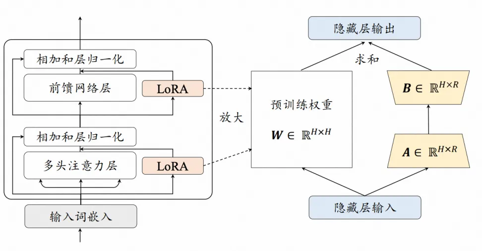

## LoRA 原理
LoRA（Low-Rank Adaptation: 低秩的适配器）是一种新颖的微调技术，它通过引入低秩矩阵来调整模型的行为，以提高模型在新任务上的表现。具体来说，**LoRA 在原有的预训练模型中增加了两个旁路矩阵 A 和 B，这两个矩阵的维度远小于原始模型的输入输出维度，从而实现了参数的高效微调**，从而减少适配下游任务所需要训练的参数。给定一个参数矩阵 $\mathbf W$，其 更新过程可以一般性地表达为以下形式：
$\mathbf W= \mathbf W_0+ \Delta\mathbf W$
其中，$\mathbf W_0$ 是原始参数矩阵，$\Delta\mathbf W$ 是更新的梯度矩阵。LoRA 的基本思想是冻结原 始矩阵 $\mathbf W_0 ∈ R^{H*H}$，通过低秩分解矩阵 $\mathbf A ∈ R^{H*H}$和  $\mathbf B ∈ R^{H*H}$ 来近似参数更新矩阵 $\Delta W=A\cdot B^T$，其中 $R << H$ 是减小后的秩。在微调期间，原始的矩阵参数 $W_0$不会被更新，低秩分解矩阵 $\mathbf A$ 和 $\mathbf B$则是可训练参数用于适配下游任务。在前向传 播过程中，原始计算中间状态 $\mathbf h = \mathbf W_0 \cdot \mathbf x$ 的公式修改为:
$\mathbf h = \mathbf W_0 \cdot x + \mathbf A \cdot \mathbf B^T \cdot x$
在训练完成后，进一步将原始参数矩阵 $\mathbf W_0$ 和训练得到的权重  $\mathbf A$ 和 $\mathbf B$ 进行合并：$\mathbf W = \mathbf W_0 + \mathbf A \cdot \mathbf B^T$，得到更新后的参数矩阵。因此，LoRA 微调得到的模型在解码过 程中不会增加额外的开销。

