> 本文由 [简悦 SimpRead](http://ksria.com/simpread/) 转码， 原文地址 [mp.weixin.qq.com](https://mp.weixin.qq.com/s/xYORZzAWMYacoQ_WSxGAlQ)

模型训练和推理的速度随着大模型的到来变得越来越重要，减小计算过程中数据的长度从而降低存储和带宽，是提升速度的一个重要方法。因此，我花精力学习和整理了常见的各种精度细节，避免囫囵吞枣。  

****1****

**从FP32说起**

计算机处理数字类型包括整数类型和浮点类型，IEEE 754号标准定义了浮点类型数据的存储结构。一个浮点数由三部分组成，以最常见的FP32(Float Point 32)为例：  

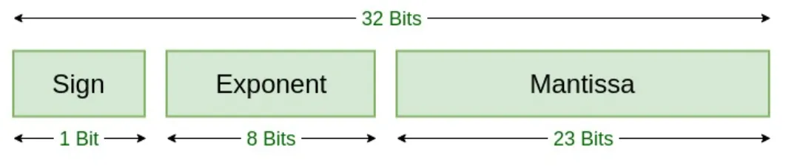

图1. FP32位数分配，来源[2]

*   Sign：最高位用1位表示符号位，1表示负数，0表示正数，记为S  
    
*   Exponent：中间8位表示指数位，记为E  
    
*   Mantissa：低位23位表示小数部分，记为M
    

我们以十进制数9.625为例，看看十进制和FP32二进制之间如何转换：  

**十进制--》二进制**  

先分为整数部分9和小数部分0.625。

9转为二进制1001，0.625通过乘以2取整数部分，剩余小数部分再乘以2取整数部分不断循环的方法，得到0.101，合起来就是1001.101，写成2进制指数形式为1.001101*2^**3。**

根据IEEE 754的规范，FP32的**指数**部分要加127偏移，调整为**3**+127=130，对应二进制为10000010，**小数**部分001101后面补齐为23位后，**符号**位为0，三个部分拼起来就是

0 10000010 00110100000000000000000。

使用转换工具验证，正确！工具的上面把三个部分都表示出来了，复选框打勾表示对应位置二进制数为1，否则为0。  

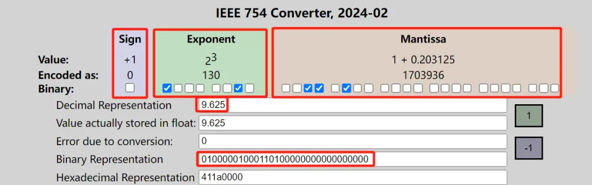

图2. FP32转换工具，来源[3]

**二进制--》十进制**  

直接把上面这个步骤反过来为例，把二进制分为三个部分S、E、M，FP32转换为十进制的公式为：  

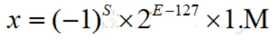

其中1.M表示小数部分的二进制表示，上述例子具体为S=0，E二进制10000010转为十进制为130，M为00110100000000000000000,1.M小数部分后面的0没用直接去掉，实为1.001101（二进制），转为十进制为$1 \frac{13}{64}$

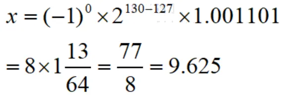

顺利还原回了十进制数。

FP32搞清楚了，FP16、FP64类似，只是指数位和小数位的长度不一样：

<table data-sort="sortDisabled"><tbody><tr><td valign="top" style="border-color: rgb(221, 221, 221);"><strong>类型</strong></td><td valign="top" style="word-break: break-all;border-color: rgb(221, 221, 221);"><strong>符号位长度 </strong></td><td valign="top" style="word-break: break-all;border-color: rgb(221, 221, 221);"><strong>指数位长度</strong></td><td valign="top" style="word-break: break-all;border-color: rgb(221, 221, 221);"><strong>小数位长度 </strong></td><td valign="top" style="word-break: break-all;border-color: rgb(221, 221, 221);" width="41"><strong>偏移 </strong></td></tr><tr><td valign="top" style="word-break: break-all;border-color: rgb(221, 221, 221);">
<strong>半精度</strong>

<strong>FP16</strong>
</td><td valign="top" style="word-break: break-all;border-color: rgb(221, 221, 221);">1 </td><td valign="top" style="word-break: break-all;border-color: rgb(221, 221, 221);">5 </td><td valign="top" style="word-break: break-all;border-color: rgb(221, 221, 221);">10 </td><td valign="top" style="word-break: break-all;border-color: rgb(221, 221, 221);" width="64.33333333333333">15 </td></tr><tr><td valign="top" style="word-break: break-all;border-color: rgb(221, 221, 221);">
<strong>单精度 </strong>

<strong>FP32</strong>
</td><td valign="top" style="word-break: break-all;border-color: rgb(221, 221, 221);">1</td><td valign="top" style="word-break: break-all;border-color: rgb(221, 221, 221);">8 </td><td valign="top" style="word-break: break-all;border-color: rgb(221, 221, 221);">23 </td><td valign="top" style="word-break: break-all;border-color: rgb(221, 221, 221);" width="41">127 </td></tr><tr><td valign="top" style="word-break: break-all;border-color: rgb(221, 221, 221);">
<strong>双精度</strong>

<strong>FP64</strong>
</td><td valign="top" style="word-break: break-all;border-color: rgb(221, 221, 221);">1</td><td valign="top" style="word-break: break-all;border-color: rgb(221, 221, 221);">11 </td><td valign="top" style="word-break: break-all;border-color: rgb(221, 221, 221);">52 </td><td valign="top" style="word-break: break-all;border-color: rgb(221, 221, 221);" width="41">1023 </td></tr></tbody></table>

  

****2****

**模型训练中不同精度的问题**

首先对比FP32和FP64，由于一个FP32浮点数只占32位，和FP64比有明显的优势：

1.  减少存储使用：模型训练显存大小是关键，FP32只占用一半的存储，同样的GPU可以训练更大的模型，或者同样的模型batch_size可以更大；  
    
2.  提高训练速度：同样的两个数进行计算，FP32由于位数少，计算量更小，可以降低计算时间。
    
      
    

同样的道理适用于FP16和FP32的对比，但是否意味着我们都使用FP16就行了？当然不是，主要原因是位数少同时有两个劣势：

1.  位数少时精度比位数多时低，可能导致准确度不够；
    
2.  位数少时表示的范围比位数多时要小，可能导致数据溢出，装不下了。
    
      
    

先看看精度问题，以下是用FP64、FP32、FP16表示1/3时不同的精度：

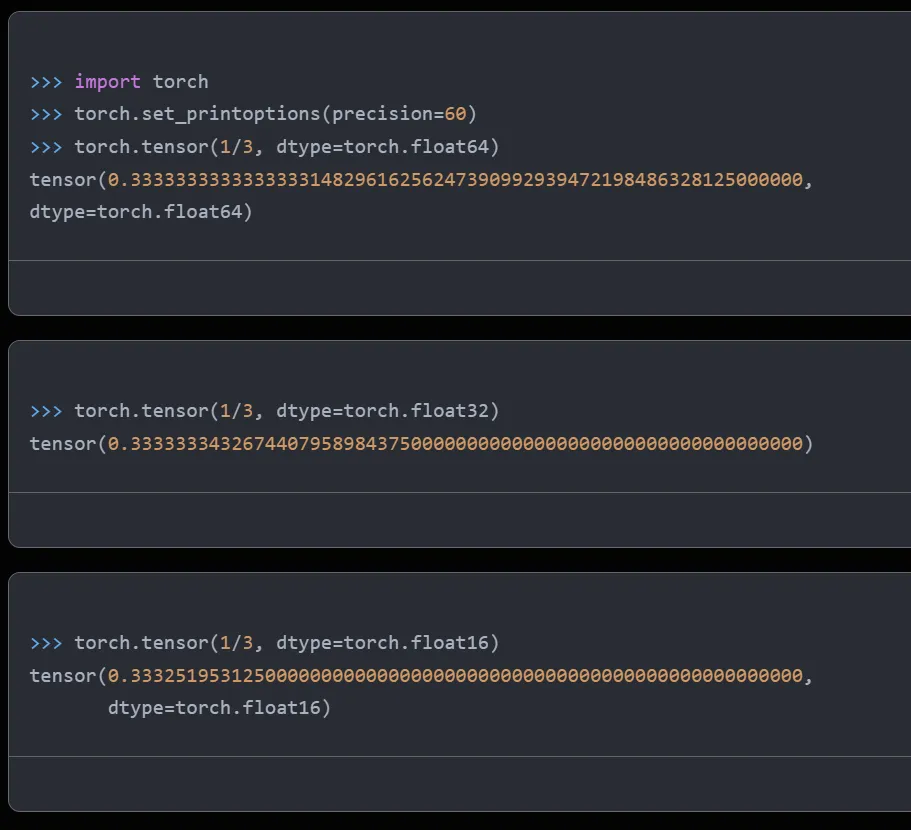

精度越高，数据表示和计算越准确，模型训练拟合出来的参数更精准，这个需要看我们对具体模型精度的要求。

再看表示的范围，通过pytorch的接口，我们看看FP32和FP16能表示的数的范围：

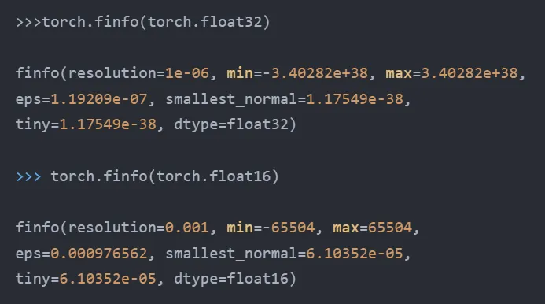

我们用一个大数10^6看看二者能否表示：  

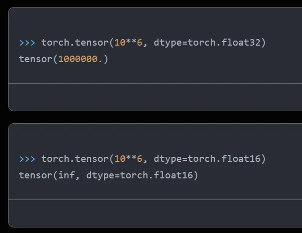

显然10^6已经超过了FP16能支持的范围，无法处理。如果模型的某些参数超过了65504，就无法用FP16表达了。

****3****

**混合精度**

既然FP32和FP16长短各有优缺点，那我们就可以采取混合使用的方法，在模型训练的不同步骤使用不同的精度：

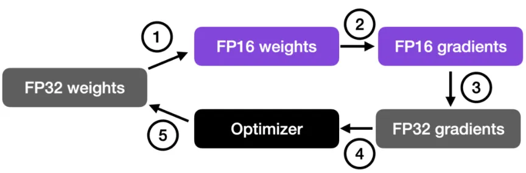
图3. 混合精度使用流程，来源[1]

1.  把神经网络权重参数由初始化的FP32转为FP16；  
    
2.  用FP16进行前向和后向计算，并进行梯度计算；
    
3.  把FP16的梯度转为FP32；
    
4.  使用FP32的梯度和学习率learning rate相乘；
    
5.  使用FP32更新网络权重，得到FP32的更新后的权重。
    
      
    

以上步骤不断循环进行。简单来讲就是使用梯度更新权重的时候用FP32，因为梯度乘上学习率后一般数值都比较小，使用FP32能防止精度不够。  

混合使用精度的时候，有一个**"****损失缩放"**的技术，在反向计算前，将得到的损失扩大一个倍数，避免数据太小精度不够变为0了，扩大后在FP16可表达的范围内，反向计算后，再把梯度缩小同样的倍数，确保最后数值是对的。  

资料[1]使用DistilBERT模型进行了一个电影情感分类任务微调，对比了单独使用FP32、FP16和混合使用的性能及准确率：  
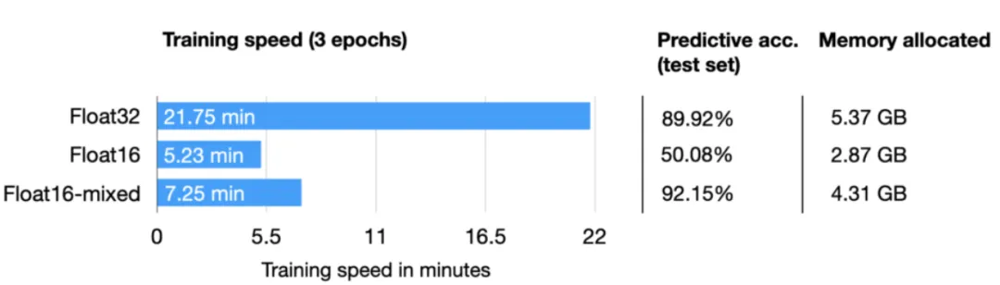

图4. FP32、FP16和混合精度训练对比，来源[1]

从图4可以看出，混合精度训练时间和FP16接近，为FP32的1/3，使用的存储间于二者之间，但预测准确率和FP32类似，甚至比FP32还高，作者说了高可能是因为使用了正则化的原因，FP16的预测准确率低很多，应该是训练中发生了数据溢出，模型已经不准了。

****4****

**BF16、TF32**

FP16的指数位只有5位，小数位10位，能表示的整数范围有点小，于是谷歌为了深度学习特别是他们的TPU定义了一种新的格式Brain Floating Point 16，简称BF16。和FP16比，总长度都是16位，只是把指数由5位变为了8位（和FP32一样，能有其相同的整数范围），小数位数缩短到了7位。

英伟达根据其GPU的需要定义了TF32，指数位8位（和FP32、BF16一样），小数位10位（和FP16一样，比BF16长），其实就是比BF16多了3个小数位。
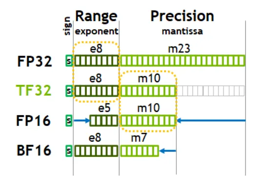
图5. BF16、TF32位数，来源：英伟达白皮书  

资料[1]对除了TF32之外的所有类型以及混合精度做了对比，仍然使用之前相同的任务：

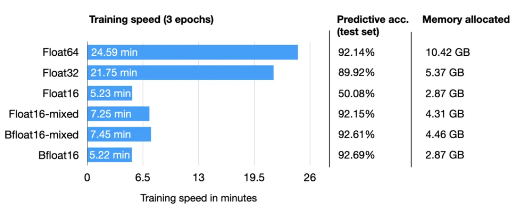
图6. 各种精度综合对比

可以看出，BF16是时间最短（和FP16相当，因为长度都是16位）、使用存储最少（小数位少）、准确率最高（主要是和其他几个92%的同一水平，可能其他因素会导致微小偏差）。

到此结束，我们搞清楚了各种浮点类型的定义、转换、模型训练时如何使用，以及性能对比。  

参考资料：  

[1] https://lightning.ai/pages/community/tutorial/accelerating-large-language-models-with-mixed-precision-techniques/

[2] https://www.geeksforgeeks.org/ieee-standard-754-floating-point-numbers/

[3] https://www.h-schmidt.net/FloatConverter/IEEE754.html

[4] https://zhuanlan.zhihu.com/p/441591808