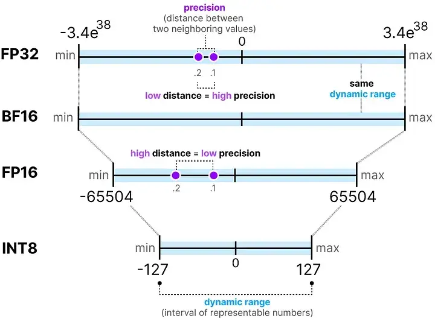
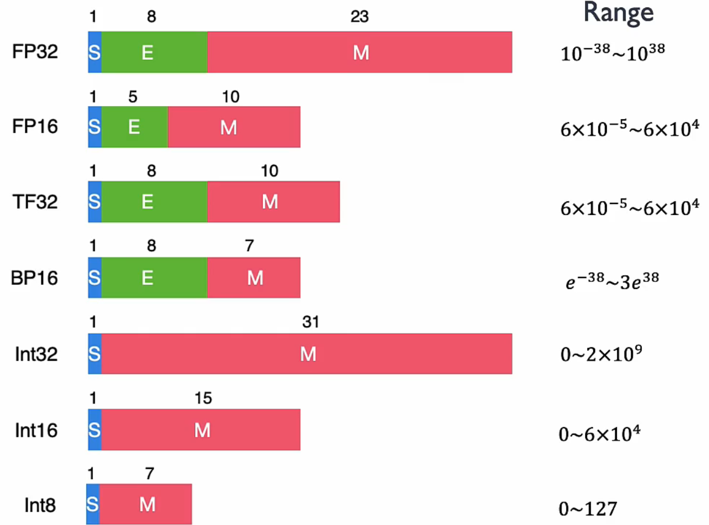
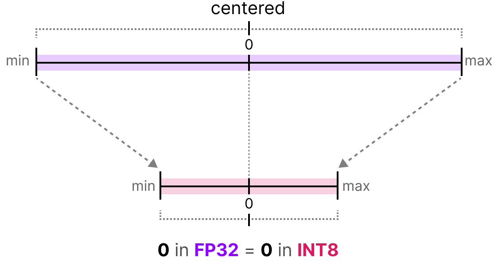
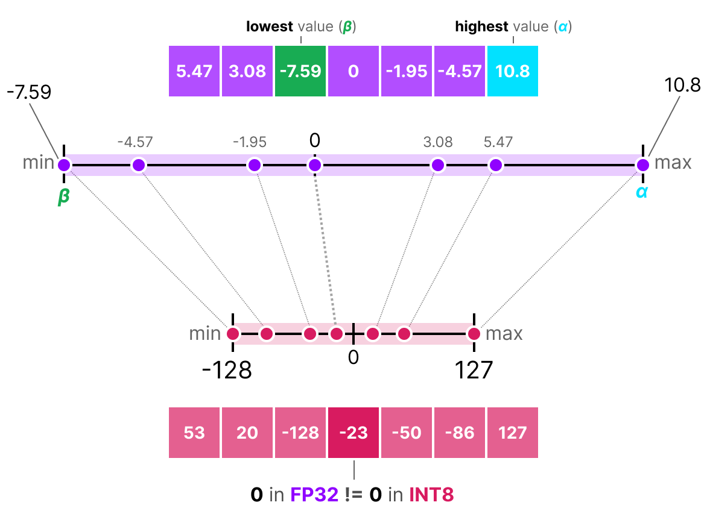
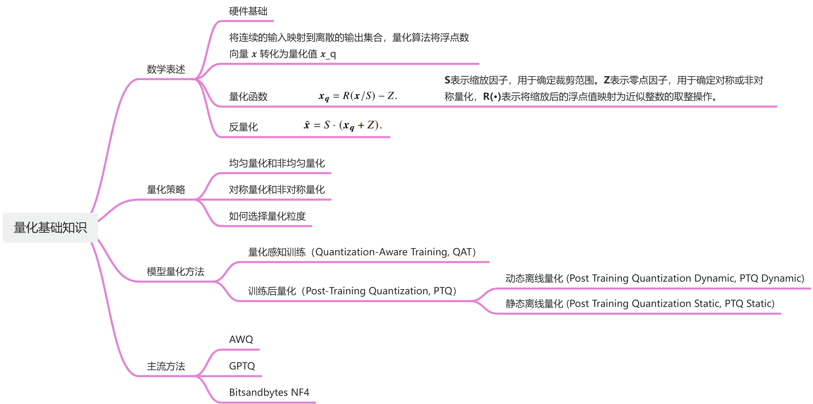

# 量化
模型量化就是通过降低模型参数的表示精度，以此降低模型的存储空间，内存占用和计算复杂度。

## 数的不同表示精度
重点需要注意的是**BF16**，

    
    

## 量化分类
首先可以分为**对称量化**、**非对称量化**和**随机量化**。
### 1. 对称量化
量化之后的值是以零为原点中心对称的，并且量化之后的零点必须对应量化之前原始值的零点，也就是量化操作并不会改变数据的零点。如下图所示：

    

量化公式为：

$$ Q_{int} = round[\frac{float}{scale}]$$
$$ scale = \frac{2 \cdot max(|r_{nub}|, r_{max}) }{Q_{max}-Q_{min}} $$

### 2. 非对称量化
不强制要求量化后的零点对应于原始数据中的零点。因此，

    

$$\begin{aligned} Scale &= \frac{(Rmax-Rmin)}{(Qmax-Qmin)} \\ Z &= Qmax - Round(\frac{Rmax}{Scale}) \\ Q &= Round(\frac{R}{Scale} + Z) \\ Q &= Clip(Q,-128,127) \\ R' &= (Q -Z) * Scale \end{aligned}$$

### 3. 随机量化

### 1. 非饱和量化

## 量化方法
量化方法主要分为三种，分别是**量化训练（Quant Aware Training）**，**动态离线量化**

### 1. 量化感知训练 (Quant Aware Training, QAT)
因为

# 学习路线

    

## 资源整理
1. B站视频课：[TensorRT下的模型量化](https://www.bilibili.com/video/BV18L41197Uz/?share_source=copy_web&vd_source=bae123c791941d42dda0fe590dc54c21)
2. 优质文档：[低比特量化原理](https://chenzomi12.github.io/04Inference03Slim/02Quant.html)
3. **强推**优质综述：[A Visual Guide to Quantization](https://www.maartengrootendorst.com/blog/quantization/)
4. 手写算法的代码仓库：[TensorRT Quantization Tutorial](https://github.com/shouxieai/tensorRT_quantization)