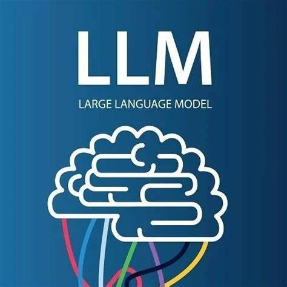

  
  <h1>大语言模型知识大熔炉</h1>
  <h3>LLM-tutorial-AllinOne<h3>

&emsp;&emsp;本项目旨在整合网上已有的优质大语言模型学习资源，面向于刚刚入门开始学习LLM的同学，也适合有工作经验的大佬来查阅相关资料，当然也非常欢迎有大佬来分享自己的大模型经验。本项目的模板是能够尽可能多的囊括大语言模型各方面的知识，包括NLP基础知识，LLM基本原理，LLM应用开发，LLM开发进阶，Prompt工程，Agent开发，大模型预训练和微调，人类对齐等方面。囊括原理的同时，也会包含详细的动手教程，帮助每一位学习者、研究者更快速的上手大语言模型领域。

## 项目计划囊括内容
1. NLP基础
2. 大模型核心原理
    - Transformer架构
    - Self-Attention
    - Multi-head Attention
    ...
3. Prompt工程
    - API调用
    - 提示词工程基础
    - 提示词工程进阶
4. LLM应用开发
    - Function Calling
    - RAG
    - GPTs
    - Langchain
    - Agent
5. 大模型私有化部署
    - HuggingFace开源社区
    - 热门模型部署实战
6. 大模型微调
    - 数据集构造
    - 微调原理
    - 高效微调方法LoRA， QLora，ptuning，prompt-tuning等
    - 调优策略
7. 大模型预训练
    - 预训练策略
    - 预训练实操
8. 人类对齐
    - 为什么需要对齐
    - 对齐技术介绍
    - 强化学习
    - PPO，DPO
    - RLHF
9. 模型量化
    - 加速训练技术
    - FlashAttention、3D Parallel Training， ZeRO
    - DeepSpeed

## 亲测优质学习资源
### Github仓库

1. [开源大模型食用指南](https://github.com/datawhalechina/self-llm)
&emsp;&emsp; 这里面有非常详细的模型微调指南
2. [LLM综述](https://github.com/RUCAIBox/LLMSurvey)
&emsp;&emsp; 非常不错的一本LLM综述书籍，强烈建议阅读，非常详细的讲述了LLM的基础知识和发展状况。
3. [大模型快速上手](https://github.com/DjangoPeng/LLM-quickstart)
&emsp;&emsp; 这里面各种大语言模型微调策略，同时有示例可以正常运行，强烈建议作为上手练习使用