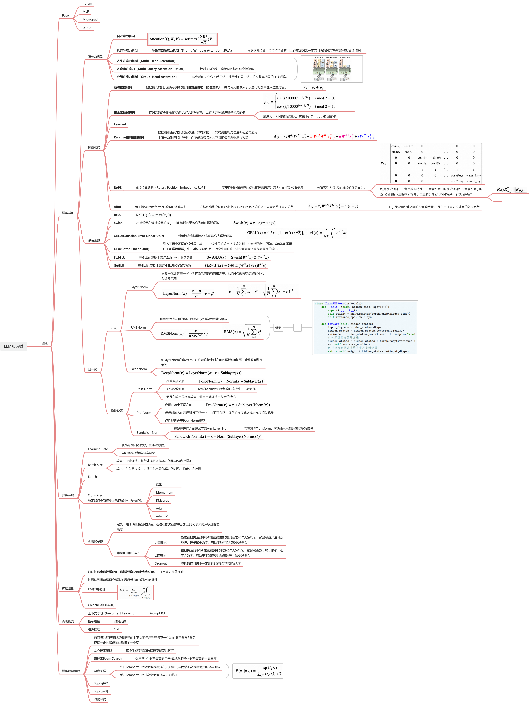
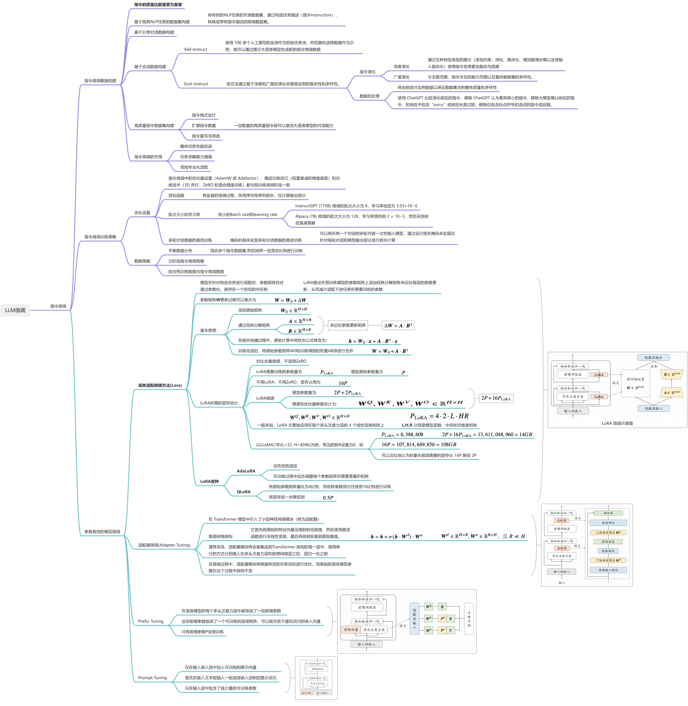
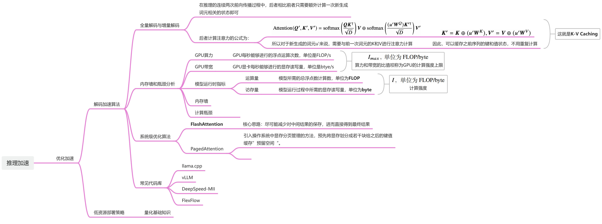

<div align=center>
  
  <h1>大语言模型知识大熔炉</h1>
  <h3>LLM-tutorial-AllinOne<h3>
</div>

&emsp;&emsp;本项目旨在整合网上已有的优质大语言模型学习资源，面向于刚刚入门开始学习LLM的同学，也适合有工作经验的大佬来查阅相关资料，当然也非常欢迎有大佬来分享自己的大模型经验。本项目的模板是能够尽可能多的囊括大语言模型各方面的知识，包括NLP基础知识，LLM基本原理，LLM应用开发，LLM开发进阶，Prompt工程，Agent开发，大模型预训练和微调，人类对齐等方面。囊括原理的同时，也会包含详细的动手教程，帮助每一位学习者、研究者更快速的上手大语言模型领域。

# Markdown {.tabset}
## Plots
\```{r}
1
\```

## Tables
\```{r}
head(mtcars)
\```


 # MacOS内容文本 
 # Linux内容文本 
 # Windows内容文本 



## 项目计划囊括内容
1. NLP基础
2. 大模型核心原理
    - 模型基础
        - 注意力机制
        - 位置编码
        - 激活函数
        - 归一化
    - Transformer架构
    - 模型解码策略
    - 参数详解
    - 扩展法则
    - 涌现能力
    
3. Prompt工程
    - API调用
    - 提示词工程基础
    - 提示词工程进阶
4. LLM应用开发
    - Function Calling
    - RAG
    - GPTs
    - Langchain
    - Agent
5. 数据处理
    - 预处理
        - 质量过滤
        - 数据去重
    - 词元化
        - BPE分词
        - WordPiece分词
        - Unigram分词
    - 数据调度
6. 大模型预训练
    - 预训练任务
        - 语言建模
        - 去噪自编码
        - 混合自编码
    - 预训练技术
        - 优化参数设置
        - 稳定化技术
        - 可扩展预训练技术
    - 模型参数计算
    - 预训练实操
7. 指令微调
    - 微调数据集构造
    - 指令微调训练策略
    - 参数高效的微调方法
8. 人类对齐
    - 对其标准
    - RLHF
    - DPO
9. 优化加速
    - 解码加速算法
    - 低资源部署策略
10. 评估方法

## 各部分思维导图
### 大语言模型基础


### 预训练


### 指令微调


### 人类对其


### 优化加速


## 亲测优质学习资源
### Github仓库

1. [开源大模型食用指南](https://github.com/datawhalechina/self-llm)
&emsp;&emsp; 这里面有非常详细的模型微调指南
2. [LLM综述](https://github.com/RUCAIBox/LLMSurvey)
&emsp;&emsp; 非常不错的一本LLM综述书籍，强烈建议阅读，非常详细的讲述了LLM的基础知识和发展状况。
3. [大模型快速上手](https://github.com/DjangoPeng/LLM-quickstart)
&emsp;&emsp; 这里面各种大语言模型微调策略，同时有示例可以正常运行，强烈建议作为上手练习使用

# 申明：本项目旨在汇集网上优质资源，会按个人理解进行整理